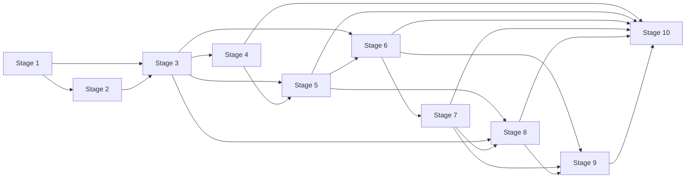

# Project 1 Engine-Neutral Core Implementation Roadmap

**Status:** Approved planning decomposition; Stages 1 through 6 complete

## 1. Purpose

This roadmap decomposes the approved Project 1 engine-neutral core design into ten ordered implementation stages. It fixes ownership, dependencies, exclusions, review gates, and acceptance evidence without authorizing implementation or embedding stage-level executable instructions.

Stages 1 through 6 have approved detailed implementation plans. Every later detailed plan is written just in time after its prerequisite implementation is complete, verified, reviewed, and committed.

## 2. Normative source documents and commits

| Source | Authority in this roadmap |
|---|---|
| `docs/superpowers/specs/2026-08-10-engine-neutral-core-design.md` | Normative Project 1 architecture, contracts, safety boundaries, test strategy, and acceptance criteria. The approved architecture is present in commit `4bbf58a7cb46b63e925ecd7fc00c9c88141d88fe`. |
| `docs/decisions/0001-gitnexus-development-tooling.md` | Approved developer-tooling decision for optional, project-scoped, read-only GitNexus use. The ADR is present in commit `9db208c902ab92be615fa4494f7a4bf7810d7768`. |
| Repository-level `AGENTS.md` | No repository-level instructions exist at roadmap creation. Stage 1 creates them under the normative specification and ADR. |
| `README.md` | Current repository introduction; Stage 1 replaces its one-line content with the approved foundation guidance. |
| `.gitattributes` | Current text-normalization baseline; Stage 1 makes line-ending behavior deterministic. |

For every stage, specification sections 1–9, 24, 27, 31–32, and 34 form the global normative floor. Stage-specific references below are additive. Section 33 is cumulative acceptance: each stage proves its owned criteria, and Stage 10 closes the complete section.

If a plan, GitNexus result, code comment, or implementation choice conflicts with the specification, the specification wins. An architectural change requires an approved design revision before implementation.

## 3. Global architecture constraints

- Project 1 is a local Windows, engine-neutral, deterministic foundation implemented with a user-local, `uv`-managed CPython 3.12 runtime. The interpreter is discovered through `uv`; it is not required to be installed through Python.org's MSI or WinGet, registered as PythonCore, discoverable through `py -3.12`, or added to `PATH`.
- The core remains the sole system of record for canonical identity, lifecycle state, provenance, diagnostics, audit facts, and artifact finalization.
- Package dependency direction follows specification section 27.1. In particular, `crypto_lab.domain` never depends on adapters, persistence, subprocess APIs, configuration readers, the CLI, or any trading engine.
- Real engines remain isolated future adapters. Project 1 installs, imports, and executes none of VectorBT Community, Freqtrade, NautilusTrader, Jesse, OctoBot, Hummingbot, or QuantConnect LEAN.
- Project 1 uses executable fake adapters only. Engine capabilities in the future-integration matrix remain hypotheses, not verified claims.
- No live trading, exchange credentials, API keys, withdrawal behavior, shorting, margin, futures, leverage, real Binance integration, or implicit network access is permitted.
- No Docker, WSL dependency, cloud deployment, server deployment, real market-data ingestion, real backtest, paper wallet, tax/TDS logic, dashboard, local LLM, optimization, or strategy-promotion logic enters Project 1.
- Financial values are authoritative only as `Decimal`; timestamps are timezone-aware UTC; canonical hashes use the specified SHA-256 profiles; strict boundaries reject unknown fields.
- The core launches explicitly registered child executables with argument arrays and no shell. Adapters receive neither writable registry access nor authority over final artifact paths.
- SQLite is the authoritative metadata registry once persistence is introduced. Immutable large content stays outside SQLite and is registered only through core-owned finalization.
- Canonical schemas and relational migrations change only in stages explicitly authorized below and only within that stage's named ownership boundary.
- Every verification workflow in every stage remains offline. From Stage 3 onward, every lock resolution/check, synchronization, installed Python-tool invocation, and build runs through closed named profiles in a reviewed repository-controlled child-process launcher. Ordinary profiles pin the repository/project and managed Python version, disable uv configuration/downloads and network access, require exactly one resolvable `uv.exe`, and invoke its normalized absolute path; run profiles also disable synchronization and dotenv loading. The launcher injects only the fixed `PYDANTIC_DISABLE_PLUGINS=__all__` dependency-hardening control before Python starts. Application and runtime networking remain prohibited throughout Project 1.
- Dependency acquisition is always stage-local, offline-first, exact, and approval-gated. An active stage that introduces an explicitly approved dependency first runs its stage-plan lock-resolution and synchronization commands offline. Only when required registry metadata or locked distributions are missing may the controller present the exact one-time non-offline command written in that approved stage plan and run it after explicit user approval; verification never uses the network, and ordinary work returns immediately to the offline launcher. The historical exceptions remain distinct: before Stage 1, the selected interpreter could be downloaded exactly once with `uv python install --no-bin --no-registry 3.12.13`; Stage 1 Task 2 could run its exact approved `uv lock` and `uv sync --frozen --no-install-project`; and Stage 2 could run its exact approved GitNexus package-installation command. None authorizes online verification, automatic downloads, ambient or permanent network access, application networking, or runtime networking.
- Pydantic dependency code alone may read `PYDANTIC_DISABLE_PLUGINS=__all__`. The repository launcher sets that fixed non-secret literal unconditionally in each relevant child and never treats an ambient value as configuration. It may remove only reviewed fixed literal uv, Python, virtual-environment, pytest, coverage/pytest-cov, and mypy selection/injection variable names before invocation, without enumerating, reading, saving, printing, logging, persisting, or restoring their values. Application, domain, configuration, schema, and CLI modules never read, set, branch on, print, log, persist, expose, or hash the Pydantic control. It is neither application/user configuration nor a credential, experiment input, canonical field, or product runtime input; no other environment-variable exception follows.
- GitNexus is optional, advisory, read-only development context. It is never a product, runtime, build, test, or acceptance dependency.
- Terminal states, immutable records, source evidence, stale-attempt protection, raw-token exclusion, and result/evidence separation may not be weakened for convenience.

## 4. Ten-stage implementation sequence

### Stage 1 — Repository Foundation and Quality Gates

**Goal:** Using the explicitly preinstalled user-local, `uv`-managed CPython 3.12 prerequisite, create the Python 3.12 package scaffold, local quality tooling, project instructions, offline smoke tests, safety-boundary tests, an approval-gated one-time dependency bootstrap when the local cache is incomplete, and a repeatable verification workflow that is independently offline.

**Normative specification sections:** Global normative floor; sections 9, 24, 27, 28.1, 28.6, 33.1, and 33.7. ADR 0001 applies only as a negative constraint: GitNexus is not installed or configured in this stage.

**Prerequisite stages:** None.

**Major deliverables:** A `src`-layout `crypto_lab` distribution foundation using the user-local, `uv`-managed CPython 3.12 selected through `uv`; empty runtime dependencies; typed package marker; version-only `argparse` CLI; focused package and CLI tests; typed standard-library AST domain-boundary scanner; dependency and forbidden-path safety tests; deterministic local quality configuration; an offline-first lock/bootstrap procedure whose only Stage 1 dependency-acquisition commands that may use the network are the exact one-time approved `uv lock` and `uv sync --frozen --no-install-project`; repository instructions; development verification guidance; and an independently offline PowerShell verification entry point. The separately approved pre-Stage-1 `uv python install --no-bin --no-registry 3.12.13` prerequisite acquisition is not part of Stage 1 and is not verification evidence.

**Explicit exclusions:** All future domain records and services; generated canonical schemas; database or migrations; strategy YAML; protocol behavior; process supervision; artifact finalization; runtime directories; GitNexus; real or fake engine execution; application networking; Docker; and WSL requirements.

**Required test categories:** Package and CLI unit/smoke tests, architecture-boundary tests, dependency-safety tests, forbidden-runtime-path tests, strict type checks, formatting/lint checks, offline lockfile-consistency validation before environment synchronization, offline package build, and offline full-suite verification using only offline synchronization and no-sync tool execution.

**Exit evidence:** The independently offline Stage 1 verification script passes from a clean isolated worktree while `uv` selects the preinstalled managed CPython 3.12 without downloading an interpreter, with `uv lock --check --offline` succeeding before environment synchronization and proving that `uv.lock` matches the current project metadata; the package builds offline; version and help behavior match their contract; coverage is at least 90 percent; prohibited dependencies and paths are absent; the complete base-to-HEAD diff is reviewed; and the stage ends in a clean committed worktree. The pre-Stage-1 interpreter acquisition and any approval-gated Task 2 dependency acquisition are recorded separately and are not verification evidence.

**Detailed implementation plan:** `docs/superpowers/plans/2026-08-10-project-1-foundation-implementation-plan.md`.

| Control | Stage 1 permission |
|---|---|
| GitNexus expected | No; installation, invocation, and configuration are prohibited |
| Interpreter prerequisite | User-local uv-managed CPython 3.12, explicitly installed before Stage 1 |
| Developer-tool bootstrap network | Only the exact one-time approved `uv lock` and `uv sync --frozen --no-install-project` commands when local cache content is incomplete; all verification remains offline |
| Relational schema changes | No |
| Canonical schema changes | No |

### Stage 2 — Guarded GitNexus Development Tooling

**Goal:** Complete the ADR 0001 governance decision after the Stage 1 source and module scaffold exists, ending in either `ENABLED` or `DISABLED_WITH_EVIDENCE`. The expected path for this personal project is `ENABLED`, but successful installation is not required to complete the stage.

**Normative specification sections:** Global normative floor; sections 9, 28.6, 33.1, and 33.7; ADR 0001 in full.

**Prerequisite stages:** Stage 1.

**Major deliverables:** Read-only inspection of the pre-existing global launcher and local prerequisites; a recorded governance outcome; and ordinary offline project verification with GitNexus disabled. For `ENABLED`, also deliver then-current exact release and license verification, explicit one-time approval for the exact GitNexus package-installation command, an exact version pin and integrity record, project-scoped read-only MCP configuration, repository allowlisting, exclusions for generated/runtime/sensitive/data paths, a disposable local graph, a constrained tool surface, and one bounded successful local query. For `DISABLED_WITH_EVIDENCE`, deliver the decline, unavailability, incompatibility, unverifiability, or safety reason and inspected evidence; removal of every partial project-scoped GitNexus or MCP configuration and every local index; and a documented manual source, reference, and diff-analysis fallback.

**Explicit exclusions:** Product/runtime/build/test dependency status; automatic launcher trust or execution; implicit network access; credentials; runtime data indexing; generated instructions or skills; hooks; wiki, web, publishing, group, rename, embedding, and raw-Cypher features; and any weakening of ordinary verification.

**Required test categories:** Both outcomes require the complete ordinary offline project verification workflow with GitNexus disabled. `ENABLED` additionally requires static configuration and security checks, allowlist/exclusion proof, constrained read-only tool-surface checks, a bounded local graph/query smoke check, and disabled-tool regression checks. `DISABLED_WITH_EVIDENCE` requires proof that no partial project-scoped GitNexus or MCP configuration and no local index remains, review of the recorded reason and evidence, and review of the documented manual source/reference/diff fallback.

**Exit evidence:** Stage 2 records exactly one acceptable outcome. `ENABLED` requires verified exact version and license, recorded package integrity, project-scoped read-only MCP configuration, verified repository allowlist and exclusions, a successful bounded local query, and ordinary offline verification passing with GitNexus disabled. `DISABLED_WITH_EVIDENCE` requires a recorded decline/unavailability/incompatibility/unverifiability/safety reason with inspected evidence, no remaining partial project-scoped GitNexus or MCP configuration and no local index, a documented manual source/reference/diff fallback, and ordinary offline verification passing without GitNexus. Either outcome completes Stage 2 and permits Stage 3 planning.

**Approved detailed implementation plan:** `docs/superpowers/plans/2026-08-10-project-1-gitnexus-development-tooling-implementation-plan.md`.

| Control | Stage 2 permission |
|---|---|
| GitNexus expected | No at entry; `ENABLED` is the expected path, while `DISABLED_WITH_EVIDENCE` is equally stage-completing and non-blocking |
| Developer-tool bootstrap network | Only the exact one-time approved GitNexus package-installation command; all verification remains offline |
| Relational schema changes | No |
| Canonical schema changes | No |

### Stage 3 — Canonical Domain, Configuration, Hashing, and Schemas

**Goal:** Implement canonical identifiers, UTC time, Decimal financial primitives, diagnostics, canonical JSON, hashing profiles, strict configuration, dataset/engine/adapter descriptors, artifact ownership primitives, and generated JSON Schemas, including dataset metadata contracts but no ingestion.

**Normative specification sections:** Global normative floor; sections 10–11, 13.2, 14.2, 18, 19.1, 21–22, 28.1, 28.4, 33.1–33.2, 33.6, and 33.7.

**Prerequisite stages:** Stages 1 and 2. The Stage 2 dependency is on completing its governance decision, satisfied by either `ENABLED` or `DISABLED_WITH_EVIDENCE`, not on successfully installing or enabling GitNexus.

**Major deliverables:** A repository-controlled offline uv/Python launcher with fixed Pydantic plugin discovery disabled before interpreter startup; operational identifiers; canonical UTC and Decimal primitives; diagnostic foundations; canonical JSON and domain-separated hashing profiles; strict configuration precedence and safety policy; dataset descriptors and partitions as metadata contracts; foundational engine and adapter descriptor schemas; all `ArtifactOwnerRef` variants; schema generation infrastructure; reviewed generated schemas; and deterministic in-memory validation.

**Explicit exclusions:** Real data download/import/normalization; strategy evaluation; experiment orchestration; process launch; concrete persistence; real adapters or engines; artifact filesystem finalization; and application network access.

**Required test categories:** Launcher closure, argument/exit propagation, fixed plugin-disable behavior, and parent-environment isolation; model and unknown-field validation; Decimal/time round trips; hash golden and property tests; configuration precedence and safety-policy tests; owner-union property tests; dataset metadata validation; and generated-schema consistency.

**Exit evidence:** The reviewed launcher proves the exact fixed Pydantic control is effective without allowing application environment access; canonical serialization and hashes are deterministic; invalid boundary values fail; every initial schema regenerates without diff; configuration safety invariants pass offline; and cumulative lint, types, tests, build, and review gates are green.

**Approved detailed implementation plan:** `docs/superpowers/plans/2026-08-10-project-1-canonical-domain-configuration-hashing-schemas-implementation-plan.md`.

| Control | Stage 3 permission |
|---|---|
| GitNexus expected | Use only after `ENABLED` while healthy; otherwise use the manual fallback; always advisory and non-blocking |
| Dependency bootstrap network | Run launcher profiles `lock-resolve-offline`, `lock-check`, and `sync` first; only the exact Stage 3 Task 1 `lock-acquire` and `sync-acquire` profiles may omit offline after separate one-time approval; the historical Stage 1 exceptions grant no Stage 3 authority; verification never uses the network |
| Relational schema changes | No |
| Canonical schema changes | Yes, limited to foundational domain, configuration, dataset, descriptor, ownership, and generator contracts |

### Stage 4 — Portable Strategy, Capabilities, and Comparison

**Goal:** Implement safe YAML ingestion, the expression AST, feature DAG validation, reference Level 1 evaluation, strategy versioning, capability vocabulary, compatibility resolution, approximation declarations, and comparison eligibility.

**Normative specification sections:** Global normative floor; sections 10.2, 11.3–11.5, 12–13, 20.4, 25–26, 28.1, 28.4, and 33.2–33.3.

**Prerequisite stages:** Stage 3.

**Major deliverables:** Strict safe-YAML loading; `StrategySpec` and immutable strategy versions; typed expression nodes; acyclic feature validation; the fixture-sized deterministic Level 1 reference evaluator; capability vocabulary and resolver; approximation and comparison-level exclusions; comparison eligibility and difference classification; golden fixtures; and owned generated schemas.

**Explicit exclusions:** Arbitrary Python execution; extension execution; engine imports; order/fill simulation; portfolio accounting; real backtests; optimization or promotion; persistence implementations; process execution; and application network access.

**Required test categories:** YAML security and unknown-field tests, AST/DAG/type validation, golden Level 1 fixtures, Decimal and missing-value semantics, hash/property tests, all four compatibility outcomes, stable complete-reason ordering, approximation policy, and comparison-level eligibility.

**Exit evidence:** Golden feature and signal series pass; strategy hashes are formatting-independent; compatibility outcomes and reasons are deterministic; comparison exclusions are explicit; generated schemas are clean; and all cumulative gates pass.

**Approved detailed implementation plan:** `docs/superpowers/plans/2026-08-10-project-1-portable-strategy-capabilities-comparison-implementation-plan.md`.

| Control | Stage 4 permission |
|---|---|
| GitNexus expected | Use only after `ENABLED` while healthy; otherwise use the manual fallback; always advisory and non-blocking |
| Relational schema changes | No |
| Canonical schema changes | Yes, limited to strategy, capability, approximation, and comparison contracts |

### Stage 5 — Experiment, Run, Invocation, Retry, and Aggregation Logic

**Goal:** Implement experiment, engine-run, and command-invocation state machines; immutability; compare-and-swap transition rules; retry policy; retry scheduling; terminal aggregation; and application-owned repository ports using in-memory test doubles.

**Normative specification sections:** Global normative floor; sections 7.1–7.2, 8.1–8.2, 10.3, 11.3, 11.5, 14.8, 15.2, 16–17, 21, 22.2.1, 23.2–23.3, 25.4, 28.1, 28.4, 29.6, 30.2–30.3, and 33.5.

**Prerequisite stages:** Stages 3 and 4.

**Major deliverables:** Strict lifecycle models and transition tables; queue-time immutability; command/run separation; revision-based compare-and-swap; immutable retry policy; six-gate retry decisions and durable-delay semantics in ports; experiment aggregation; application repository and unit-of-work protocols; and in-memory doubles for deterministic orchestration tests.

**Explicit exclusions:** SQLAlchemy, Alembic, SQLite, operating-system process launch, fake-adapter execution, artifact filesystem finalization, real engines, and infrastructure coupling inside domain logic.

**Required test categories:** Every state pair and forbidden transition, terminal immutability, state-governed field shapes, CAS conflict/race tests, retry bounds and hard blockers, delayed retry/restart behavior, fresh availability identity, aggregation/cancellation races, and in-memory application integration/property tests.

**Exit evidence:** All invocation ordered state pairs and ten allowed transitions are proven; run and experiment transitions are exhaustive; retry and aggregation matrices pass; application ports work against in-memory doubles; no infrastructure imports cross the boundary; and cumulative gates pass.

**Approved detailed implementation plan:** `docs/superpowers/plans/2026-08-10-project-1-experiment-run-invocation-retry-aggregation-implementation-plan.md`.

| Control | Stage 5 permission |
|---|---|
| GitNexus expected | Use only after `ENABLED` while healthy; otherwise use the manual fallback; always advisory and non-blocking |
| Relational schema changes | No |
| Canonical schema changes | Yes, limited to experiment, run, invocation, retry, and lifecycle contracts |

### Stage 6 — Adapter Protocol and Fake-Adapter Contract Harness

**Goal:** Implement adapter descriptors, negotiation, request envelopes, stdout events, validation results, adapter result manifests, sanitized manifests, exit mappings, protocol validation, and executable fake adapters covering the contract matrix.

**Normative specification sections:** Global normative floor; sections 8.1–8.2, 10.2–10.3, 11.3–11.5, 13.2–13.4, 14, 15.5, 15.7, 19.1, 19.4, 20–21, 28.2–28.4, 33.2, 33.4, 33.6, and 33.7.

**Prerequisite stages:** Stages 3 and 5.

**Major deliverables:** Explicit adapter catalog contracts; bootstrap descriptors; negotiation; command-discriminated request envelopes; invocation-scoped stdout events; validation results; temporary adapter result manifests and core-sanitized representations; stable exit mappings; incremental protocol validation; raw-token redaction; executable fake adapters; reusable contract vectors; and generated protocol schemas.

**Explicit exclusions:** Real engines or adapters; production Windows process supervision; shell invocation; network or credentials; direct database mutation; final artifact registration; and claims that contract vectors have passed through the production supervisor before Stage 7.

**Required test categories:** Schema/parser contract tests; exact exit categories `0`, `10`, `20`, `30`, `40`, `50`, `60`, and `70` plus unknown exits; invocation/run/token identity; per-invocation sequence and replay; stale output; malformed, oversized, or contaminated stdout; manifest reconciliation; sanitization; and bounded property tests.

**Exit evidence:** Fake executables produce every planned protocol case; identity and replay rules pass; source/sanitized hashes remain distinct; raw tokens are absent from authoritative projections; generated protocol schemas are clean; and cumulative gates pass.

**Approved detailed implementation plan:** `docs/superpowers/plans/2026-08-10-project-1-adapter-protocol-fake-adapter-contract-harness-implementation-plan.md`.

| Control | Stage 6 permission |
|---|---|
| GitNexus expected | Use only after `ENABLED` while healthy; otherwise use the manual fallback; always advisory and non-blocking |
| Relational schema changes | No |
| Canonical schema changes | Yes, limited to descriptors, negotiation, requests, events, validation, manifests, diagnostics, and protocol contracts |

### Stage 7 — Windows Process Supervision

**Goal:** Implement command-specific deadlines, subprocess launch without a shell, stdout parsing, stderr capture, heartbeat monitoring, cancellation, termination, PID creation identity, cleanup, stale-invocation protection, and restart-oriented process reconciliation on Windows.

**Normative specification sections:** Global normative floor; sections 7.1, 14.1, 14.4–14.8, 15, 17.3, 21, 22.2.1, 22.5, 28.2–28.3, 28.5, 29.2–29.3, 30, 33.4, 33.5, and 33.7.

**Prerequisite stages:** Stage 6.

**Major deliverables:** Absolute argument-array launch with no shell; a fresh non-inherited process environment; bounded readers; incremental event parsing; per-invocation stderr evidence; paired UTC/monotonic deadlines; heartbeat liveness; graceful and forced termination; durable PID creation identity; handle and process-tree cleanup; path-boundary checks; stale invocation rejection; and process-side restart reconciliation.

**Explicit exclusions:** Engine installation/import; shell strings; ambient environment inheritance; application networking; relational migrations; canonical-contract expansion; result artifact finalization; and operating-system sandbox claims.

**Required test categories:** Unit, contract, integration, and Windows platform cases covering paths with spaces, Unicode, conditional long paths, argument preservation, process groups and Job Objects, deadline/cancellation races, PID reuse, handle loss, cleanup, stale output, and restart in every invocation state.

**Exit evidence:** The complete Stage 6 fake-adapter harness passes through the production supervisor; all deadline mappings and cleanup paths are proven; PID reuse and stale children cannot corrupt state; no false `EXITED` or semantic success occurs; and cumulative gates pass.

**Planned detailed implementation plan:** `docs/superpowers/plans/2026-08-10-project-1-windows-process-supervision-implementation-plan.md`.

| Control | Stage 7 permission |
|---|---|
| GitNexus expected | Use only after `ENABLED` while healthy; otherwise use the manual fallback; always advisory and non-blocking |
| Relational schema changes | No |
| Canonical schema changes | No; this stage consumes frozen protocol and lifecycle schemas |

### Stage 8 — SQLite Persistence and Migrations

**Goal:** Implement SQLAlchemy mappings, SQLite WAL configuration, Alembic migrations, repositories, units of work, optimistic concurrency, constraints, retry-decision persistence, invocation-scoped events, ownership relations, and persistence recovery.

**Normative specification sections:** Global normative floor; sections 8.1–8.2, 10.4, 11.3, 11.5, 15.2, 15.6, 16–19, 21, 23, 28.1, 28.3, 28.5, 29, 30.3, 33.5, and 33.6.

**Prerequisite stages:** Stages 3, 5, and 7.

**Major deliverables:** SQLite WAL, foreign keys, `synchronous=FULL`, and bounded busy timeout; SQLAlchemy mappings separate from domain models; repositories and short units of work; Alembic migration infrastructure; revision CAS; table constraints and indexes; retry decisions; command invocations and sanitized events; owner relations; base artifact lifecycle mappings; migration checks; and persistence-side recovery.

**Explicit exclusions:** Large database blobs; engine-native databases as system of record; adapter access to the core database; long write transactions around process/file I/O; filesystem atomic moves; complete artifact finalization; and redefinition of canonical contracts.

**Required test categories:** Repository contracts, empty/current/unsupported-newer migration cases, WAL/restart behavior, foreign-key/CHECK/index/CAS tests, invocation/run agreement, idempotent event replay, retry-decision recovery, ownership constraints, Windows locking, and safe disk/concurrency failure behavior.

**Exit evidence:** The relational schema has one expected Alembic head; migration consistency and startup checks pass; all mapped canonical invariants round-trip; CAS and recovery evidence is green; generated canonical schemas remain unchanged; and cumulative gates pass.

**Planned detailed implementation plan:** `docs/superpowers/plans/2026-08-10-project-1-sqlite-persistence-migrations-implementation-plan.md`.

| Control | Stage 8 permission |
|---|---|
| GitNexus expected | Use only after `ENABLED` while healthy; otherwise use the manual fallback; always advisory and non-blocking |
| Relational schema changes | Yes, limited to database infrastructure, base registries, lifecycle state, retry, invocation/event, owner, and recovery mappings |
| Canonical schema changes | No; ORM mappings must conform to accepted canonical types |

### Stage 9 — Artifact Finalization, Recovery, Provenance, and Audit

**Goal:** Implement `CandidateArtifact` and `ArtifactRef` persistence, `RESULT` versus `EVIDENCE` finalization, strict path confinement, checksums, manifests, purpose-specific leases, atomic moves, finalization journals, restart reconciliation, normalized provenance, diagnostics, structured logs, and audit records.

**Normative specification sections:** Global normative floor; sections 10.2–10.4, 11.3–11.5, 14.5, 14.7–14.8, 15.5–15.7, 17.2–17.3, 18.3, 19–21, 22.5, 23.3–23.4, 28.1–28.5, 29–30, 33.2, 33.4, 33.5, 33.6, and 33.7.

**Prerequisite stages:** Stages 6, 7, and 8.

**Major deliverables:** Separate candidate and finalized repositories; owner/purpose/role validation; `RESULT` and `EVIDENCE` finalizers with disjoint identities; confinement and link defenses; independent size/hash/token scanning; canonical manifests; same-volume atomic moves; purpose-tagged journal and crash recovery; normalized result provenance; diagnostic causal chains; bounded local logs; append-only audit; and post-run sensitive-material scans.

**Explicit exclusions:** Relabeling failed results as evidence; finalizing unsanitized stdout, raw-token input, original adapter-result candidates, quarantined or corrupt bytes; real engine integration; cloud/telemetry/dashboard/network features; and schema changes outside the owned artifact/provenance/audit scope.

**Required test categories:** Candidate/reference/type separation; all owner variants; purpose/producer/role property tests; path traversal/reparse/security tests; corruption and mutation; every finalization crash point; result/evidence race and recovery; cancellation/timeout precedence; provenance; diagnostics/log/audit; and raw-token absence scans.

**Exit evidence:** The complete finalization and recovery matrix passes; only eligible successful results enter a `RunManifest`; evidence never changes semantic state; post-run scanning finds no raw token in SQLite, logs, audits, diagnostics, evidence, or finalized artifacts; migrations and generated schemas are clean; and cumulative gates pass.

**Planned detailed implementation plan:** `docs/superpowers/plans/2026-08-10-project-1-artifact-finalization-recovery-provenance-audit-implementation-plan.md`.

| Control | Stage 9 permission |
|---|---|
| GitNexus expected | Use only after `ENABLED` while healthy; otherwise use the manual fallback; always advisory and non-blocking |
| Relational schema changes | Yes, limited to artifact, reference, manifest, journal, provenance, diagnostic, audit, and recovery increments |
| Canonical schema changes | Yes, limited to artifact, manifest, provenance, diagnostic, and audit contracts |

### Stage 10 — CLI Composition and End-to-End Acceptance

**Goal:** Wire the application through the local CLI, implement composition, configuration loading, offline fake-adapter workflows, schema and migration checks, end-to-end acceptance scenarios, documentation, and the complete Project 1 verification command.

**Normative specification sections:** All sections 1–34, with emphasis on sections 7–8, 22, 24–25, 27–30, and 33. ADR 0001 remains advisory development-tooling guidance.

**Prerequisite stages:** Stages 4, 5, 6, 7, 8, and 9.

**Major deliverables:** Local CLI command composition; explicit strict configuration loading; startup reconciliation; application-service wiring; offline fake-adapter success, warning, incompatibility, unavailability, crash, timeout, cancellation, stale-output, and recovery workflows; generated-schema and migration checks; operator documentation; and one complete offline Project 1 verification command.

**Explicit exclusions:** New architecture; unplanned canonical or relational schema changes; real market data; real engines/backtests; Binance integration; live or paper trading; wallet, risk, tax, UI, LLM, Docker, cloud, server, optimization, and promotion features. A discovered schema defect returns to its owning stage through an approved corrective plan.

**Required test categories:** CLI and composition unit tests; complete contract and Windows supervisor suites; full end-to-end success and non-success matrix; restart and crash recovery; persistence and artifact integrity; security scans; all specification section 28 categories; and every section 33 acceptance criterion.

**Exit evidence:** Every section 33 criterion maps to fresh offline evidence; the full verification command, generated-schema diff, migration check, strict types, lint/format, tests, build, security review, code review, and diff review pass; no exclusion is breached; and the worktree is clean and committed.

**Planned detailed implementation plan:** `docs/superpowers/plans/2026-08-10-project-1-cli-composition-end-to-end-acceptance-implementation-plan.md`.

| Control | Stage 10 permission |
|---|---|
| GitNexus expected | Use only after `ENABLED` while healthy; otherwise use the manual fallback; always advisory and non-blocking |
| Relational schema changes | No |
| Canonical schema changes | No |

## 5. Dependency graph

The graph contains the required 21 edges. Its dependency chain makes the mandated Stage 1 through Stage 10 sequence the only valid topological execution order.

The `S2 --> S3` edge means completion of the Stage 2 governance decision under either `ENABLED` or `DISABLED_WITH_EVIDENCE`; it does not require successful GitNexus installation or continuing availability.

## 6. Verification and review gates

Every implementation stage must pass all fifteen gates:

1. An approved detailed implementation plan exists for that stage.
2. An isolated Git worktree is created through the appropriate Superpowers workflow.
3. Production behavior is developed test-first through red, green, and refactor cycles.
4. Focused tests pass before broader and full test suites run.
5. Formatting and linting pass.
6. Strict static type checking passes.
7. Generated-schema consistency passes where applicable. From Stage 3 onward, a stage without schema-change permission must still prove a clean generated-schema diff.
8. Migration consistency passes where applicable. From Stage 8 onward, a stage without relational-change permission must still prove the migration state remains clean.
9. Package build verification passes.
10. A security and safety review confirms the fixed scope and stage exclusions.
11. A fresh Git diff is reviewed in full.
12. After Stage 2, branch on its recorded governance outcome. With `ENABLED`, use the complete optional ADR workflow: before a cross-module or architectural change, check status, refresh a stale index, inspect context or a bounded query, and review impact; after implementation, refresh the index, run change detection and impact review, and examine unexpected graph effects. Record only an advisory developer-tool review note, never verification evidence. With `DISABLED_WITH_EVIDENCE`, or whenever an enabled tool is temporarily unhealthy, record the documented manual source, reference, and diff analysis instead. Both paths satisfy this gate only alongside the ordinary offline verification gates.
13. A code-review gate resolves material findings.
14. Fresh verification evidence is collected before any completion claim.
15. The stage ends in a clean committed worktree before the next stage begins.

For any stage that introduces a newly approved dependency, the stage plan must
name the exact offline-first lock and synchronization sequence and any exact
one-time non-offline fallback commands. A fallback requires explicit user
approval and is bootstrap evidence only; it never satisfies or weakens a
verification gate. From Stage 3 onward, the fixed Pydantic plugin-discovery
control is applied only by the reviewed repository launcher before relevant
Python children start.

A passing GitNexus query, context report, or impact report cannot replace any ordinary verification gate. GitNexus absence cannot block application implementation, builds, tests, runtime operation, reviews, or acceptance.

## 7. Just-in-time planning policy

The roadmap fixes stage order, ownership, exclusions, and acceptance gates. It does not freeze detailed future file layouts.

For Stages 2–10, the transition is:

1. Complete, verify, review, and commit every prerequisite stage.
2. Inspect the actual repository files, package/module boundaries, public interfaces, test commands, generated schemas, migration state, lessons from completed work, and—only after `ENABLED` while the tool is healthy—the GitNexus graph; otherwise inspect the recorded manual source, reference, and diff evidence.
3. Write the next stage's detailed plan against those observed facts.
4. Review and approve that plan before creating its implementation worktree.
5. Implement only the approved stage scope.

Later detailed plans must not be written from hypothetical modules, interfaces, database tables, graph relationships, test commands, migrations, or tool layouts when prior implementation can materially change those details. No other future implementation plan is created during this planning task.

## 8. GitNexus activation point

Stage 1 establishes the real source/module scaffold and independently offline quality gates without GitNexus. Stage 2 is the sole governance-decision and possible activation stage for ADR 0001.

Stage 2 must first inspect the pre-existing launcher and local Node/package-manager state without trusting or invoking GitNexus automatically. If enablement remains safe and desired, it verifies the exact then-current release and license, presents the exact package-installation command, and obtains one-time user approval before that developer-tool bootstrap network operation. Only after those gates may it pin and configure project-scoped read-only access, repository allowlisting, safe exclusions, the bounded tool allowlist, and a disposable local graph. A successful enablement records `ENABLED` only after the bounded query and disabled-tool ordinary verification gates pass.

If GitNexus is declined, unavailable, incompatible, unverifiable, or unsafe, Stage 2 removes every partial project-scoped GitNexus or MCP configuration and every local index, records the reason and inspected evidence, documents manual source/reference/diff analysis, proves ordinary offline verification without the tool, and records `DISABLED_WITH_EVIDENCE`. Either outcome completes Stage 2 and leaves the Stage 2 to Stage 3 dependency intact as a governance dependency rather than an installation dependency.

From Stage 3 onward, GitNexus is expected to be available when healthy after `ENABLED`, but remains optional and advisory. After `DISABLED_WITH_EVIDENCE`, or during later tool unavailability, stages use the documented manual fallback. Every stage must prove ordinary development and verification work without GitNexus. Removing its local graph or configuration must not affect product data, runtime behavior, source correctness, builds, tests, reviews, or acceptance.

## 9. Status tracking

| Stage | Detailed plan status | Implementation status | Exit-gate status |
|---|---|---|---|
| 1 — Repository Foundation and Quality Gates | Approved and executed | Complete at `56d029e8e6d3c67dc6309b267c74833a09d2e419` | Complete |
| 2 — Guarded GitNexus Development Tooling | Approved and executed | `DISABLED_WITH_EVIDENCE`: pinned 1.6.9 lacks mandatory MCP controls; no partial tooling remains | Complete; ordinary offline verification and manual fallback recorded |
| 3 — Canonical Domain, Configuration, Hashing, and Schemas | Approved and executed | Implementation complete at `88711307ff377e645bb17c798e599b6bac1c2be4`; post-completion stability correction merged at `e1c821453459f5eccf86a472e9204b6a90829d64` | Complete; canonical models, explicit configuration, named hashes, dataset metadata, structural descriptors, artifact owners, and 11 generated schemas verified offline |
| 4 — Portable Strategy, Capabilities, and Comparison | Approved and executed; corrected detailed plan approved at `b6721b870c79db7b999b9eb70107e53992cbe1ab` after two independent reviews, superseding the pre-correction review at `bf5e427a8fe055be2b6cb803b69d4c2334aeee69`; launcher bootstrap prerequisite completed at `350fac49ff5b1db4ec62b60c7ade76580f9894dd`; reviewed plan corrections at `65eca5b17d45c0cf04f856dc6049e0c3ee7a2be9`, `f898499d647d1d4ade571345973c6ced5e84403c`, `f57357379222404685d805d081de4f61f36a7fe5`, `cfede94c5de22fba93176e4d5f75aceeffc7695e`, `7830f935e069d0fb3053682095e949cedb4bb1de`, `2edd529a93547b4374e65de78f21619f5122b498`, `a5112b2812b5dccf5e4c12ec6d7b08a43232a65f`, `f5de3305d71713c452bccc74823b4c1e016c1814`, `77e0bc2e327bac333d228c6e4cde08c2cedf21a5` | Implementation complete at `33f5b1c3b644c1df7e8db0df17dae88c6bcea2ce`; post-completion evaluator rendering-bound correction at `7f7bfce12abc72a63b8624562ff2e448a26f7610`, with review follow-ups at `a5112b2812b5dccf5e4c12ec6d7b08a43232a65f`, `f5de3305d71713c452bccc74823b4c1e016c1814`, `77e0bc2e327bac333d228c6e4cde08c2cedf21a5`; final status recorded by the separate Task 9 status commit, which is a status record and not the implementation hash | Complete; portable strategy ingestion, static validation, deterministic Level 1 evaluation, strategy versioning and hashing, capability vocabulary and compatibility resolution, comparison eligibility, and the closed 20-schema registry — 9 new Stage 4 schemas with the 11 Stage 3 schemas preserved byte-identical — verified offline on the complete verifier, which passed on its first attempt; GitNexus remains `DISABLED_WITH_EVIDENCE` with the manual source, reference, and diff fallback recorded; Stage 5 complete |
| 5 — Experiment, Run, Invocation, Retry, and Aggregation Logic | Approved and executed | Implementation complete at `71ab94d8e9e13d6895cef9346ed58a711c8819f3` | Complete; strict lifecycle records and exhaustive transition tables for experiments, engine runs, and command invocations, queue-time immutability, revision compare-and-swap, the immutable six-gate retry decision with durable delay and successor creation, deterministic terminal aggregation, and application-owned repository and unit-of-work ports exercised through in-memory doubles; the closed 27-schema registry — 7 new Stage 5 schemas with the 20 Stage 3 and Stage 4 schemas preserved byte-identical — together with the Stage 5 architecture and safety guards, the end-to-end in-memory flow, and this status were added by the separate Task 9 commit, which is not the implementation hash; verified offline on the complete verifier, which passed on its first attempt; GitNexus remains `DISABLED_WITH_EVIDENCE` with the manual source, reference, and diff fallback recorded; Stage 6 complete |
| 6 — Adapter Protocol and Fake-Adapter Contract Harness | Approved and executed | Implementation complete at `539e96bbba4cad0747dba5dc12ea3d74318d1c83` | Complete; explicit adapter catalog contracts, bootstrap descriptors and protocol negotiation, command-discriminated request envelopes, invocation-scoped stdout events with sequence, replay, and identity rules, validation results, untrusted adapter result manifests reconciled into core-sanitized manifests, stable exit mappings, incremental protocol validation, raw-token redaction, and executable fake adapters covering the 52-row contract matrix through a test-resident offline harness; the closed 35-schema registry — 8 new Stage 6 schemas with the 27 Stage 3, 4 and 5 schemas preserved byte-identical — together with the Stage 6 boundary guard, the end-to-end protocol flow, and this status were added by the separate Task 9 commit, which is not the implementation hash; verified offline on the complete verifier; GitNexus remains `DISABLED_WITH_EVIDENCE` with the manual source, reference, and diff fallback recorded; Stage 7 not started |
| 7 — Windows Process Supervision | Intentionally deferred until Stage 6 completion | Not started | Not evaluated |
| 8 — SQLite Persistence and Migrations | Intentionally deferred until Stages 3, 5, and 7 completion | Not started | Not evaluated |
| 9 — Artifact Finalization, Recovery, Provenance, and Audit | Intentionally deferred until Stages 6–8 completion | Not started | Not evaluated |
| 10 — CLI Composition and End-to-End Acceptance | Intentionally deferred until Stages 4–9 completion | Not started | Not evaluated |

The table is updated only with evidence from an approved stage plan and its committed implementation. When Stage 2 completes, its exact `ENABLED` or `DISABLED_WITH_EVIDENCE` outcome and committed evidence are recorded here; installation success is not the completion criterion. Planning status never implies implementation progress.

## 10. Project 1 completion gate

Project 1 is complete only after all ten stage exit gates are completed in order—including a recorded Stage 2 outcome of `ENABLED` or `DISABLED_WITH_EVIDENCE`—and every cumulative acceptance criterion in specification section 33 has fresh offline evidence. GitNexus installation or availability is not a completion criterion. The final record must show:

- all required canonical contracts, lifecycle rules, protocol behaviors, Windows supervision cases, persistence constraints, finalization/recovery paths, provenance, diagnostics, and audit behavior;
- the complete fake-adapter-only test matrix from section 28;
- clean generated-schema and migration checks;
- strict typing, formatting, linting, package build, security/safety, code review, and full diff review;
- no real engine, Binance integration, application or runtime network behavior, credential path, live/paper trading, tax, UI, LLM, Docker, cloud, or server feature;
- the recorded Stage 2 outcome is `ENABLED` or `DISABLED_WITH_EVIDENCE`; GitNexus remains optional, advisory, read-only when enabled, removable, and outside product/build/test/runtime/acceptance dependencies, with the manual fallback available and no partial project-scoped GitNexus or MCP configuration or local index after a disabled outcome; and
- a clean committed worktree containing the reviewed Project 1 implementation and documentation.

Until that evidence exists, Project 1 remains incomplete regardless of partial unit-test success, GitNexus output, or the presence of generated files.
