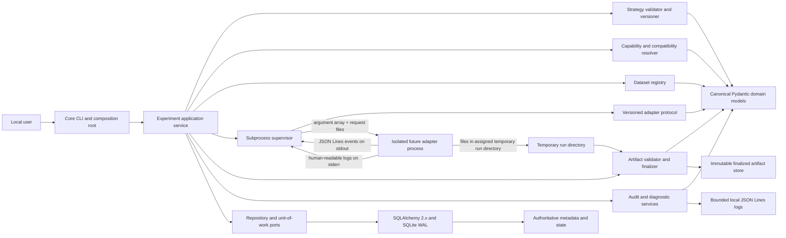
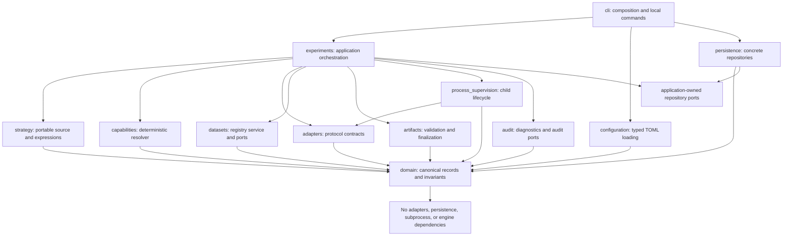
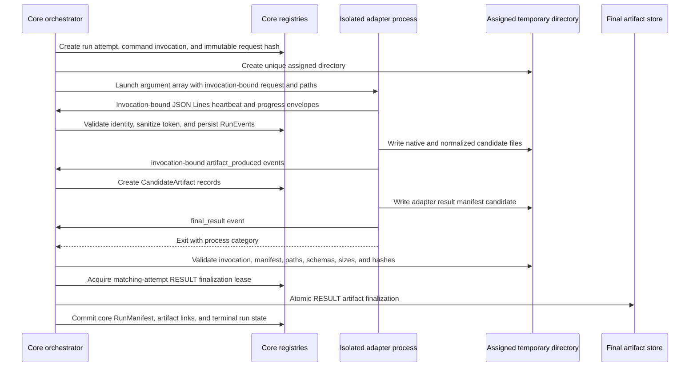
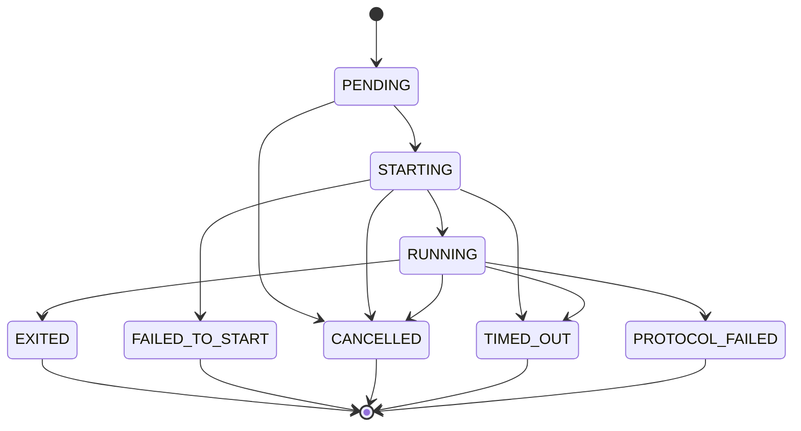
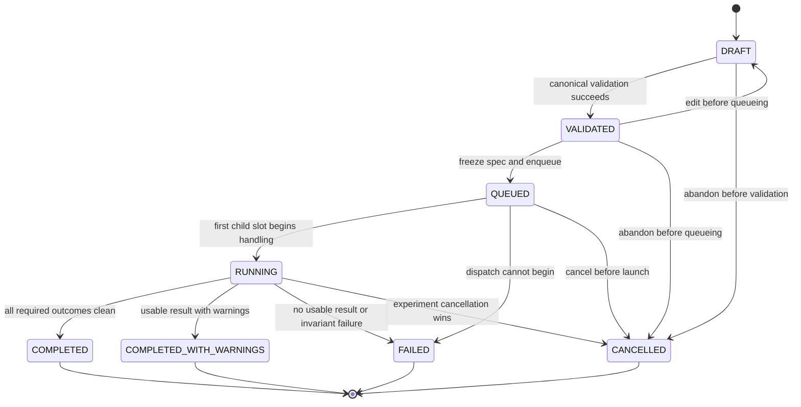
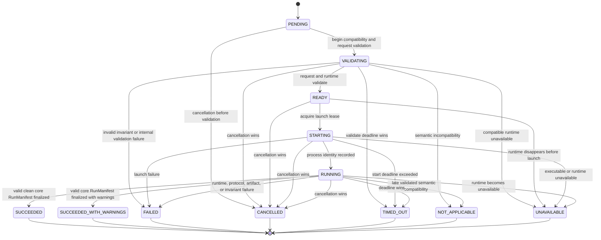
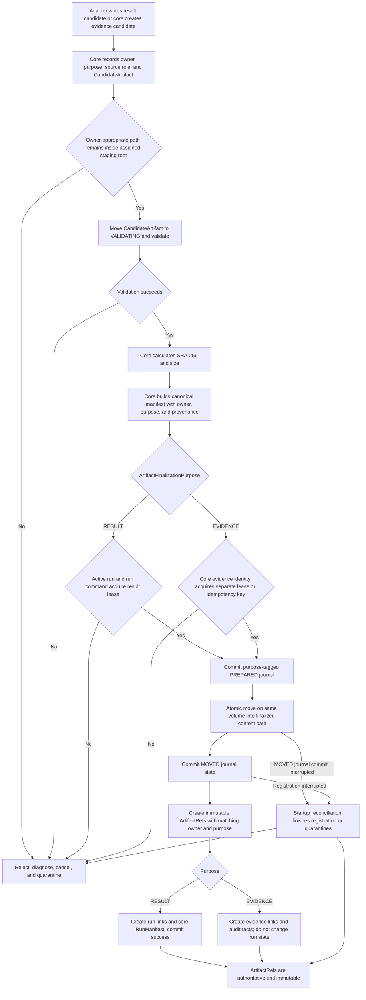

# Project 1 — Engine-Neutral Core for a Local Seven-Engine Trading Research Lab

## 1. Title and document status

**Document:** Engine-Neutral Core Architecture Specification
**Project:** Project 1
**Status:** Approved architecture handoff; implementation has not started
**Date:** 2026-08-10
**Intended audience:** The implementation-plan author, implementers, reviewers, and the future maintainer of the local research lab

This document is the normative design for Project 1. It records an already approved product direction and architecture boundary. It authorizes documentation only; it does not install an engine, create implementation code, initiate an implementation plan, or enable any form of real-money trading.

The words **MUST**, **MUST NOT**, **SHOULD**, and **MAY** express architectural requirements. Examples and pseudocode clarify contracts but are not implementation.

## 2. Executive summary

Project 1 establishes the deterministic, engine-neutral foundation for a personal Windows application that will eventually compare research and simulated-trading behavior across seven isolated trading engines. The core is a Python 3.12 orchestrator with strict static typing, Pydantic v2 canonical records, versioned schemas, deterministic capability resolution, SQLite metadata registries, immutable file artifacts, and supervised adapter subprocesses.

The architecture deliberately separates the system of record from every trading engine. Engines never run inside the core process and never write to the core database. A future adapter for each engine will execute in its own compatible runtime and communicate through a versioned executable protocol composed of request files, JSON Lines events, result manifests, explicit exit categories, and immutable artifacts.

The approved strategy model is hybrid portability:

- Shared deterministic strategy specifications are portable where economic equivalence is meaningful.
- Explicit engine extensions are permitted only inside isolated adapter runtimes.
- A strategy is not forced through an engine that cannot model its requirements.
- Incompatibility is recorded as `NOT_APPLICABLE`, not as a failed experiment.
- Engine disagreement is evidence for diagnosis; results are never combined through majority voting or averaged into a synthetic return.

Project 1 defines contracts, records, state machines, persistence boundaries, artifact rules, and fake-adapter tests. It does not install or integrate the seven engines, download data, run backtests, implement a paper wallet, calculate Indian taxes, create a dashboard, or add an LLM.

## 3. Approved context

The product is a personal, local-only research and simulated-trading application running on Windows. Its initial trading domain is deliberately narrow:

- Binance Spot instruments quoted in USDT
- Long-only strategies
- No leverage and no futures
- Historical research and backtesting
- Always-available hypothetical-money trading in a later project
- Indian tax-adjusted analysis in a later project
- No real-money order placement
- No exchange credentials or API-key handling
- Local LLM analysis only after deterministic research and paper-trading behavior is reliable

The eventual research lab is planned to integrate:

1. VectorBT Community
2. Freqtrade
3. NautilusTrader
4. Jesse
5. OctoBot
6. Hummingbot
7. QuantConnect LEAN

Project 1 treats all framework-specific capability statements as planned adapter intent. Exact capabilities, operating-system behavior, supported versions, and limitations MUST be verified against a pinned framework version during that engine's adapter project.

The core vocabulary may represent broader markets, directions, data types, and `runtime.live` so future compatibility can be described without a schema break. Policy enforcement nevertheless prohibits live execution, short selling, margin, futures, leverage, credentials, and withdrawal behavior in the approved application scope.

## 4. Goals

Project 1 MUST:

1. Define canonical, validated, versioned engine-neutral domain records.
2. Define a declarative, deterministic, versioned portable strategy format for bar-based strategies.
3. Express strategy requirements and adapter capabilities through a versioned vocabulary.
4. Resolve compatibility deterministically as `SUPPORTED`, `SUPPORTED_WITH_APPROXIMATION`, `NOT_APPLICABLE`, or `UNAVAILABLE`.
5. Define an executable adapter protocol that keeps all engine code outside the orchestrator process.
6. Make the core authoritative for experiments, runs, datasets, artifacts, diagnostics, and audit records.
7. Make all material experiment inputs immutable once an experiment enters `QUEUED`.
8. Preserve engine-native outputs while also storing provenance-linked canonical results.
9. Make run identity, inputs, versions, warnings, and approximations reproducible and auditable.
10. Survive adapter crashes, malformed output, timeouts, cancellation, and application restart without false success or false finalization.
11. Provide strict path, schema, protocol, and process boundaries suitable for local use without claiming operating-system sandboxing.
12. Define enough module, interface, lifecycle, storage, and test detail for a separate implementation-plan task.
13. Keep all Project 1 tests independent of the seven real engines by using fake adapters.
14. Preserve extension points for future paper trading, Indian tax analysis, local LLM analysis, and Indian equities without coupling those concerns into the core domain.

## 5. Non-goals

Project 1 explicitly excludes all of the following:

- Installing any trading engine
- Implementing any trading-engine adapter
- Binance API integration
- Downloading or normalizing real market data
- Running a backtest
- Paper-wallet implementation
- India tax calculations
- Tax Deducted at Source calculations
- Risk-engine implementation
- Dashboard implementation
- Local LLM integration
- Live trading
- Exchange credentials
- API-key handling
- Withdrawal functionality
- Cloud deployment
- Docker
- Server deployment
- Strategy optimization
- Strategy promotion or approval decisions
- Verifying current engine-specific capabilities

Project 1 also does not create an operating-system security sandbox. Child-process isolation, explicit command invocation, bounded I/O, and path validation reduce accidental or faulty behavior; they do not make an untrusted engine executable safe.

## 6. System boundaries

### 6.1 Inside the Project 1 core

| Boundary | Project 1 responsibility |
|---|---|
| Canonical domain | Identifiers, financial values, timestamps, strategy, capability, experiment, run, artifact, result, diagnostic, and audit records |
| Strategy ingestion | Safe YAML parsing, canonical Pydantic validation, expression validation, and strategy hashing |
| Capability resolution | Versioned vocabulary, deterministic compatibility decisions, and approximation records |
| Adapter contracts | Descriptor, request, event, manifest, command, version-negotiation, and exit-code contracts |
| Registries | Experiment, run, dataset, artifact, strategy-version, diagnostic, and audit metadata |
| Artifact control | Validation, hashing, manifest creation, atomic finalization, immutability, and provenance |
| Process supervision | Argument-array launch, PID identity, protocol parsing, heartbeat, timeout, cancellation, termination, and restart reconciliation |
| Configuration | Safe local TOML configuration with deterministic precedence and immutable run snapshots |
| Persistence | SQLite/SQLAlchemy repositories, units of work, migrations, constraints, and recovery metadata |
| Observability | Structured local logs, protocol-event capture, diagnostics, and append-only audit facts |
| Verification | Unit, contract, integration, property-based, and Windows platform tests using fake adapters |

### 6.2 Outside the Project 1 core

The following remain external even in later projects:

- Engine-native execution algorithms and databases
- Engine-specific strategy lifecycle code
- Engine-specific package and runtime management
- Exchange connectivity
- Credential storage
- Market-data vendor or exchange clients
- User-interface rendering
- Tax policy logic
- LLM inference

The core may own contracts consumed by these components, but it MUST NOT absorb their implementation details.

### 6.3 Trust boundaries

1. **Human-authored input boundary:** TOML and strategy YAML are untrusted until parsed with safe parsers and validated against strict models.
2. **Adapter boundary:** Every adapter process and every byte it emits are untrusted until protocol and schema validation succeed.
3. **Filesystem boundary:** A path supplied by a request, event, or manifest is untrusted until resolved and proven to remain within its assigned root.
4. **Artifact boundary:** Engine-native output is untrusted until size, type, checksum, schema, and provenance validation complete.
5. **Persistence boundary:** Only core repository implementations may mutate core SQLite state. Engines and adapters receive no database handle or database path for writing.
6. **Future network boundary:** Project 1 performs no implicit network activity. Later adapters must explicitly declare any network requirement and remain subject to policy.

## 7. Architecture overview



### 7.1 Primary control flow

1. The local entry point loads deterministic non-secret configuration.
2. A strategy YAML document is safely parsed, strictly validated, normalized, and content-hashed.
3. An existing validated dataset version is selected by immutable hash; Project 1 uses fixtures only.
4. An `ExperimentSpec` captures every material input, selected engine intent, and normalized immutable `RetryPolicy`.
5. Compatibility is resolved from strategy requirements, comparison level, adapter descriptor, and runtime availability.
6. The experiment becomes immutable when a transaction moves it to `QUEUED`.
7. Each eligible engine slot creates a distinct `EngineRunRecord`, a sanitized authoritative request snapshot containing `attempt_token_hash`, and temporary `EngineRunRequest` material containing the raw token for adapter invocation.
8. The supervisor launches the adapter executable using an argument array and an assigned temporary directory.
9. The core parses and validates JSON Lines events, captures bounded stderr, monitors heartbeats and deadlines, and persists significant state transitions.
10. The adapter writes large native and canonical candidate outputs within its assigned directory and writes its `AdapterResultManifest` semantic declaration.
11. The core validates that adapter manifest and its candidate artifacts, calculates its own checksums, and may atomically finalize matching `RESULT` files and create the authoritative core `RunManifest` only after successful reconciliation. Independently generated sanitized core `EVIDENCE` may finalize after any outcome without changing semantic state.
12. The experiment aggregate derives its terminal state from child-run outcomes according to deterministic rules.

No adapter event, exit code, native report, or manifest is trusted by itself. Success requires a permitted lifecycle transition plus reconciliation of the matching `AdapterResultManifest`, process outcome, core `RunManifest`, and finalized artifacts.

### 7.2 Local dispatch model

Project 1 uses a local in-process scheduler owned by the `experiments` application package. A CLI command validates and queues an experiment transactionally, then drives eligible slots until the experiment reaches a terminal state or the user cancels. There is no background Windows service, daemon, server, remote worker, or persistent message broker.

The scheduler claims work through repository compare-and-swap leases so a restarted CLI cannot duplicate a run. `max_concurrent_runs` defaults to one and is bounded from one through eight by configuration; the observed value is audited. Concurrency changes scheduling and resource pressure but not economic assumptions. Each run remains isolated by request hash, attempt-token hash, work directory, command invocation identities, invocation-scoped event sequences, and purpose-specific finalization identities.

Queue order is deterministic by experiment queue timestamp, engine-slot ordinal, and attempt number. A policy-approved retry records `retry_not_before_utc = terminal_completed_at_utc + retry_delay_seconds`; it becomes queue-eligible only at or after that durable instant and then enters the same ordered queue. Restart reuses the recorded instant and never restarts the delay. Scheduling never changes adapter selection, compatibility, comparison level, retry policy, or immutable inputs.

## 8. Dependency direction



Arrows mean “imports or depends on.” The dependency rules are:

- `domain` is pure and engine-neutral. It MUST NOT import adapters, persistence, process APIs, configuration readers, CLIs, or engine libraries.
- Canonical record types and state-transition invariants live in `domain`; behavior that coordinates I/O does not.
- `strategy`, `capabilities`, and `adapters` may depend on canonical domain types but not on concrete persistence or engine packages.
- `experiments` is the application layer. It coordinates ports and services but does not instantiate SQLite sessions or operating-system processes directly.
- Repository protocols are owned by the application package that consumes them. `persistence` implements those protocols; the application does not import concrete implementations.
- `process_supervision` implements an application-facing `ProcessSupervisor` port using adapter protocol types. It does not make economic trading decisions.
- `cli` is the composition root. It may depend on concrete implementations solely to wire them to abstract ports.
- Future engine adapter code resides outside the central package and central runtime.

### 8.1 Required core interfaces

The later implementation plan MUST provide narrowly scoped interfaces equivalent to these contracts:

| Interface | Owner | Responsibility |
|---|---|---|
| `StrategyLoader` | `strategy` | Convert safe YAML bytes into a validated `StrategySpec` and `StrategyVersion` |
| `CompatibilityResolver` | `capabilities` | Resolve one immutable requirement set against one adapter descriptor and runtime observation |
| `AdapterCatalog` | `adapters` | Return explicitly registered adapter executable descriptors; never scan arbitrary directories |
| `ExperimentRepository` | `experiments` | Persist and compare-and-swap experiment records and immutable specs |
| `EngineRunRepository` | `experiments` | Persist semantic attempt identity, lifecycle transitions, retry provenance, purpose-specific result leases, invocation links, and terminal outcomes; command PID, stderr, native exit, and command deadline facts remain on `CommandInvocationRecord` |
| `CommandInvocationRepository` | `adapters` application port | Persist and compare-and-swap one `describe`, `validate`, or `run` command lifecycle independently from `EngineRunRecord` |
| `DatasetRepository` | `datasets` | Resolve immutable dataset descriptors and partitions by ID and hash |
| `CandidateArtifactRepository` | `artifacts` | Record candidate identity, discriminated owner, finalization purpose, core-selected source role, staging path, validation observations, lifecycle transitions, and quarantine facts |
| `ArtifactRepository` | `artifacts` | Resolve and register finalized immutable `ArtifactRef` records by discriminated owner and finalization purpose; it never accepts a candidate as an artifact reference |
| `AuditSink` | `audit` | Append stable structured audit facts and correlated diagnostics |
| `UnitOfWork` | application boundary | Commit related registry mutations atomically or roll them back |
| `ProcessSupervisor` | `process_supervision` | Run one adapter command under deadlines, protocol limits, and cancellation |
| `ArtifactFinalizer` | `artifacts` | Accept one purpose, owner, correlation identity, and candidate set; validate and atomically move bytes; and return explicit candidate-to-finalized-reference mappings without confusing result finalization with evidence finalization |
| `Clock` | `domain` port | Supply timezone-aware UTC instants and deterministic test clocks |
| `ContentHasher` | `domain` port | Produce canonical SHA-256 digests from normalized bytes |

Each interface MUST accept and return canonical types, explicit result objects, or stable diagnostics. It MUST NOT use an untyped dictionary as its public contract when a canonical model is available.

### 8.2 Interface operation contracts

The following signatures are normative at the operation level. Names may move between files during implementation planning, but parameters, ownership, sync/async behavior, and result semantics must remain equivalent. `Result[T]` is a discriminated success-or-diagnostics value; expected boundary failures are not communicated only through exceptions.

```text
StrategyLoader.load(source: bytes, source_name: str, observed_at_utc: datetime) -> Result[StrategyVersion]

CompatibilityResolver.resolve(
    requirements: tuple[CapabilityRequirement, ...],
    descriptor: AdapterDescriptor,
    availability: RuntimeAvailabilityObservation,
    comparison_level: ComparisonLevel,
    policy: CompatibilityPolicy,
) -> CompatibilityResult

AdapterCatalog.get(adapter_name: str, adapter_version: str) -> Result[AdapterCatalogEntry]
AdapterCatalog.list_registered() -> tuple[AdapterCatalogEntry, ...]

ExperimentRepository.get(experiment_id: ExperimentId) -> Result[ExperimentRecord]
ExperimentRepository.add(record: ExperimentRecord) -> Result[None]
ExperimentRepository.compare_and_swap(
    expected_revision: int,
    replacement: ExperimentRecord,
) -> Result[ExperimentRecord]

EngineRunRepository.get(run_id: RunId) -> Result[EngineRunRecord]
EngineRunRepository.add_attempt(record: EngineRunRecord) -> Result[None]
EngineRunRepository.compare_and_swap(
    expected_revision: int,
    replacement: EngineRunRecord,
) -> Result[EngineRunRecord]
EngineRunRepository.append_event(event: RunEvent) -> Result[RunEvent]

CommandInvocationRepository.get(invocation_id: InvocationId) -> Result[CommandInvocationRecord]
CommandInvocationRepository.add(record: CommandInvocationRecord) -> Result[None]
CommandInvocationRepository.compare_and_swap(
    expected_revision: int,
    replacement: CommandInvocationRecord,
) -> Result[CommandInvocationRecord]

DatasetRepository.get_by_hash(content_hash: Sha256) -> Result[DatasetDescriptor]
DatasetRepository.list_partitions(dataset_id: DatasetId) -> Result[tuple[DatasetPartition, ...]]

CandidateArtifactRepository.get(candidate_artifact_id: CandidateArtifactId) -> Result[CandidateArtifact]
CandidateArtifactRepository.add(record: CandidateArtifact) -> Result[None]
CandidateArtifactRepository.compare_and_swap(
    expected_revision: int,
    replacement: CandidateArtifact,
) -> Result[CandidateArtifact]
CandidateArtifactRepository.list_recoverable(
    states: tuple[CandidateArtifactState, ...],
    owner: ArtifactOwnerRef | None,
    purpose: ArtifactFinalizationPurpose | None,
    limit: int,
) -> Result[tuple[CandidateArtifact, ...]]

ArtifactRepository.get(artifact_id: ArtifactId) -> Result[ArtifactRef]
ArtifactRepository.list_by_owner(
    owner: ArtifactOwnerRef,
    purpose: ArtifactFinalizationPurpose | None,
) -> Result[tuple[ArtifactRef, ...]]
ArtifactRepository.record_finalization(result: FinalizationResult) -> Result[tuple[ArtifactRef, ...]]

AuditSink.append(event: AuditEvent) -> Result[None]

UnitOfWork.begin() -> UnitOfWork
UnitOfWork.commit() -> Result[None]
UnitOfWork.rollback() -> None

async ProcessSupervisor.invoke(
    command: AdapterCommand,
    cancellation: CancellationToken,
) -> CommandResult

async ArtifactFinalizer.finalize(
    request: ResultFinalizationRequest | EvidenceFinalizationRequest,
    cancellation: CancellationToken,
) -> FinalizationResult[candidate_to_artifact_refs: tuple[CandidateFinalization, ...]]

ComparisonEligibilityService.evaluate(
    left: RunManifest,
    right: RunManifest,
    requested_level: ComparisonLevel,
) -> ComparisonEligibilityResult

Clock.now_utc() -> datetime
Clock.monotonic() -> MonotonicInstant
ContentHasher.sha256_stream(source: BinaryIO) -> Sha256
```

`ResultFinalizationRequest` is the `purpose=RESULT` branch and requires a `RUN` owner, active run-command invocation, attempt-token hash, source and sanitized adapter-manifest hashes, successful or warning semantic reconciliation, candidate identities, and result-lease identity. `EvidenceFinalizationRequest` is the `purpose=EVIDENCE` branch and requires a permitted owner, core-produced candidate identities, candidate-set hash, evidence source role, and exactly one typed correlation identity: `INVOCATION`, `DIAGNOSTIC`, or `AUDIT`, with the matching ID. Fields belonging only to the other branch are rejected. A generic correlation string cannot authorize finalization.

Repository and unit-of-work operations are synchronous because SQLite transactions are short local operations. Subprocess invocation and artifact hashing/finalization are asynchronous and cancellable because they can wait on external I/O. An application service owns the unit of work; repositories never commit independently. No database transaction remains open across adapter execution, heartbeat waiting, large-file hashing, or filesystem moves.

Infrastructure exceptions are caught at their owning boundary and converted to stable `Result` diagnostics. Programmer defects and violated internal invariants may raise internally, but the outer application boundary records `CORE.INVARIANT_VIOLATION` before returning a failed command result. Cancellation is an explicit token and result category, not an unstructured task exception.

## 9. Technology decisions

| Concern | Approved decision | Architectural consequence |
|---|---|---|
| Core language | Python 3.12 | The orchestrator has one pinned central runtime independent of engine runtimes |
| Typing | Strict static typing | Public interfaces, state transitions, event payloads, and repository boundaries are fully typed; unchecked dynamic data stops at validation boundaries |
| Dependency management | `uv` | The central lockfile and virtual environment are separate from every engine runtime |
| Canonical validation | Pydantic v2 | Unknown fields are rejected by default; versioned JSON Schemas are generated from canonical models |
| Metadata persistence | SQLite in WAL mode | Local transactional registries support concurrent readers and one controlled writer |
| Persistence boundary | SQLAlchemy 2.x | Repositories and units of work hide SQL and sessions from application services |
| Schema migration | Alembic | Database changes are explicit, ordered, reviewable, and never inferred from model drift |
| Large tabular data | Parquet | Candle partitions, normalized result series, fills, positions, and equity curves use typed columnar artifacts |
| Small structured data | JSON | Manifests, protocol request files, descriptor files, and small artifacts use canonical JSON |
| Event and log streams | JSON Lines | One bounded record per line supports incremental subprocess parsing and local structured logs |
| Human strategy source | YAML | Safe, declarative authoring is converted immediately to a canonical validated model |
| Application configuration | TOML | Local non-secret configuration has deterministic precedence and strict validation |
| Process isolation | Child process per adapter command | No engine is imported into the core; crashes and incompatible runtimes remain outside it |
| Large-value arithmetic | `Decimal` | Authoritative financial values never use binary floating point |
| Time | Timezone-aware UTC | Canonical timestamps serialize as RFC 3339 strings ending in `Z`; naive datetimes are rejected |
| Content identity | SHA-256 | Datasets, strategies, configuration snapshots, and finalized files have stable content identities |

The central project may select concrete linting, type-checking, and safe-YAML libraries during implementation planning, but those choices MUST enforce the contracts above and MUST NOT weaken strict typing, safe parsing, or rejection of arbitrary YAML tags.

Pydantic v2 dependency code alone MAY read the fixed, non-secret process
variable `PYDANTIC_DISABLE_PLUGINS=__all__`. A reviewed,
repository-controlled process launcher MUST set that exact literal
unconditionally in the child environment before the Python interpreter starts
whenever the child may import Pydantic models, construct Pydantic validators,
or generate Pydantic schemas. The launcher MUST NOT inspect, preserve, or use
an alternative ambient value as configuration. Application, domain,
configuration, schema, and CLI Python modules MUST NOT read, set, mutate,
branch on, print, log, persist, or expose the variable. It is deterministic
dependency hardening, not application or user configuration, a credential, an
experiment input, a canonical field, a runtime product input, or hash
material. No other environment-variable exception is authorized.

The repository launcher MUST expose only reviewed, closed operation profiles;
MUST bind uv to the repository root, the repository project, uv-managed
CPython 3.12, disabled Python downloads, and offline mode for ordinary work;
and MUST reject caller-selected executables, Python code, plugin loading,
configuration files, and paths outside the reviewed repository scope. It MUST
resolve exactly one `uv.exe` application, normalize that executable to an
absolute path, and fail closed when resolution is absent or ambiguous. To
prevent ambient tool-selection or plugin-injection controls from overriding
those bindings, the launcher MAY remove only the fixed literal uv, Python,
virtual-environment, pytest, coverage/pytest-cov, and mypy variable names enumerated by the reviewed
Stage 3 plan, assigning null to each named process entry. It MUST NOT enumerate
environment variables, call an environment-value getter, or inspect, save,
print, log, persist, restore, or branch on any removed value. Removing those
fixed names is deterministic fail-closed sanitization, not a configuration
source and not authority to read or set another environment variable.

Project dependency work is stage-local and offline-first. An active stage that
introduces an explicitly approved dependency MUST first run the exact
lock-resolution, lock-check, and synchronization sequence written in its
approved implementation plan with offline enforcement. If required registry
metadata or locked distributions are absent locally, only the exact one-time
non-offline lock or synchronization command named by that stage plan MAY run,
and only after the user separately approves that command. Dependency
acquisition is bootstrap evidence, never verification evidence. Every
verification workflow remains offline, and ordinary work returns immediately
to the repository-controlled offline launcher. This rule does not expand
application or runtime network authority.

Development-only repository context tooling is governed by [ADR 0001: GitNexus for Local Development Context](../../decisions/0001-gitnexus-development-tooling.md). That tooling is non-normative and outside the runtime architecture; it MUST NOT weaken any Project 1 security, determinism, testing, or dependency-direction requirement.

## 10. Canonical identity and reproducibility

### 10.1 Operational identifiers

Operational records use UUID4 values rendered in lowercase canonical form and prefixed by record purpose:

- `exp_<uuid4>` for an experiment
- `run_<uuid4>` for an engine-run attempt
- `art_<uuid4>` for an artifact record

Additional internal identifiers use explicit prefixes such as `ds_` for dataset records, `strat_` for strategy definitions, `inv_` for command invocations, `evt_` for run events, `cand_` for candidate artifacts, `art_` for finalized artifact references, `diag_` for diagnostics, and `audit_` for audit events. Prefix validation prevents one identifier class from being accepted as another. UUIDs provide operational uniqueness; they do not replace content hashes.

### 10.2 Content hashes

SHA-256 is authoritative for:

- Validated canonical strategy versions
- Dataset versions and partition manifests
- Normalized material configuration snapshots
- Engine-extension modules declared by a strategy
- Finalized artifact files
- Canonical result manifests

Hash inputs MUST be deterministic bytes. Canonical JSON is UTF-8 without a byte-order mark, uses sorted object keys, compact separators, preserved array order, normalized version strings, Decimal strings, and UTC `Z` timestamps. Fields explicitly marked non-material, such as local display paths or ingestion wall-clock timestamps, are excluded only by a named versioned hashing profile. A hashing profile change creates a new schema/version contract; it never silently changes an existing digest.

Temporary request material, wire `ProtocolEventEnvelope` bytes, and the original `AdapterResultManifest` candidate may contain the raw attempt token. Their exact-byte SHA-256 values MAY persist only as source-provenance fingerprints for identity and recovery; they are not authoritative canonical-content hashes and the bytes themselves remain temporary. `attempt_token_hash` is SHA-256 over the ASCII domain separator `crypto_lab:attempt-token:v1` followed by one zero byte and the canonical UTF-8 token bytes.

`wire_event_hash` fingerprints the exact temporary wire bytes. Authoritative `RunEvent.content_hash` covers canonical sanitized event JSON with `content_hash` omitted. `source_adapter_result_manifest_hash` fingerprints the exact temporary adapter-result candidate bytes. `sanitized_adapter_result_manifest_hash` covers canonical `SanitizedAdapterResultManifest` JSON with that self-hash field omitted. `run_manifest_hash` covers canonical `RunManifest` JSON with that self-hash field omitted. These named exclusions are part of hashing profile version 1; no profile may silently copy the raw token into a persisted or finalized record.

`ExperimentRecord.spec_hash` is SHA-256 over the complete canonical `ExperimentSpec`, including the normalized `RetryPolicy` and its deterministic terminal-state ordering; `spec_hash` is external to that payload and therefore is not a self-hash field. The retry policy is also represented in the material configuration snapshot and `configuration_hash`; changing either representation changes the experiment identity, and the two representations MUST agree before `QUEUED`.

YAML text itself is not the strategy identity. The strategy-version hash covers the canonical validated strategy model, the strategy hashing-profile version, and every explicitly declared extension-module hash. Comments, key ordering, and harmless YAML formatting therefore do not change strategy identity.

Dataset identity covers the normalized dataset manifest, ordered partition identities, raw and normalized checksums, normalization version, instrument identity, data type, interval, timeframe where applicable, and quality declarations. The implementation MUST stream large-file hashing and MUST NOT load large artifacts entirely into memory.

### 10.3 Required run provenance

The authoritative evidence aggregate for every engine run, composed of its `EngineRunRecord`, related `CommandInvocationRecord`s, and successful `RunManifest` where one exists, MUST retain:

- Experiment ID, immutable experiment-spec hash, and the exact normalized retry policy covered by that hash
- Run ID, logical engine slot, attempt number, and attempt-token hash; the raw token is temporary sensitive correlation material at the adapter trust boundary
- Every `CommandInvocationRecord.invocation_id` used by `validate` or `run`; the `RunManifest` retains the relevant `run_invocation_id`, while the run aggregate retains all validation and run invocations and every persisted event points to its exact invocation
- Strategy-version hash
- Dataset-version hash
- Engine name and pinned engine version
- Adapter name and pinned adapter version
- Canonical configuration hash
- Negotiated protocol version
- Negotiated schema versions
- Capability-vocabulary version
- Requested comparison level
- Start and completion timestamps
- All warnings and approximation declarations
- Matching `RUN`-owned `RESULT` references and checksums used by the `RunManifest`, plus separately typed `EVIDENCE` references that never contribute to success
- Process exit category and semantic result status

A run is reproducible only when all required provenance fields exist, referenced artifacts validate, and no material input is represented solely by a mutable path or ambient process state. Reproducibility means inputs and assumptions can be reconstructed; it does not promise numerically identical Level 3 outcomes across different operating systems, hardware, or nondeterministic engine internals. Such limitations MUST be recorded.

### 10.4 Versions and migrations

Every persisted or cross-process record has an explicit `schema_version`. Every adapter envelope has an explicit `protocol_version`. Readers reject unknown major versions and unknown fields by default. Backward compatibility is implemented through explicit, tested migrations that:

1. Read a known earlier immutable representation.
2. Produce a new representation without altering the original artifact.
3. Record the migration name, version, timestamp, input hash, output hash, and diagnostic warnings.
4. Preserve provenance back to the original record.

Silent reinterpretation of stored JSON, Parquet schemas, strategy files, or database columns is prohibited.

## 11. Canonical domain model

### 11.1 Common model rules

Canonical models are Pydantic v2 models configured to reject unknown fields. Cross-process and persisted top-level records include `schema_version`; operational records include stable identifiers and UTC creation timestamps. Values are validated before use and serialized only through versioned canonical serializers.

The following rules apply across the model:

- Financial values are `Decimal` in memory and canonical decimal strings in JSON. Exponents are normalized, negative zero is forbidden, non-finite values are forbidden, and scale constraints are explicit where an instrument supplies precision.
- Canonical timestamps are timezone-aware UTC instants serialized with RFC 3339 and a `Z` suffix. Naive datetimes and non-UTC offsets at canonical boundaries are rejected rather than silently converted.
- Enum values serialize as stable uppercase or namespaced strings documented by their schema.
- Asset, venue, engine, adapter, and capability names use normalized identifiers; separate display labels may retain user-facing spelling.
- Lists whose order has no economic meaning are sorted before canonical hashing. Lists whose order affects semantics, such as rule evaluation or event sequence, preserve order.
- Native engine symbols never replace canonical instrument identity.
- Every normalized record produced from engine output retains experiment, run, engine, adapter, source-artifact, and schema provenance.
- Models never accept arbitrary Python objects, callable values, class paths, pickles, or implicit code hooks.

### 11.2 Instrument identity

The canonical instrument form is:

```text
<VENUE>:<BASE>/<QUOTE>:<MARKET_TYPE>
```

For example:

```text
BINANCE:BTC/USDT:SPOT
```

`InstrumentRef` stores venue, base asset, quote asset, and market type as separate validated fields. An adapter-owned mapping may associate this identity with a native engine symbol, but that mapping is contextual to a pinned adapter and engine version. The canonical identity remains stable if two engines use different native symbols.

### 11.3 Required records

In the table below, “core-owned” means the accepted canonical copy and its lifecycle are authoritative in the core even when a human, dataset importer, or adapter produced the candidate data.

| Record | Purpose and ownership | Minimum fields | Validation and serialization |
|---|---|---|---|
| `InstrumentRef` | Core-owned normalized instrument identity | `schema_version`, `canonical_id`, `venue`, `base_asset`, `quote_asset`, `market_type` | Components are normalized and must reconstruct `canonical_id`; base and quote differ; market type is vocabulary-backed; native symbols are stored only in explicit mappings |
| `Money` | Currency-denominated amount | `schema_version`, `currency`, `amount` | Currency is a normalized asset code; amount is a finite `Decimal` string; sign constraints are imposed by the containing record |
| `Price` | Quote-currency value per base unit | `schema_version`, `instrument_id`, `quote_asset`, `value` | Instrument quote asset must match; value is a positive finite `Decimal` string and respects declared price precision when available |
| `Quantity` | Base-asset quantity for an instrument | `schema_version`, `instrument_id`, `base_asset`, `value` | Instrument base asset must match; value is a non-negative finite `Decimal` string and respects quantity precision when available |
| `Fee` | Canonical fee linked to an execution fact | `schema_version`, `fee_id`, `run_id`, `fill_id`, `amount`, `fee_type`, `timestamp_utc`, `source_artifact_id` | Fee amount currency is explicit; rebates use a named fee type rather than an ambiguous sign convention; provenance is mandatory |
| `DatasetDescriptor` | Authoritative metadata for one immutable dataset version | `schema_version`, `dataset_id`, `content_hash`, `source`, `venue`, `instrument`, `data_type`, `timeframe`, `start_utc`, `end_utc`, `normalization_version`, `validation_status`, `partition_ids`, `created_at_utc` | Time bounds are ordered and UTC; timeframe is required only where applicable; hash and partition order follow the dataset hashing profile |
| `DatasetPartition` | Immutable unit of large tabular data | `schema_version`, `partition_id`, `dataset_id`, `relative_path`, `content_hash`, `row_count`, `start_utc`, `end_utc`, `raw_checksum`, `normalized_checksum`, `column_schema_version` | Path must be registry-relative and confined to the dataset root; checksums use SHA-256; bounds and row count agree with validated metadata |
| `StrategySpec` | Canonical form of the portable strategy | All fields in section 12, including version, identity, rules, requirements, assumptions, and authoring metadata | Derived from safe YAML; unknown fields, unknown expression operators, arbitrary tags, and executable values are rejected |
| `StrategyVersion` | Immutable content identity for a validated strategy | `schema_version`, `strategy_version_id`, `strategy_id`, `content_hash`, `strategy_spec`, `extension_hashes`, `hashing_profile_version`, `created_at_utc` | Hash is recomputed from canonical content; extension declarations and hashes must match exactly; the accepted record is immutable |
| `CapabilityRequirement` | One strategy or comparison requirement | `schema_version`, `capability`, `required`, `minimum_semantics`, `approximation_policy`, `comparison_levels` | Capability must exist in the declared vocabulary version; approximation policy is explicit rather than inferred |
| `CapabilityDeclaration` | Adapter claim for one vocabulary item | `schema_version`, `capability`, `support_kind`, `evidence_note`, `limitations` | `support_kind` is `NATIVE`, `APPROXIMATED`, or `UNSUPPORTED`; approximated declarations reference an `ApproximationDeclaration` |
| `ApproximationDeclaration` | Machine-readable account of non-native behavior | `schema_version`, `approximation_id`, `capability`, `method`, `expected_impact`, `prevented_comparison_levels`, `adapter_version` | Required text fields are non-empty and bounded; prevented levels are an ordered unique set; declaration version is included in run provenance |
| `EngineDescriptor` | Core-owned description of a pinned engine version | `schema_version`, `engine_name`, `engine_version`, `engine_family`, `planned_role`, `known_limitations` | Names and versions are explicit; no unversioned “latest” value is accepted; capabilities are not inferred from the engine name |
| `AdapterDescriptor` | Validated output of `describe` and catalog registration | `schema_version`, `adapter_name`, `adapter_version`, `engine`, `supported_protocol_versions`, `supported_schema_versions`, `capability_vocabulary_version`, `native_capabilities`, `approximated_capabilities`, `unsupported_capabilities`, `supported_operating_systems`, `runtime_requirements`, `network_required`, `credentials_required`, `known_modeling_limitations`, `executable_hash` | Capability sets are disjoint and complete for claims made; versions are non-empty and ordered deterministically; the descriptor may report network or credential requirements, while Project 1 policy prohibits executing any operation that requires them |
| `RuntimeAvailabilityObservation` | Time-bounded local observation used separately from logical capabilities | `schema_version`, `availability_observation_id`, `adapter_name`, `adapter_version`, `executable_path`, `executable_hash`, `runtime_version`, `operating_system`, `available`, `reason_code`, `observed_at_utc`, `expires_at_utc`, `network_required`, `credentials_required` | Identity is unique and content-hashed; expiry follows observation time; availability cannot override semantic incompatibility or safety policy; paths and hashes come from the explicit catalog |
| `NegotiationResult` | Deterministic protocol/schema/vocabulary selection | `schema_version`, `adapter_name`, `candidate_protocol_versions`, `candidate_schema_versions`, `candidate_vocabulary_versions`, `selected_protocol_version`, `selected_schema_versions`, `selected_vocabulary_version`, `outcome`, `diagnostics` | Candidate lists are sorted and complete; selected values belong to intersections; failed negotiation has no selected values and makes the adapter unavailable |
| `AdapterCommandRequestEnvelope` | Temporary command-discriminated request wrapper | Common fields `schema_version`, `protocol_version`, `request_id`, `invocation_id`, `command`, `created_at_utc`, `timeout_seconds`, `deadline_utc`, `payload_hash`, `payload`; `validate` and `run` payloads additionally require experiment/run/slot/attempt identity and the temporary raw `attempt_token` | `invocation_id` and the snapshotted command-specific timeout are required for every command; `describe` prohibits run/attempt fields; the token appears exactly once inside the `EngineRunRequest` payload and is prohibited in the envelope header; raw-token-bearing variants are never persisted or finalized |
| `AdapterValidationResult` | Adapter-produced result of the `validate` command | `schema_version`, `protocol_version`, `request_id`, `invocation_id`, `run_id`, `attempt_token_hash`, `outcome`, `diagnostics`, `validated_at_utc`, `result_hash` | Outcome is `VALID`, `NOT_APPLICABLE`, `UNAVAILABLE`, or `INVALID`; invocation, run, request, token-hash, and result identities must match; no engine execution result or finalized artifact is represented |
| `CommandInvocationRecord` | Core-owned process facts for one `describe`, `validate`, or `run` subprocess | `schema_version`, `invocation_id`, `command_kind`, `adapter_name`, `adapter_version`, `run_id`, `request_hash`, `timeout_seconds`, `deadline_utc`, `state`, `process_created`, `launch_attempted_at_utc`, `process_started_at_utc`, `pid_identity`, `completed_at_utc`, `native_exit_value`, `process_exit_category`, `cleanup_complete`, `cleanup_completed_at_utc`, `stderr_artifact_id`, `primary_diagnostic_id`, `diagnostic_ids`, `created_at_utc`, `updated_at_utc`, `revision` | `run_id` is required for validate/run and absent for every describe; timeout duration is fixed at creation while deadlines are established at `STARTING`; non-`EXITED` terminal states require one primary diagnostic; exit value/category co-occur; state and cleanup govern every process/completion field; transitions are compare-and-swap; `stderr_artifact_id`, when present, references only an `EVIDENCE` `ArtifactRef` |
| `RetryPolicy` | Immutable bounded automatic-retry policy embedded in an experiment | `schema_version`, `maximum_attempts_per_slot`, `automatically_retry_terminal_states`, `retry_delay_seconds`, `require_fresh_availability_observation_for_unavailable` | Maximum attempts is integer `1..5`, default `1`; terminal states are a unique subset of `FAILED`, `TIMED_OUT`, `UNAVAILABLE` stored in that fixed order, default empty; delay is integer `0..300`, default `0`; fresh availability is fixed `true` in Project 1; default maximum `1` means no automatic retry |
| `ExperimentSpec` | Immutable material inputs for one comparison intent | `schema_version`, `strategy_version_hash`, `dataset_version_hash`, `selected_engine_slots`, `starting_balance`, `fee_assumptions`, `slippage_assumptions`, `execution_assumptions`, `comparison_level`, `retry_policy`, `configuration_hash`, `created_at_utc` | All money and rates use Decimal strings; engine-slot order is canonicalized; references resolve before queueing; normalized retry policy agrees with the material configuration snapshot; any material change produces a new experiment |
| `ExperimentRecord` | Authoritative experiment lifecycle and immutable spec linkage | `schema_version`, `experiment_id`, `spec`, `spec_hash`, `state`, `created_at_utc`, `updated_at_utc`, `revision` | State changes use compare-and-swap on `revision`; `spec` cannot change at or after `QUEUED`; terminal records cannot transition |
| `EngineRunRequest` | Temporary immutable adapter command payload for one attempt | `schema_version`, `protocol_version`, `request_id`, `experiment_id`, `run_id`, `logical_slot_id`, `attempt_number`, `attempt_token`, `strategy_version_hash`, `dataset_version_hash`, `adapter`, `engine`, `configuration_snapshot`, `configuration_hash`, `comparison_level`, `assigned_work_dir`, `created_at_utc` | References and hashes must agree with the experiment; the containing command envelope supplies its command-specific timeout and UTC deadline; work directory is absolute in the launcher but serialized as an authorized root plus safe relative references; token is unique per attempt; this raw-token-bearing representation is never persisted or finalized, while its authoritative snapshot substitutes `attempt_token_hash` |
| `EngineRunRecord` | Authoritative semantic and orchestration state for one attempt | `schema_version`, `run_id`, `experiment_id`, `logical_slot_id`, `attempt_number`, `attempt_token_hash`, `state`, `adapter`, `engine`, `request_hash`, `predecessor_run_id`, `retry_reason`, `primary_terminal_diagnostic_id`, `availability_observation_id`, `finalization_deadline_utc`, `created_at_utc`, `updated_at_utc`, `revision` | Attempt number is monotonic within a slot; transitions are compare-and-swap; predecessor/retry facts exist only on successor attempts; non-success terminal states require a primary terminal diagnostic; availability and finalization fields are state-governed |
| `ProtocolEventEnvelope` | Untrusted temporary wire record parsed from one adapter stdout line | `schema_version`, `protocol_version`, `event_id`, `invocation_id`, `run_id`, `attempt_token`, `sequence`, `event_type`, `timestamp_utc`, `payload` | Raw token is allowed only while verifying the active invocation and attempt; sequence begins at one independently for each invocation; this record is never persisted or finalized unsanitized |
| `RunEvent` | Authoritative sanitized event persisted after wire identity validation | `schema_version`, `protocol_version`, `event_id`, `invocation_id`, `run_id`, `attempt_token_hash`, `sequence`, `event_type`, `timestamp_utc`, `payload`, `received_at_utc`, `wire_event_hash`, `content_hash` | `(invocation_id, sequence)` is unique; invocation links to the same run; payload and diagnostics contain no raw token; wire hash is source provenance while content hash covers the sanitized model; event type selects a strict payload schema; size is bounded before parsing |
| `ArtifactOwnerRef` | Strict discriminated owner identity shared by candidate and finalized artifact records | `owner_kind` plus exactly the fields of one `RUN`, `EXPERIMENT`, `DATASET`, `STRATEGY`, `ADAPTER`, or `SYSTEM` variant | Exactly one variant is valid; each variant requires its named identifiers and rejects identifiers belonging to every other variant; canonical serialization is discriminator-first and deterministically ordered |
| `CandidateArtifact` | Core-owned lifecycle record for bytes in staging | `schema_version`, `candidate_artifact_id`, `owner`, `finalization_purpose`, `source_role`, `producer_kind`, `artifact_kind`, `staging_relative_path`, `state`, `adapter_declared_size`, `adapter_declared_hash`, `adapter_declared_media_type`, `validation_observations`, `source_event_id`, `source_adapter_manifest_id`, `created_at_utc`, `updated_at_utc`, `revision` | State is only `CANDIDATE`, `VALIDATING`, `FINALIZING`, `QUARANTINED`, or `CORRUPT`; owner, purpose, and core-selected source role are immutable; adapter-declared fields and adapter provenance are allowed only for adapter-produced `RUN`-owned `RESULT` candidates; staging path never becomes a finalized path |
| `ArtifactRef` | Authoritative finalized identity and provenance for immutable content | `schema_version`, `artifact_id`, `owner`, `finalization_purpose`, `artifact_kind`, `finalized_relative_path`, `content_hash`, `size_bytes`, `media_type`, `source_role`, `source_candidate_artifact_id`, `created_at_utc`, `finalized_at_utc`, `state` | `state` is literal `FINALIZED`; owner, purpose, and source role equal the source candidate; path is core-controlled; checksum and size are independently calculated; every field is final and immutable; source candidate identity is mandatory; a candidate can never substitute for this type |
| `AdapterResultManifest` | Untrusted temporary adapter-produced semantic declaration and candidate-artifact index | `schema_version`, `protocol_version`, `adapter_manifest_id`, `experiment_id`, `run_id`, `invocation_id`, `attempt_token`, `semantic_status`, `started_at_utc`, `completed_at_utc`, `provenance`, `candidate_artifacts`, `candidate_metrics`, `diagnostics`, `warnings`, `approximations` | `invocation_id` is the relevant `run` command; the raw token and candidate paths are permitted only in this temporary trust-boundary input; its exact-byte `source_adapter_result_manifest_hash` is calculated out of band; the core validates every claim and never finalizes this original representation |
| `SanitizedAdapterResultManifest` | Core-preserved immutable representation of a validated adapter result | `schema_version`, `protocol_version`, `adapter_manifest_id`, `experiment_id`, `run_id`, `invocation_id`, `attempt_token_hash`, `semantic_status`, `started_at_utc`, `completed_at_utc`, `provenance`, `candidate_artifact_ids`, `candidate_metrics`, `diagnostics`, `warnings`, `approximations`, `source_adapter_result_manifest_hash`, `sanitized_adapter_result_manifest_hash` | Generated only after invocation/run/token validation and field-level redaction; contains no raw token or staging paths; when finalized, its serialized candidate is core-produced, `RUN`-owned purpose `EVIDENCE`, and may be retained after any semantic outcome without implying success |
| `RunManifest` | Core-generated authoritative consolidated record after successful process reconciliation and result finalization | `schema_version`, `protocol_version`, `manifest_id`, `experiment_id`, `run_id`, `run_invocation_id`, `attempt_token_hash`, `sanitized_adapter_result_manifest_hash`, `semantic_status`, `process_exit_category`, `started_at_utc`, `completed_at_utc`, `provenance`, `artifact_refs`, `metrics`, `diagnostics`, `warnings`, `approximations`, `run_manifest_hash` | Built only by the core for `SUCCEEDED` or `SUCCEEDED_WITH_WARNINGS`; every artifact reference is `RUN`-owned, purpose `RESULT`, and matches the manifest experiment/run; `EVIDENCE` references are prohibited; matching invocation, semantic status, process outcome, result lease, and finalized references must reconcile |
| `CanonicalOrder` | Normalized order intent or accepted engine order fact | `schema_version`, `order_id`, `experiment_id`, `run_id`, `source_artifact_id`, `instrument`, `side`, `position_effect`, `order_type`, `quantity`, `limit_price`, `time_in_force`, `submitted_at_utc`, `engine_order_id` | `BUY` opens or increases and `SELL` reduces or closes in long-only scope; negative quantities are forbidden; optional native ID never becomes canonical identity |
| `CanonicalFill` | Normalized execution fact | `schema_version`, `fill_id`, `order_id`, `experiment_id`, `run_id`, `source_artifact_id`, `instrument`, `side`, `quantity`, `price`, `fees`, `filled_at_utc`, `engine_fill_id` | Quantity and price are positive; fee currencies are explicit; fill cannot exceed modeled order constraints without a diagnostic |
| `PositionSnapshot` | Position state at a canonical instant | `schema_version`, `snapshot_id`, `experiment_id`, `run_id`, `source_artifact_id`, `instrument`, `quantity`, `average_entry_price`, `market_price`, `realized_pnl`, `unrealized_pnl`, `timestamp_utc` | Long-only quantity is non-negative; financial values are Decimal-based and currencies are explicit; snapshots are time ordered within a series |
| `PortfolioSnapshot` | Portfolio-level balance and valuation | `schema_version`, `snapshot_id`, `experiment_id`, `run_id`, `source_artifact_id`, `cash_balances`, `position_snapshot_ids`, `equity`, `timestamp_utc` | Asset balances and equity reconcile within declared precision or emit a diagnostic; no floating-point total is authoritative |
| `EquityPoint` | Compact normalized equity-series point | `schema_version`, `experiment_id`, `run_id`, `source_artifact_id`, `timestamp_utc`, `equity`, `cash`, `exposure` | Series is sorted by unique UTC timestamp; all amounts and ratios use Decimal strings |
| `MetricValue` | Named normalized result metric | `schema_version`, `metric_name`, `value`, `value_type`, `unit`, `methodology_version`, `comparison_level`, `source_artifact_id` | Numeric values are Decimal strings; units and methodology are mandatory; missing or undefined values use an explicit status rather than NaN |
| `Diagnostic` | Stable machine-readable warning or error | `schema_version`, `diagnostic_id`, `severity`, `error_code`, `category`, `message`, `source_component`, `experiment_id`, `run_id`, `invocation_id`, `engine`, `retriable`, `timestamp_utc`, `details`, `causal_diagnostic_ids` | Invocation is required for command/process/protocol findings and absent when no command caused the fact; message and structured details are bounded and redact raw tokens; causal IDs cannot cycle; free-form exception text is supplementary only |
| `AuditEvent` | Append-only record of a meaningful core action | `schema_version`, `audit_event_id`, `action`, `actor`, `outcome`, `experiment_id`, `run_id`, `invocation_id`, `artifact_id`, `timestamp_utc`, `correlation_id`, `details_hash`, `details` | Invocation is required for command lifecycle, protocol, event-ingest, and command-produced artifact actions; actor is `LOCAL_USER`, `CORE`, or a named adapter identity; events are immutable, ordered, bounded, and contain no raw token or secret |

### 11.4 Canonical versus native data

Canonical models define comparison contracts, not a claim that all engines natively share the same semantics. Native reports remain immutable artifacts. A converter may produce canonical records only when it can document the mapping, precision, timing semantics, and any approximation. A conversion failure does not delete or invalidate a valid native report; it produces a diagnostic and prevents the affected canonical comparison.

### 11.5 Field optionality and discriminators

Canonical boundary fields are required unless this specification makes their absence state-dependent. Models do not use implicit `None` defaults to hide missing data. Exact state-governed optionality is:

- `DatasetDescriptor.timeframe` is absent only for data types without a timeframe; OHLCV requires it.
- `EngineRunRecord` links to the invocations that perform validation and execution but does not duplicate their PID, native-exit, command-deadline, or stderr facts. Semantic completion, adapter/core manifest references, result-finalization deadline, retry provenance, and terminal diagnostic fields exist only when their governing facts occur. Every non-success terminal run has exactly one `primary_terminal_diagnostic_id` used by retry evaluation.
- `CommandInvocationRecord.run_id` is absent for every `describe` and required for every `validate` or `run`; its exact state-governed process, deadline, completion, exit, and evidence-reference rules are defined in section 15.2.
- `RetryPolicy` has no optional fields. `maximum_attempts_per_slot` counts the initial attempt and every successor already created for the slot; value `1` always disables automatic retry. Its terminal-state collection is an explicit empty array when no states are automatically retried. Duplicate values or any foreign state are rejected, and accepted values are normalized to fixed order `FAILED`, `TIMED_OUT`, `UNAVAILABLE` before hashing.
- Every `CandidateArtifact` has an immutable core-selected `source_role` consistent with its owner, purpose, producer, and artifact kind; adapters cannot choose it. For `producer_kind=ADAPTER`, owner is `RUN`, purpose is `RESULT`, the role is a result role, the owner invocation ID, adapter declarations, and adapter provenance are required, and `source_event_id` is required when an `artifact_produced` event created the candidate. A `CORE` producer prohibits adapter-declared fields and may produce normalized `RESULT` or sanitized/canonical `EVIDENCE` with the corresponding result or evidence role. `source_adapter_manifest_id` is absent at initial creation and becomes required only after a validated adapter manifest associates an adapter result candidate; it is absent for independent core evidence. Validation observations accumulate by state, while `staging_relative_path` is always required and confined to the assigned root.
- Every `ArtifactRef` field, including owner, purpose, `finalized_relative_path`, independently calculated hash and size, source role, source candidate identity, `finalized_at_utc`, and literal `FINALIZED` state, is required. Candidate paths and candidate states cannot inhabit this type. `EVIDENCE` requires a `CORE` source candidate and `CORE_EVIDENCE` or a stricter typed evidence role; `RESULT` requires `RUN` ownership and a result role.
- `ProtocolEventEnvelope.attempt_token` is required on temporary `validate` and `run` wire input. Its sanitized `RunEvent` replacement requires `attempt_token_hash` and never retains the raw token.
- `CanonicalOrder.limit_price` is required for limit orders and prohibited for market orders. Native order IDs remain optional provenance.
- `PositionSnapshot.average_entry_price` is absent only for a zero position; realized and unrealized PnL remain explicit Money values.
- A failed negotiation has no selected version; a successful negotiation requires every selected version.
- A core `RunManifest.process_exit_category` is a captured known category from a durable `EXITED` run-command invocation, never omitted or reconstructed after loss.
- A core `RunManifest` exists only for a run whose terminal state is `SUCCEEDED` or `SUCCEEDED_WITH_WARNINGS`; every other terminal outcome is represented by the `EngineRunRecord`, diagnostics, audit events, quarantined result candidates, and any separately finalized core-produced sanitized `EVIDENCE` rather than a core run manifest.

`ArtifactOwnerRef` variants are exact and mutually exclusive:

| `owner_kind` | Required fields | Prohibited fields and constraints |
|---|---|---|
| `RUN` | `experiment_id`, `run_id`; `invocation_id` when the candidate or evidence belongs to a command | Dataset, strategy, adapter-only, and system-only IDs are prohibited; the run must belong to the experiment; `RESULT` always requires the active run-command invocation |
| `EXPERIMENT` | `experiment_id` | `run_id`, `invocation_id`, and every dataset, strategy, adapter, engine, or system owner field are prohibited |
| `DATASET` | `dataset_id` | Experiment, run, invocation, strategy, adapter, engine, and system owner fields are prohibited |
| `STRATEGY` | Exactly one of `strategy_version_id` or `strategy_version_hash` | Experiment, run, invocation, dataset, adapter, engine, and system owner fields are prohibited |
| `ADAPTER` | `adapter_name`, `adapter_version`; `engine_name` and `engine_version` either both present where applicable or both absent | Experiment, run, invocation, dataset, strategy, and system owner fields are prohibited; command correlation remains provenance outside the owner when a catalog-level `describe` produced evidence |
| `SYSTEM` | `core_component`, `correlation_id` | Experiment, run, invocation, dataset, strategy, adapter, and engine owner fields are prohibited unless ownership is instead represented by the appropriate `RUN` or `EXPERIMENT` variant |

Exactly one row validates. A union payload containing a prohibited identifier, two owner discriminators, incomplete paired identifiers, or identifiers inconsistent with referenced registry facts is rejected before path access or hashing.

Discriminated unions use explicit fields such as `event_type`, `artifact_kind`, `command_kind`, `order_type`, `value_type`, and `semantic_status`. The initial normative enums are:

- `CompatibilityOutcome`: `SUPPORTED`, `SUPPORTED_WITH_APPROXIMATION`, `NOT_APPLICABLE`, `UNAVAILABLE`
- `ValidationOutcome`: `VALID`, `NOT_APPLICABLE`, `UNAVAILABLE`, `INVALID`
- `CommandKind`: `DESCRIBE`, `VALIDATE`, `RUN`
- `CommandInvocationState`: `PENDING`, `STARTING`, `RUNNING`, `EXITED`, `FAILED_TO_START`, `CANCELLED`, `TIMED_OUT`, `PROTOCOL_FAILED`
- `CandidateArtifactState`: `CANDIDATE`, `VALIDATING`, `FINALIZING`, `QUARANTINED`, `CORRUPT`; `ArtifactRef.state` is the separate literal `FINALIZED`
- `CandidateArtifactProducerKind`: `ADAPTER`, `CORE`
- `ArtifactOwnerKind`: `RUN`, `EXPERIMENT`, `DATASET`, `STRATEGY`, `ADAPTER`, `SYSTEM`
- `ArtifactFinalizationPurpose`: `RESULT`, `EVIDENCE`
- `ArtifactSourceRole`: result roles include `ENGINE_NATIVE_RESULT` and `NORMALIZED_RESULT`; evidence roles include `CORE_EVIDENCE`, `ADAPTER_DESCRIPTOR_EVIDENCE`, `DATASET_INPUT`, `STRATEGY_INPUT`, and `EXPERIMENT_INPUT`
- `SemanticStatus`: `SUCCEEDED`, `SUCCEEDED_WITH_WARNINGS`, `FAILED`, `CANCELLED`, `TIMED_OUT`, `NOT_APPLICABLE`, `UNAVAILABLE`
- `OrderType`: `MARKET`, `LIMIT`
- `OrderSide`: `BUY`, `SELL`
- `PositionEffect`: `OPEN_OR_INCREASE`, `REDUCE_OR_CLOSE`
- `DiagnosticSeverity`: `INFO`, `WARNING`, `ERROR`, `CRITICAL`

Arrays default to no value only when absence has distinct semantics; otherwise schemas require an explicit empty array. Numeric bounds, string lengths, path lengths, and collection limits are declared in generated schemas and share compiled ceilings with process and artifact readers. `details` payloads use a bounded JSON-value union, never arbitrary Python types. These rules and the generated JSON Schemas are normative together; implementation planning may choose class layout but may not invent different field semantics.

## 12. Portable strategy specification

### 12.1 Source and canonical form

The human-authored portable strategy source is versioned YAML. It is parsed using a safe mode that rejects custom tags and object construction, then validated into a strict `StrategySpec` Pydantic model. The validated model, not raw YAML formatting, is authoritative for execution requests and hashing.

Version 1 targets deterministic bar-based strategies. It is intentionally not a general-purpose programming language and MUST NOT execute arbitrary Python, import modules, perform file I/O, access the network, read environment variables, or call engine APIs in the orchestrator.

### 12.2 Required fields

Version 1 contains:

- `schema_version`
- `strategy_id`
- `display_name`
- `description`
- `strategy_family`
- `market_type`
- `direction`
- `timeframe`
- `universe`
- `required_capabilities`
- `parameters`
- `features`
- `entry_rules`
- `exit_rules`
- `sizing_intent`
- `risk_assumptions`
- `warm_up_requirements`
- `comparison_requirements`
- `supported_approximation_policy`
- `engine_extensions`
- `authoring_metadata`

The initial policy accepts only `market_type: spot`, `direction: long`, and comparison runtimes allowed by the approved scope. The broader canonical vocabularies remain available for descriptor compatibility and future migrations.

### 12.3 Declarative expression model

Features form a directed acyclic graph. Each feature has a stable ID, a versioned operation from an allowlist, typed inputs, typed parameters, output type, warm-up length, and missing-value policy. Initial operation families cover source bar fields, arithmetic, comparisons, rolling aggregates, deterministic indicators, shifts, crossovers, and boolean composition.

Rules are validated expression trees referencing declared parameters and feature IDs. The grammar supports typed literals, `and`, `or`, `not`, relational comparisons, equality, `crosses_above`, `crosses_below`, and explicit bar offsets. It prohibits `eval`, arbitrary function names, reflection, imports, recursion, loops, mutation, wall-clock access, and nondeterministic random values.

Evaluation order follows graph dependencies and declared rule order. The same canonical input bars, warm-up policy, Decimal quantization rules, and expression-semantics version MUST yield the same Level 1 signal intent.

### 12.3.1 Expression AST and types

Every expression node is a discriminated object with an `op` field. The version 1 abstract syntax tree contains only:

- `literal`: typed `BOOLEAN`, `INTEGER`, `DECIMAL`, `STRING`, or canonical identifier value
- `ref`: a declared parameter, source field, or feature ID plus non-negative `bars_ago`
- Unary `not`, `negate`, and `is_missing`
- Arithmetic `add`, `subtract`, `multiply`, `divide`, `minimum`, and `maximum`
- Comparison `equal`, `not_equal`, `less_than`, `less_than_or_equal`, `greater_than`, and `greater_than_or_equal`
- Boolean `and` and `or` over ordered non-empty operand lists
- Temporal `crosses_above` and `crosses_below` over two numeric series

Operator signatures are fixed by `expression_semantics_version: expressions/v1`. Arithmetic accepts compatible numeric values and returns `DECIMAL`, except integer-only parameter validation remains integer. Comparison accepts compatible operands and returns `BOOLEAN`. Boolean operators accept booleans only. There is no implicit string-to-number, float-to-Decimal, asset-to-string, scalar-to-series, or timezone conversion.

A reference with `bars_ago: 0` reads the current fully closed bar; `bars_ago: 1` reads the prior closed bar. Negative offsets and access to a future or still-open bar are invalid. At bar `t`, `crosses_above(left, right)` is true exactly when both series are present at `t` and `t-1`, `left[t] > right[t]`, and `left[t-1] <= right[t-1]`. `crosses_below` uses the inverse inequalities.

Feature operations are separately versioned allowlist entries with typed signatures, including `source.bar_field/v1`, arithmetic/boolean expression projection, deterministic rolling aggregates, shift, and named deterministic indicators such as `indicator.sma/v1`. A feature graph must be acyclic, every input must exist and type-check, and declared warm-up must be at least the maximum dependency warm-up.

### 12.3.2 Missing values, warm-up, and quantization

Before a feature's declared warm-up completes, its value is `MISSING`. A top-level entry or exit rule containing `MISSING` evaluates to false; it never becomes true through truthiness. After warm-up, the strategy's explicit missing-data policy is one of `REJECT_DATASET`, `SKIP_BAR`, or `PROPAGATE_FALSE`. The chosen policy is material input and applies consistently across reference and adapter evaluations.

Canonical expression arithmetic uses a Decimal context with 34 significant digits and `ROUND_HALF_EVEN`. Division by zero, overflow beyond schema bounds, and invalid operations produce deterministic diagnostics. Indicator values are not quantized to instrument tick size. Prices and quantities are quantized only when sizing intent becomes an order intent, using the experiment's explicit instrument precision and rounding policy.

### 12.3.3 Reference semantics

Project 1 implements a pure reference expression evaluator for fixture-sized Level 1 contract examples. It validates feature/rule semantics and produces expected feature and signal series; it does not model orders, fills, portfolio accounting, optimization, or a backtest. Future adapters must pass golden Level 1 fixtures against this evaluator before claiming portable signal parity.

Golden examples cover first-valid warm-up bar, crossover equality boundaries, missing inputs, explicit bar offsets, Decimal rounding, entry and exit on adjacent bars, and invalid future references. The evaluator has no wall-clock, filesystem, network, engine, or random-number access.

### 12.4 Illustrative source shape

```yaml
schema_version: strategy/v1
strategy_id: sma_cross_long
display_name: SMA Cross Long
description: Enters long when a fast average crosses above a slow average and exits on the reverse cross.
strategy_family: trend_following
market_type: spot
direction: long
timeframe: 1h
universe:
  kind: static
  instruments:
    - BINANCE:BTC/USDT:SPOT
required_capabilities:
  - capability: market.spot
    required: true
  - capability: direction.long
    required: true
  - capability: data.ohlcv
    required: true
  - capability: execution.bar_market
    required: true
  - capability: runtime.backtest
    required: true
parameters:
  fast_period:
    type: integer
    value: 20
    minimum: 2
  slow_period:
    type: integer
    value: 50
    minimum: 3
features:
  - id: fast_sma
    operation: indicator.sma/v1
    inputs: [bar.close]
    parameters: {period: fast_period}
  - id: slow_sma
    operation: indicator.sma/v1
    inputs: [bar.close]
    parameters: {period: slow_period}
entry_rules:
  - id: enter_cross
    expression:
      op: crosses_above
      left: {op: ref, id: fast_sma, bars_ago: 0}
      right: {op: ref, id: slow_sma, bars_ago: 0}
exit_rules:
  - id: exit_cross
    expression:
      op: crosses_below
      left: {op: ref, id: fast_sma, bars_ago: 0}
      right: {op: ref, id: slow_sma, bars_ago: 0}
sizing_intent:
  method: fraction_of_available_quote
  fraction: "1"
risk_assumptions:
  leverage: "1"
  shorting_allowed: false
warm_up_requirements:
  minimum_bars: 50
comparison_requirements:
  maximum_level: 2
supported_approximation_policy:
  default: reject
engine_extensions: []
authoring_metadata:
  author: local_user
  created_at_utc: "2026-08-10T00:00:00Z"
```

This example communicates shape only. The generated JSON Schema is the normative field and union definition.

### 12.5 Parameters, universe, and economic meaning

- Parameters are typed values with optional bounds and units. A run request contains resolved immutable values, never an unresolved parameter sweep.
- A static universe lists canonical instrument IDs. A future registry-query universe must be resolved to an ordered immutable instrument list before the experiment is queued, and that resolved list becomes material input.
- Sizing describes economic intent, such as a fraction of available quote balance. An adapter declares whether it can implement the intent natively or through a documented approximation.
- Fee, slippage, timing, rounding, and starting-balance assumptions belong to the immutable experiment, while the strategy records only strategy-level requirements and acceptable approximation policy.
- Risk assumptions describe the strategy's expected boundaries but do not implement a risk engine.

### 12.6 Engine extensions

Future engine extensions are explicitly declared by adapter name, extension identifier, version, content hash, purpose, lifecycle effect, and economic-effect classification. They:

- Execute only inside the named adapter runtime.
- Are loaded only from explicit catalog entries, never discovered by scanning arbitrary directories.
- Contribute their hashes to the strategy-version hash.
- Declare whether they only adapt lifecycle hooks or alter execution behavior.
- MUST NOT silently change shared entry, exit, sizing, or risk meaning.
- Make a Level 1 or Level 2 comparison ineligible when their declared economic effect prevents parity.

The central core stores the declarations and hashes but never imports or executes extension code.

## 13. Capability and compatibility model

### 13.1 Versioned vocabulary

The initial vocabulary version is `capabilities/v1` and includes at least:

| Category | Capability names |
|---|---|
| Market | `market.spot`, `market.margin`, `market.futures`, `market.equities` |
| Direction | `direction.long`, `direction.short` |
| Data | `data.ohlcv`, `data.trades`, `data.quotes`, `data.order_book_l2` |
| Execution | `execution.bar_market`, `execution.bar_limit`, `execution.event_driven`, `execution.maker_orders`, `execution.partial_fills`, `execution.multiple_open_orders` |
| Portfolio | `portfolio.single_asset`, `portfolio.multi_asset`, `portfolio.multi_venue` |
| Research | `research.parameter_sweep`, `research.optimization`, `research.monte_carlo`, `research.walk_forward` |
| Runtime | `runtime.backtest`, `runtime.paper`, `runtime.live` |

`runtime.live` is descriptive vocabulary only. Project 1 policy rejects any request containing it before adapter selection or process launch. Its presence in a descriptor does not enable it.

Vocabulary evolution is additive within a compatible minor version. Renaming, removing, or changing the meaning of a capability requires a new major vocabulary version and explicit descriptor and strategy migrations.

### 13.2 Adapter declaration

For every capability an adapter claims, its descriptor places the capability in exactly one set:

- **Native:** The pinned engine/adapter implements the declared semantics without the adapter substituting a materially different model.
- **Approximated:** The adapter can produce a result only through a named approximation declaration.
- **Unsupported:** The adapter does not provide the required model.

Absence is not interpreted as native support. Unknown capability names or overlapping declarations invalidate the descriptor.

### 13.3 Deterministic resolution algorithm

Core safety-policy validation runs before compatibility resolution. A prohibited request, including live runtime, credentials, shorting, margin, futures, or leverage, produces a user/configuration diagnostic; no `CompatibilityResult` or engine-run attempt is created.

For policy-valid input, compatibility resolution is a pure function of the capability-policy version, strategy requirements, experiment assumptions, comparison level, adapter descriptor, and a separate runtime-availability observation. It returns exactly one of the four approved outcomes using this order:

1. Verify vocabulary, protocol, and schema versions are recognized and internally consistent.
2. Compare every required capability with the adapter's native, approximated, and unsupported sets.
3. If any required capability is unsupported or absent, return `NOT_APPLICABLE` with the complete list of unmet requirements.
4. If approximations are required, verify the strategy permits each approximation and that none prevents the requested comparison level. A disallowed approximation returns `NOT_APPLICABLE`.
5. If semantic compatibility is established but the adapter executable, engine runtime, pinned version, negotiated protocol, or required local configuration is not runnable, return `UNAVAILABLE`.
6. If every required capability is native and the runtime is available, return `SUPPORTED`.
7. If at least one allowed approximation is required and the runtime is available, return `SUPPORTED_WITH_APPROXIMATION` with all approximation records.

The resolver returns all reasons in stable capability-name order. It never stops at the first missing capability, guesses from an engine name, or treats runtime absence as strategy incompatibility.

### 13.4 Outcome semantics

| Outcome | Meaning | Run behavior |
|---|---|---|
| `SUPPORTED` | All required semantics are native and the runtime is available | A run attempt may proceed |
| `SUPPORTED_WITH_APPROXIMATION` | The runtime is available and every required approximation is explicitly allowed | A run may proceed with approximation records attached to request, events, manifest, and comparison eligibility |
| `NOT_APPLICABLE` | The engine cannot model at least one required strategy, data, execution, portfolio, or comparison semantic | Normally record before `run`; descriptor or adapter-specific `validate` may have executed. A late adapter discovery during `run` requires exit `20`, a matching adapter manifest, and a diagnostic |
| `UNAVAILABLE` | The adapter is logically compatible but is absent, misconfigured, version-incompatible, or not runnable | Record a terminal availability outcome; do not mislabel it as strategy failure |

Each `ApproximationDeclaration` identifies the capability, approximation method, expected impact, evidence note, and whether it prevents Level 1, Level 2, or Level 3 comparison. A result excluded from a level cannot enter that level's comparison set.

Compatibility results are never votes. A set of three `SUPPORTED` runs and two `NOT_APPLICABLE` results says nothing about strategy quality. Likewise, disagreement among successful runs remains a diagnostic subject, not an averaging instruction.

## 14. Adapter protocol

### 14.1 Executable operations

Each explicitly registered adapter exposes these logical commands:

```text
adapter-executable describe
  --request <request-path>
  --output <descriptor-path>

adapter-executable validate
  --request <request-path>
  --output <validation-result-path>

adapter-executable run
  --request <request-path>
  --work-dir <assigned-temporary-directory>
  --result <final-manifest-path>
```

The orchestrator passes an argument array to the operating-system process API. Concatenated shell commands, `shell=True`, implicit shell expansion, and executable discovery from untrusted paths are prohibited. Executable paths come only from the explicit adapter catalog and are recorded with a checksum.

`describe` produces an `AdapterDescriptor`. Its minimal request carries common command-envelope identity, including `invocation_id`, but no run or attempt fields. `validate` performs adapter-specific validation without starting a backtest. `run` executes one immutable request and may write only inside its assigned directory. All commands use the same version-negotiation, exit-category, diagnostics, and bounded-output rules.

`describe` writes only its descriptor output file and MUST emit no stdout protocol events; any stdout byte is contamination. Stdout event envelopes are defined only for `validate` and `run`, whose envelopes always have `run_id` and raw active-attempt correlation material.

Every adapter subprocess invocation has a core-owned `CommandInvocationRecord` with identity, command kind, adapter identity, request hash, timeout policy, lifecycle state, diagnostics, and state-governed deadline, launch, PID, completion, native-exit/category, cleanup, and bounded-stderr-evidence facts. `run_id` is absent for every `describe`, which neither creates nor links an engine-run attempt, and is required for every `validate` and `run`. The run lifecycle describes the semantic attempt; invocation records independently describe each child process used by that attempt.

`validate` writes a strict `AdapterValidationResult` containing protocol/schema versions, request/run/attempt-hash identity, its exact `invocation_id`, validation outcome, diagnostics, and adapter-specific applicability facts. The invocation must equal the active `VALIDATE` `CommandInvocationRecord`; a result from any describe, prior validate, run, or stale attempt is rejected. Its outcome is `VALID`, `NOT_APPLICABLE`, `UNAVAILABLE`, or `INVALID`. A valid result permits the later `run` command; the other outcomes map to the corresponding engine-run terminal state or validation failure without launching `run`.

`run --result` points to an `AdapterResultManifest` inside the assigned temporary directory. That adapter-produced manifest is final for the adapter's semantic declaration but is still untrusted input to the core. Only after successful process reconciliation and matching `RESULT` finalization may the core create the authoritative consolidated `RunManifest`.

All request, descriptor-output, validation-output, work, and result paths are absolute core-selected paths under a command-specific temporary root. `describe` may write only its descriptor output; `validate` may write only its validation output and declared bounded diagnostics; `run` may write only within its assigned work directory. A `CommandResult` returned by the supervisor contains the finalized `CommandInvocationRecord`, observed exit category and native exit value, parsed output model when valid, bounded diagnostics, cancellation/timeout facts, and protocol-integrity status. The parsed output union is selected by `command_kind`: `AdapterDescriptor`, `AdapterValidationResult`, or `AdapterResultManifest`.

### 14.2 Version negotiation

The core validates `describe` output using the bootstrap descriptor schema supported by Project 1. It computes the intersection of core-supported and adapter-supported protocol and schema versions, then deterministically selects the highest mutually supported stable version according to semantic version ordering. The chosen versions are pinned in the request and run record.

An empty intersection makes a logically compatible adapter `UNAVAILABLE` with a version-negotiation diagnostic. The core never guesses a version or silently downgrades a stored request during execution.

The bootstrap descriptor envelope has fixed fields: `bootstrap_schema_version`, adapter name/version, engine name/version, executable hash, supported protocol versions, supported canonical schema versions, capability-vocabulary versions, and descriptor payload hash. A `NegotiationResult` records the sorted candidate intersections, selected versions, policy version, outcome, and diagnostics. A `RuntimeAvailabilityObservation` records executable presence/hash, runtime version observation, operating system, observed-at UTC, expiration UTC, network/credential requirement flags, and a stable availability reason. Availability is an observation with bounded lifetime, not a permanent capability declaration.

### 14.3 Request envelope

A request envelope has a common header required for every command:

- `protocol_version`
- `schema_version`
- `request_id`
- `invocation_id`
- `command`
- `created_at_utc`
- `timeout_seconds`
- `deadline_utc`
- `payload_hash`
- `payload`

The `describe` variant has only that common header and a descriptor-negotiation payload. The `validate` and `run` variants carry `experiment_id`, `run_id`, `logical_slot_id`, `attempt_number`, and `attempt_token` exactly once inside their `EngineRunRequest` payload or versioned projection; the envelope header prohibits duplicate placement. The core mints a new `invocation_id` for every `describe`, `validate`, and `run` command and records it before launch. A `validate` invocation and a later `run` invocation for the same run attempt therefore have different identities. The raw `attempt_token` is temporary sensitive correlation material supplied only through this core-controlled request material. The adapter verifies the envelope, invocation ID, payload hash, versions, assigned path, and attempt identity before engine initialization. Temporary request material is never registered as an ordinary finalized artifact.

### 14.4 Event envelope and event types

Every stdout line during `validate` or `run` MUST be non-empty and contain one complete UTF-8 JSON `ProtocolEventEnvelope` object with:

- `protocol_version`
- `schema_version`
- `event_id`
- `invocation_id`
- `run_id`
- `attempt_token`
- `sequence`
- `event_type`
- `timestamp_utc`
- `payload`

Supported event types are:

| Event | Required payload semantics |
|---|---|
| `heartbeat` | Adapter monotonic activity counter, current phase, and optional bounded resource observation; no progress claim is implied |
| `progress` | Phase name, completed units, total units when known, and a Decimal percentage when meaningful |
| `warning` | Stable warning code, bounded message, structured impact, and comparison-level effect |
| `diagnostic` | Stable diagnostic structure with category, severity, retriable flag, and causal references |
| `artifact_produced` | Candidate relative path, artifact kind, media type, declared size, and adapter-computed checksum; after envelope identity validation the core creates or updates a `RUN`-owned `RESULT` `CandidateArtifact` linked to this invocation and source event, then independently validates all values |
| `final_result` | Relative `AdapterResultManifest` path, exact-byte `source_adapter_result_manifest_hash` claimed out of band by the adapter, and semantic-status summary; it is only a pointer and not authoritative without independent manifest hashing and validation |

Sequence numbers start at one independently for each command invocation and increase by exactly one within that invocation. A `validate` event at sequence one and a later `run` event at sequence one do not collide because their `invocation_id` values differ. Missing, wrong, stale, or mismatched invocation IDs; a conflicting duplicate sequence or content within one invocation; missing or out-of-order sequence; wrong run; or wrong attempt token are protocol identity violations. An identical replay with the same `(invocation_id, sequence)` and sanitized content hash returns the prior accepted `RunEvent` idempotently.

The parser treats `ProtocolEventEnvelope` as untrusted and temporary. It first validates protocol/schema versions, registered `invocation_id`, command kind, run linkage, active raw attempt token, sequence, event type, and bounds. It then hashes the raw wire object for correlation, replaces the token with `attempt_token_hash`, redacts token occurrences from payload, diagnostics, and messages, and persists a separate sanitized `RunEvent`. Accepted-event identity and idempotency are `(invocation_id, sequence)` plus identical sanitized content hash. `run_id` remains required for run aggregation, provenance, and querying. Event receipt timestamps are recorded separately from adapter timestamps.

### 14.5 Subprocess interaction



### 14.6 Exit-code categories

| Exit code | Process-level meaning |
|---:|---|
| `0` | Command completed successfully at the process level |
| `10` | Request or schema validation failure |
| `20` | Strategy not applicable to this adapter |
| `30` | Adapter or engine unavailable |
| `40` | Adapter or engine runtime failure |
| `50` | Cancelled |
| `60` | Timed out |
| `70` | Protocol violation detected by the adapter |

Any other exit code maps to a stable `UNRECOGNIZED_PROCESS_EXIT` runtime diagnostic. When child completion and capture of its native exit value plus mapped process-exit category win the compare-and-swap from `RUNNING`, the `CommandInvocationRecord` becomes `EXITED`, including for adapter exit codes `10`, `20`, `30`, `40`, `50`, `60`, and `70`; `EXITED` is a process fact and does not imply semantic success. A core deadline, cancellation, or untrusted stdout protocol may instead win and terminalize the invocation as `TIMED_OUT`, `CANCELLED`, or `PROTOCOL_FAILED`; a platform-specific native value observed afterward is only permitted same-state enrichment.

The exit code is not the semantic result. The validated matching `AdapterResultManifest` is authoritative only for what the adapter semantically declares, while the core-generated `RunManifest` is authoritative for the reconciled run record. Terminal success requires a durable `EXITED` run-command invocation with captured native exit value and mapped process-exit category, a matching successful adapter semantic declaration, valid lifecycle and result-finalization lease state, and matching finalized `RESULT` artifacts. A zero exit without a valid adapter result manifest for the active `invocation_id` cannot succeed. A valid success declaration with a nonzero failure exit cannot succeed. If restart loses the native exit value before the atomic `EXITED` transition, the invocation cannot be reconstructed as `EXITED` and no successful `RunManifest` is created; section 29 uses `PROTOCOL_FAILED` only for lost stdout trust and otherwise preserves the nonterminal record until cancellation or the original deadline determines its terminal outcome, after which only `RetryPolicy` may create a successor.

For `validate`, exit `20` maps to `NOT_APPLICABLE`, exit `30` maps to `UNAVAILABLE`, and exit `10` maps to validation failure when the `AdapterValidationResult` agrees. For `run`, a late exit `20` or `30` is accepted only with a matching adapter result manifest carrying the same semantic status and a diagnostic explaining why preflight did not resolve it. The engine-run moves to `NOT_APPLICABLE` or `UNAVAILABLE`; no `RESULT` artifact is finalized, although eligible core-produced sanitized `EVIDENCE` may be finalized independently. A semantic contradiction between a captured exit and manifest leaves the invocation `EXITED` and moves the run to `FAILED`; `PROTOCOL_FAILED` is used only when the live invocation's stdout protocol itself cannot be trusted.

### 14.7 Protocol limits and contamination

- Stdout is reserved exclusively for protocol JSON Lines. A blank line is a protocol violation, as is unexpected text, invalid UTF-8, malformed JSON, an oversized line, an unknown field or event, or mismatched invocation/run/attempt identity.
- The default maximum encoded event line is 1 MiB. Configuration may lower it but cannot raise it above the compiled safety ceiling without a protocol-version change.
- The default maximum result manifest is 16 MiB. Large results belong in artifacts.
- Stderr is human-readable engine output. It is captured separately, the raw attempt token is redacted before persistence, and sanitized output is retained up to 50 MiB per invocation using deterministic bounded segments. Truncation creates a diagnostic and audit event.
- The parser reads incrementally and applies byte limits before JSON decoding.
- On contamination, the core redacts the attempt token from a bounded escaped sample before recording it, requests cancellation, applies the grace period, terminates if necessary, rejects every `RESULT` candidate, and records a terminal protocol diagnostic. Redaction occurs before any sample is persisted. If invalid UTF-8, truncation, or chunk boundaries prevent proving complete token removal, the core records only byte length and source hash, never sample bytes. Unsanitized stdout bytes remain temporary trust-boundary input and are never finalized; independently generated sanitized diagnostic evidence may use the `EVIDENCE` path.

Malformed output is never passed through an untyped dictionary into the application layer and is never treated as a warning-only condition when it compromises event framing or identity.

Raw request files, stdout bytes, and original adapter-result candidates may remain only under the command-specific temporary runtime root while an active recovery lease requires them. When the command and any recovery lease close, the core retains only source hashes and sanitized evidence, then removes raw-bearing bytes before cleanup completes. A failed deletion is moved to restricted temporary quarantine, audited, retried, and resolved within a compiled maximum of 24 hours; it never creates an `ArtifactRef`. Before any adapter-produced candidate becomes finalizable, the core performs a streaming exact-byte scan for the active raw token. Text or structured output is sanitized and revalidated; a native or binary candidate containing that byte sequence is rejected or quarantined as sensitive-material leakage and is never finalized.

### 14.8 Timeout and cancellation

Every command request snapshots exactly one strict duration: `process.describe_timeout_seconds` for `describe`, `process.validate_timeout_seconds` for `validate`, or `process.default_run_timeout_seconds` for `run`. Invocation creation records `timeout_seconds`. The `PENDING` to `STARTING` transaction takes one paired clock observation and records `deadline_utc = now_utc + timeout_seconds`; the active supervisor simultaneously derives `deadline_monotonic = now_monotonic + timeout_seconds`. The monotonic value governs within that supervisor instance, is never persisted or serialized to the adapter, and is never compared across restarts. Reconciliation uses the durable UTC deadline, and any safely resumed supervision derives only the remaining interval so restart cannot extend it. Heartbeats demonstrate liveness but never extend a command deadline in Project 1.

Command-specific timeout mappings are normative:

- A `describe` deadline makes the invocation `TIMED_OUT`, records a stable `PROCESS.DESCRIBE_TIMED_OUT` diagnostic, and creates or refreshes an unavailable descriptor/runtime observation. No engine-run attempt is created solely for that failed `describe` operation.
- A `validate` deadline makes the invocation `TIMED_OUT` and compare-and-swap transitions its `EngineRunRecord` from `VALIDATING` to `TIMED_OUT`. A successor attempt is possible only through the immutable `RetryPolicy`.
- A `run` deadline that wins before the process-creation handoff makes the invocation `STARTING` to `TIMED_OUT` and its `EngineRunRecord` `STARTING` to `TIMED_OUT`; after the handoff, the same command deadline makes the invocation `RUNNING` to `TIMED_OUT` and the engine run `RUNNING` to `TIMED_OUT`.
- Result finalization snapshots `process.finalization_timeout_seconds` when validated result reconciliation begins. It receives its own absolute UTC and process-local monotonic deadlines, but it is not a command invocation. If that deadline wins, the run moves `RUNNING` to `TIMED_OUT`, no successful `RunManifest` or `RESULT` reference is registered, and the purpose-tagged journal follows section 29 crash-safe recovery. Separately eligible `EVIDENCE` finalization does not change that terminal run state.

Cancellation is idempotent. The supervisor records the request, sends a graceful adapter-specific interrupt through the process controller, waits the configured grace period, then force-terminates the verified process tree. A timeout follows the same cleanup path but terminalizes the invocation as `TIMED_OUT`; user or orchestrator cancellation terminalizes it as `CANCELLED`. A race with captured process exit, result finalization, experiment cancellation, or terminal aggregation is resolved by compare-and-swap on the command invocation, run attempt, and purpose-appropriate finalization lease. Exactly one terminal state wins at each aggregate.

## 15. Process supervision

### 15.1 Start and identity

Before launch, the supervisor:

1. Revalidates the `CommandInvocationRecord`, command kind, invocation-to-run linkage, parent eligibility, attempt token where applicable, snapshotted timeout duration, executable catalog entry, executable checksum, request hash, and assigned paths, then uses paired clocks while compare-and-swap transitioning the invocation from `PENDING` to `STARTING` and establishing its deadlines.
2. Creates a unique command-specific temporary root; validate/run roots are owned by their attempt, while describe uses an adapter-command root with no run identity.
3. Opens bounded stdout and stderr readers before process work begins.
4. Launches the absolute executable with an argument array, explicit working directory, no shell, and a fresh non-inherited environment block. Project 1 fake adapters receive no ambient environment variables; all inputs arrive through validated files and arguments. Future adapter projects may add explicitly configured non-secret runtime entries through a new reviewed contract, but the core never reads parent environment variables as configuration or credentials.
5. Records PID, process-creation identity, executable hash, process start time, supervisor instance ID, and the invocation `STARTING` to `RUNNING` transition transactionally; for `run`, that transaction separately coordinates the engine-run `STARTING` to `RUNNING` progression.

PID alone is insufficient because Windows may reuse it. Restart-portable process identity requires PID plus durable operating-system creation identity and recorded executable path/hash. A process handle strengthens identity only inside the live supervisor and is never a substitute for durable creation identity after restart.

### 15.2 Command-invocation lifecycle

`CommandInvocationState` has exactly these transitions:



| Invocation state | Meaning and required facts | Allowed next states |
|---|---|---|
| `PENDING` | Identity, command, request hash, snapshotted timeout duration, `process_created=false`, `cleanup_complete=false`, creation time, diagnostics array, and revision exist; deadline, launch, PID, completion, exit, and stderr-reference fields are absent | `STARTING`, `CANCELLED` |
| `STARTING` | `launch_attempted_at_utc` and absolute UTC deadline exist from the paired-clock start transaction; `process_created=false` and `cleanup_complete=false`; the durable record has no PID or process-start fact until the launch handoff commits atomically | `RUNNING`, `FAILED_TO_START`, `CANCELLED`, `TIMED_OUT` |
| `RUNNING` | `process_created=true`, `cleanup_complete=false`, `process_started_at_utc`, verified durable PID creation identity, executable identity, and supervisor identity are required; completion, native exit, mapped exit, and finalized stderr reference are absent | `EXITED`, `CANCELLED`, `TIMED_OUT`, `PROTOCOL_FAILED` |
| `EXITED` | `process_created=true`, process-start/PID/executable/supervisor facts, completion time, native exit value, and mapped process-exit category are required; this state does not imply semantic success | Terminal |
| `FAILED_TO_START` | Completion time and primary start diagnostic are required; `process_created=false`; PID, process-start, native-exit, and mapped-exit fields are prohibited | Terminal |
| `CANCELLED` | Completion time and primary cancellation diagnostic are required; process facts are present exactly when cancellation came from `RUNNING`; a later native exit value and mapped category are either both recorded or both absent and never change this state | Terminal |
| `TIMED_OUT` | Completion time, deadline, and primary command-specific timeout diagnostic are required; process facts are present exactly when timeout came from `RUNNING`; a later native exit value and mapped category are either both recorded or both absent and never change this state | Terminal |
| `PROTOCOL_FAILED` | The core rejected or terminated a `RUNNING` invocation because its stdout protocol could not be trusted due to framing, schema, identity, sequence, or sanitization failure; process identity, completion time, and primary protocol diagnostic are required; a later native exit value and mapped category co-occur when retained | Terminal |

Every unlisted state transition is forbidden, and all five terminal state values are immutable. Each transition uses `CommandInvocationRepository.compare_and_swap(expected_revision, replacement)`; a zero-row update is a concurrency conflict and the loser rereads without overwriting the winner. After terminalization, only explicitly state-governed write-once enrichment of a co-occurring native exit/category pair, cleanup completion, diagnostics, or `stderr_artifact_id` is allowed through a same-state revision CAS; it cannot overwrite an existing fact or alter semantic outcome. `cleanup_completed_at_utc` is present if and only if `cleanup_complete=true`. Every terminal record with `cleanup_complete=false` remains a reconciliation target even when `process_created=false`; that flag selects verified process-tree cleanup versus temporary-root, reader, handle, and other pre-handoff cleanup. Creation, each attempted and accepted transition, each rejected stale transition, PID attachment, observed exit, timeout, cancellation, protocol failure, cleanup, stderr truncation/finalization, enrichment, and reconciliation decision emit invocation-correlated audit events.

The operating-system process is considered owned only after PID plus creation identity, executable path/hash, and supervisor instance are durably associated with the invocation. The process-creation handoff writes those facts and `STARTING` to `RUNNING` together. A persisted `STARTING` record therefore has no trusted PID; after restart it becomes `FAILED_TO_START` unless cancellation or its deadline wins first, and an unverifiable orphan cannot supply semantic output. A `RUNNING` record may resume only when the exact process identity and stdout supervision remain trustworthy. Lost or corrupted protocol pipes make stdout untrustworthy and permit `PROTOCOL_FAILED`. Missing durable exit facts or a vanished process alone do not: unless cancellation already won, the invocation remains nonterminal under reconciliation until its original deadline wins and atomically produces `TIMED_OUT`; it can never become `EXITED` or supply semantic success.

Invocation and run state machines remain separate. `describe` has no engine run. A `validate` or `run` invocation links to one run, but `EXITED` merely supplies captured process facts for later adapter-result and engine-run semantic mapping. When an invocation terminal outcome requires a linked engine-run transition, both compare-and-swap predicates and both replacements commit atomically in one unit of work; neither aggregate is partially advanced. A `FAILED_TO_START` primary availability diagnostic maps a linked run to `UNAVAILABLE`; another start failure maps it to `FAILED`. `stderr_artifact_id`, when non-empty sanitized stderr is retained, is written only through the terminal transition or permitted write-once enrichment and references a matching-owner, purpose `EVIDENCE`, core-produced `ArtifactRef`; it never points to raw stderr or a result artifact.

### 15.3 Heartbeat and progress

The default expected heartbeat interval is 15 seconds and the default missing-heartbeat threshold is 45 seconds. These are local configuration values snapshotted into the immutable request. A missing heartbeat emits a diagnostic and initiates the configured liveness policy; it does not by itself claim the engine is dead until process identity and I/O state are checked.

Progress is informational and never used to infer success. The supervisor persists state-changing sanitized `RunEvent` records and bounded summaries. A finalized protocol-event capture is regenerated only from those sanitized records as core-produced, `RUN`-owned purpose `EVIDENCE` and contains `invocation_id`, `run_id`, `attempt_token_hash`, and invocation-scoped sequence; the unsanitized raw stdout stream is never registered or finalized.

### 15.4 Windows-compatible termination

The process controller uses Windows process handles and a new process group. It SHOULD attach the child tree to a Windows Job Object with kill-on-close semantics when available. The Job Object is a cleanup mechanism, not a security sandbox. If Job Object attachment is unavailable, the controller verifies descendant identity before best-effort tree termination and records the limitation.

Graceful cancellation defaults to 10 seconds. Forced termination occurs only after the grace period or immediately for a severe protocol/path violation. Cleanup closes handles, stops readers, releases temporary resources, and records all failed cleanup actions as diagnostics.

### 15.5 Path boundary enforcement

Every adapter-supplied `staging_relative_path` belongs to a `RUN`-owned `RESULT` candidate and must be relative, normalized, free of drive prefixes, free of alternate data-stream syntax, and free of `..` traversal. The core resolves it against that run's assigned root and verifies containment before opening it. Core-produced candidates resolve against a core-selected staging root appropriate to their `ArtifactOwnerRef`. The core rejects symbolic links, junctions, reparse points, and hard-link surprises that could escape or alias outside the authorized root. Containment, owner/purpose identity, and command correlation where applicable are rechecked immediately before validation, hashing, and finalization to reduce time-of-check/time-of-use risk. Only the core constructs an `ArtifactRef.finalized_relative_path`; adapters never supply an owner, purpose, role, or final path.

The adapter never receives a writable core registry path or finalized-artifact path. Only the assigned temporary directory is writable by contract. Project 1 does not claim this contract is enforced by an operating-system sandbox; therefore only trusted, explicitly registered fake adapters are executed in Project 1.

### 15.6 Restart reconciliation and orphan handling

At core startup, the reconciler scans every nonterminal command-invocation record and every terminal invocation with `cleanup_complete=false` before reconciling related run records. The section 15.2 state rules determine whether each invocation may resume, must be terminalized, requires process or pre-handoff cleanup, or has an unverifiable orphan. It then applies these run-level rules:

- `PENDING`, `VALIDATING`, and `READY` can resume idempotently only when temporary request material still exists and its request hash plus domain-separated computed token hash match durable facts. Missing or invalid raw-bearing request material fails the attempt; any retry receives a new run ID and token rather than reconstructing the old token.
- A persisted `STARTING` invocation has no committed process identity and never advances to `RUNNING` during reconciliation. Cancellation or the original deadline applies the command-specific atomic mapping; otherwise the invocation becomes `FAILED_TO_START`, a linked validate/run attempt maps to `UNAVAILABLE` for an availability failure or `FAILED` for another launch failure, and a describe failure updates only descriptor/runtime availability. For a `run` command, the launch handoff atomically commits both invocation and engine run as `RUNNING`, so a durable mixed pair with only one side `RUNNING` is an internal invariant violation that fails safely rather than reconstructing launch facts.
- If the matching process is alive but protocol pipes cannot be safely reattached, the core terminates the verified process tree, records `ORCHESTRATOR_RESTART_LOST_SUPERVISION`, and applies retry policy.
- If no matching process exists, the core examines only the assigned temporary directory for an `AdapterResultManifest` whose run-command `invocation_id`, run ID, request hash, and candidate identities match durable facts and whose raw token, after domain-separated hashing, matches durable `EngineRunRecord.attempt_token_hash`. Recovery rules in section 29 determine whether sanitization and finalization may resume.
- Any other live process found by stale PID is left untouched and recorded as a PID-reuse diagnostic.
- Orphan directories and incomplete outputs are quarantined or deleted only through an explicit audited retention action; they are never treated as finalized.

### 15.7 Stale-attempt protection

Each attempt has a unique `run_id`, monotonic `attempt_number`, unguessable `attempt_token`, unique work directory, and registry revision. Each adapter command additionally has a unique `invocation_id`. The adapter echoes the invocation ID and raw token in temporary wire envelopes and echoes the run-command invocation ID and raw token in its temporary `AdapterResultManifest`; after verification the core stores only the token hash in authoritative records and sanitized evidence. Before `RESULT` finalization, the core acquires a short-lived result lease with a compare-and-swap proving that the run and run-command invocation are still the active nonterminal attempt for their logical slot. `EVIDENCE` uses its separate typed identity and cannot satisfy that proof.

A retry always creates a new run ID, token, and directory. A repeated command within one attempt receives a new `invocation_id`. A late event or file from an older attempt, superseded invocation, or wrong command fails identity and lease checks. Because adapters cannot write the database or final store, a stale child cannot finalize itself.

## 16. Experiment lifecycle

### 16.1 States and transitions



| State | Meaning | Allowed next states |
|---|---|---|
| `DRAFT` | Material inputs may still change | `VALIDATED`, `CANCELLED` |
| `VALIDATED` | Inputs and references validate, but may still be deliberately edited | `DRAFT`, `QUEUED`, `CANCELLED` |
| `QUEUED` | Spec is immutable and engine slots are fixed | `RUNNING`, `FAILED`, `CANCELLED` |
| `RUNNING` | At least one selected slot is being resolved, attempted, or retried | `COMPLETED`, `COMPLETED_WITH_WARNINGS`, `FAILED`, `CANCELLED` |
| `COMPLETED` | Required applicable runs succeeded without run or experiment warnings | Terminal |
| `COMPLETED_WITH_WARNINGS` | At least one usable run succeeded and warnings, approximations, partial failures, timeouts, or unavailability require attention | Terminal |
| `FAILED` | No usable result exists or a core invariant/persistence failure prevents trustworthy completion | Terminal |
| `CANCELLED` | Experiment cancellation won before terminal aggregation | Terminal |

Every transition not listed is forbidden. Terminal states never transition. A new execution after terminal completion requires a new experiment, even if the new experiment references the same immutable input hashes.

### 16.2 Immutability

The transaction from `VALIDATED` to `QUEUED` verifies and freezes:

- Strategy version
- Dataset version
- Selected engine slots
- Starting balance
- Fee and slippage assumptions
- Execution and rounding assumptions
- Comparison level
- Configuration snapshot
- Timeout and cancellation policy
- Normalized `RetryPolicy`, including attempt bound, ordered terminal states, delay, and fixed fresh-availability requirement
- Every other material input

The config-derived retry values and embedded `ExperimentSpec.retry_policy` MUST be byte-equivalent after canonical normalization before `QUEUED`. Changing either representation or any other frozen item creates a new experiment ID and spec hash. Before `QUEUED`, an edit returns the record to `DRAFT` and invalidates the prior validation result.

### 16.3 Child correlation and aggregation

Each selected engine slot has zero or more run attempts. Only the latest valid attempt contributes to aggregate state; predecessor attempts remain immutable history.

Experiment terminal aggregation occurs only after every selected slot has a terminal latest attempt and no retry is pending, scheduled, or still permitted by the immutable retry policy. Retry scheduling and terminal aggregation contend through one experiment-revision compare-and-swap: an approved retry transaction records the decision and durable `retry_not_before_utc`, keeping the experiment `RUNNING`; if experiment cancellation or terminal aggregation commits first, no successor attempt may be created. A retriable terminal child attempt does not by itself terminalize the experiment while that decision is unresolved.

- `NOT_APPLICABLE` is an expected compatibility fact and is not a run failure.
- A `NOT_APPLICABLE` result discovered only after `run` starts carries `COMPAT.LATE_NOT_APPLICABLE`; it remains a non-failure compatibility outcome but always contributes an experiment warning because preflight did not predict it.
- `UNAVAILABLE`, `FAILED`, and `TIMED_OUT` are not votes against a strategy.
- If every applicable selected slot succeeds cleanly and every non-applicable slot was expected by deterministic preflight, the experiment is `COMPLETED`.
- If at least one applicable slot succeeds but another applicable slot is unavailable, fails, times out, succeeds with warnings, requires an allowed approximation, or becomes late `NOT_APPLICABLE`, the experiment is `COMPLETED_WITH_WARNINGS`.
- If no slot yields a usable success and at least one applicable slot fails, times out, or is unavailable, the experiment is `FAILED`.
- If every selected slot is `NOT_APPLICABLE`, the experiment is `FAILED` with `NO_APPLICABLE_ENGINE`, because it produced no research result even though no engine crashed.
- If experiment cancellation wins the compare-and-swap before aggregation, the experiment is `CANCELLED`; `RESULT` references already committed by separately terminal successful runs remain preserved and are marked as pre-cancellation results, while eligible core-produced sanitized `EVIDENCE` may finalize without altering cancellation.

Retries of the same immutable experiment occur before the experiment enters a terminal state. Retry policy creates a new child attempt without changing the experiment inputs. Once the experiment is terminal, repeating work requires a new experiment record so terminal-state immutability remains intact.

## 17. Engine-run lifecycle

### 17.1 States and transitions



| State | Meaning | Allowed next states |
|---|---|---|
| `PENDING` | Attempt exists but validation has not begun | `VALIDATING`, `CANCELLED` |
| `VALIDATING` | Core compatibility, request, descriptor, and runtime checks are running | `READY`, `NOT_APPLICABLE`, `UNAVAILABLE`, `FAILED`, `CANCELLED`, `TIMED_OUT` |
| `READY` | Immutable request is valid and runtime was observed available | `STARTING`, `UNAVAILABLE`, `CANCELLED` |
| `STARTING` | Launch lease held and process creation is in progress | `RUNNING`, `FAILED`, `UNAVAILABLE`, `CANCELLED`, `TIMED_OUT` |
| `RUNNING` | Matching child is supervised or matching output is being finalized | `SUCCEEDED`, `SUCCEEDED_WITH_WARNINGS`, `NOT_APPLICABLE`, `UNAVAILABLE`, `FAILED`, `CANCELLED`, `TIMED_OUT` |
| `SUCCEEDED` | Clean matching manifest and artifacts finalized | Terminal |
| `SUCCEEDED_WITH_WARNINGS` | Valid usable result finalized with diagnostics or approximations | Terminal |
| `FAILED` | Runtime, protocol, artifact, persistence, or invariant failure | Terminal |
| `CANCELLED` | Cancellation won; no later `RESULT` finalization or success is accepted, while eligible core-produced sanitized `EVIDENCE` remains independently finalizable | Terminal |
| `TIMED_OUT` | A validate, start, run, or result-finalization deadline won; no later `RESULT` finalization or success is accepted, while eligible core-produced sanitized `EVIDENCE` remains independently finalizable | Terminal |
| `NOT_APPLICABLE` | Semantic compatibility or adapter-specific validation failed; normally no `run` launched, though a matching late exit `20` may discover it | Terminal |
| `UNAVAILABLE` | Semantic compatibility passed but the runtime could not produce a result; describe/validate may have run, or availability may have disappeared during `run` | Terminal |

All other transitions are forbidden. Each transition records prior state, next state, revision, actor, reason code, timestamp, and correlation ID in the audit log.

### 17.2 Idempotency and retry

- Creating an attempt is idempotent on `(experiment_id, logical_slot_id, attempt_number)`.
- Protocol events are idempotent on `(invocation_id, sequence)` and identical sanitized content hash. Sequence starts at one for each invocation, so validate sequence one and run sequence one coexist. A conflicting duplicate within one invocation is a protocol violation.
- `RESULT` finalization is idempotent on `(RESULT, run_id, run_invocation_id, attempt_token_hash, source_adapter_result_manifest_hash, sanitized_adapter_result_manifest_hash)` and refuses a stale invocation or different source or sanitized result manifest for the same attempt.
- `EVIDENCE` finalization is separately idempotent on `(EVIDENCE, owner_hash, evidence_correlation_kind, evidence_correlation_id, candidate_set_hash)` and never shares or satisfies the result-finalization identity.
- A retriable failure creates a new run ID and increments attempt number. The new record references its predecessor and retry reason.
- Validate, run, and result-finalization timeouts never retry in place; any successor is created only by `RetryPolicy`.

### 17.2.1 Retry policy evaluation

An automatic retry is permitted if and only if all six gates pass:

1. The number of attempts already created for the logical slot, including the initial attempt, is strictly below `maximum_attempts_per_slot`.
2. The latest attempt's terminal state is present in `automatically_retry_terminal_states` and is therefore one of `FAILED`, `TIMED_OUT`, or `UNAVAILABLE`.
3. The attempt's required primary terminal `Diagnostic` has `retriable=true`.
4. Neither that diagnostic nor its causal closure has a hard non-retriable outcome.
5. Experiment cancellation and terminal aggregation have not won their compare-and-swap, and no conflicting retry decision exists.
6. For `UNAVAILABLE`, a distinct `RuntimeAvailabilityObservation` recorded after the terminal attempt is unexpired and matches the same adapter/executable/version identity.

Hard non-retriable outcomes override policy membership and `retriable=true`. They are `NOT_APPLICABLE`, `CANCELLED`, any safety-policy violation, deterministic request or schema error, immutable-input mismatch, internal invariant violation, protocol identity or sequence violation, unsafe artifact path, artifact corruption, sensitive-material leakage, and any failure whose primary terminal diagnostic has `retriable=false`.

When all gates pass, one transaction verifies the latest attempt and experiment revisions, records the primary diagnostic and any availability-observation identity, calculates and persists `retry_not_before_utc`, and reserves the successor attempt number. At or after that instant a second idempotent transaction creates the successor with a new run ID, token, directory, request identity, predecessor reference, and retry reason. Restart reuses the same decision, attempt count, and not-before instant. When any gate fails, the durable denial reason is audited and the terminal latest attempt contributes to aggregation; the core never reopens it.

### 17.3 Recovery

On restart, nonterminal attempts follow section 15 reconciliation. Terminal attempts are never reopened. A recoverable completed adapter result manifest may finish the original nonterminal attempt only if the run-command invocation is durably `EXITED` with captured native exit and mapped category and its `invocation_id`, computed `attempt_token_hash`, request hash, source and sanitized manifest hashes, candidate checks, sanitization, and result-finalization lease all validate. Lost exit facts cannot be reconstructed into `EXITED` or success: lost stdout trust produces `PROTOCOL_FAILED`, while missing exit facts alone remain nonterminal until cancellation or the original deadline wins. Other failed recovery checks move the original attempt to `FAILED`. After any terminal outcome, a policy-approved retry is a new attempt that reuses a durable retry decision and not-before time rather than resetting them.

## 18. Dataset registry

Project 1 defines dataset records and registry behavior but does not download, import, or normalize real market data. Tests use committed small fixtures or generated in-memory fixture content that is materialized only in test-controlled temporary directories during later implementation.

### 18.1 Descriptor content

Every immutable dataset version records:

- Dataset ID and SHA-256 content hash
- Source and venue
- Canonical instrument identity
- Data type such as OHLCV, trades, quotes, or Level 2 order book
- Timeframe where applicable
- Inclusive start and exclusive end UTC bounds
- Original timezone and normalization-to-UTC declaration
- Download or import timestamp, when a later project performs ingestion
- Raw-source provenance
- Normalization implementation and version
- Ordered partition list
- Missing intervals
- Duplicate intervals
- Validation status and diagnostics
- Raw checksums
- Normalized checksums
- Column-schema version
- Known limitations

### 18.2 Partition and validation rules

Partitions are immutable Parquet files for large tabular content. Partition boundaries and ordering are deterministic for a given normalization version. Each partition records path, row count, time bounds, schema, raw lineage, normalized checksum, and quality observations.

Validation distinguishes `VALID`, `VALID_WITH_WARNINGS`, and `INVALID`. Missing or duplicate intervals are explicit records, never silently filled or dropped. A strategy or comparison policy determines whether a warning is acceptable. Dataset validity never derives solely from a filename or directory presence.

### 18.3 Registry behavior

- Dataset records are content-addressed but retain operational IDs for references and audits.
- An existing content hash is reused idempotently rather than rewritten.
- A new normalization version creates a new dataset version and hash even when raw source files are unchanged.
- Experiments reference a dataset version hash, not a mutable “latest” alias.
- Raw provenance and normalized content are both preserved in the registry contract.
- Adapters receive read-only dataset references appropriate to their runtime contract in future projects and may not mutate registry-owned data.
- Dataset paths are local registry-relative references subject to the same containment and reparse-point defenses as artifacts.

## 19. Artifact model and immutability

### 19.1 Ownership and classes

The core owns artifact identity, lifecycle, checksums, provenance, and finalization. Adapters produce candidate files only. Artifact classes include:

- Engine-native reports and databases preserved as opaque or typed raw artifacts
- Canonical normalized orders, fills, positions, portfolio snapshots, equity series, and metrics
- Dataset partitions and dataset manifests
- Strategy and configuration snapshots
- Sanitized request snapshots containing token hashes, sanitized protocol-event captures, sanitized adapter-result manifests, and core run manifests
- Bounded sanitized stderr logs
- Diagnostic and comparison reports

Every `CandidateArtifact` and `ArtifactRef` carries one immutable `owner: ArtifactOwnerRef`. Run results are `RUN`-owned. Run-command evidence may be `RUN`-owned; catalog `describe` evidence is `ADAPTER`-owned. Dataset partitions and manifests represented as artifacts are `DATASET`-owned. Strategy snapshots are `STRATEGY`-owned, while configuration snapshots are `EXPERIMENT`-owned when frozen for one experiment. Core-wide diagnostic or audit projections may be `SYSTEM`-owned. Ownership never defaults from a nullable run ID and is revalidated at every repository, path, manifest, and finalization boundary.

`ArtifactFinalizationPurpose` is separate from ownership and has exactly two values:

- `RESULT` applies only to adapter-produced engine-native or core-normalized research result candidates. It requires `RUN` ownership, the active matching run and run-command invocation, successful or successful-with-warnings semantic reconciliation, and the existing run result-finalization lease. It may create references used by a `RunManifest`. Once `FAILED`, `CANCELLED`, `TIMED_OUT`, `NOT_APPLICABLE`, or `UNAVAILABLE` wins, no `RESULT` candidate for that attempt may finalize.
- `EVIDENCE` applies only to core-produced, sanitized or canonical evidence. It may finalize after any command-invocation or engine-run outcome under a separate evidence lease or idempotency identity scoped to an invocation, diagnostic, or audit correlation. It never creates or contributes to a `RunManifest`, never changes a run state, and never turns an outcome into success. Its source role is `CORE_EVIDENCE` or a stricter typed evidence role.

Permitted `EVIDENCE` includes sanitized bounded stderr, a capture regenerated from accepted sanitized protocol events, a sanitized `AdapterValidationResult`, a sanitized `AdapterResultManifest`, a core-generated diagnostic report, and a core-generated audit or evidence projection. Core-produced canonical dataset, strategy, or experiment input snapshots may also use their stricter typed evidence roles and matching non-run owners. `EVIDENCE` MUST NOT contain unsanitized stdout, raw attempt-token-bearing request material, the original `AdapterResultManifest` candidate, failed-run engine-native or normalized result candidates, quarantined bytes, corrupt bytes, or any content that did not pass redaction and independent validation. An adapter cannot claim `EVIDENCE`, select an owner, select a source role, or select a finalized path.

Candidate lifecycle and finalized identity remain deliberately separate. A `CandidateArtifact` may use only `CANDIDATE`, `VALIDATING`, `FINALIZING`, `QUARANTINED`, or `CORRUPT`; it owns staging provenance and validation observations but is never a finalized artifact reference. An `ArtifactRef` comes into existence only after successful atomic move and authoritative registration, has literal state `FINALIZED`, and is immutable. Its source `CandidateArtifact` identity, owner, purpose, and source role are mandatory. A successful core `RunManifest` may reference only matching `RUN`-owned `RESULT` `ArtifactRef` values; schema validation rejects `EVIDENCE`, every candidate identity or shape, and every mismatched owner. Any correction produces a new `ArtifactRef` and content hash with provenance linking the superseded finalized record.

The candidate state machine is normative:

| Candidate state | Allowed next state or successful terminal condition |
|---|---|
| `CANDIDATE` | `VALIDATING`, `QUARANTINED`, or `CORRUPT` |
| `VALIDATING` | `FINALIZING`, `QUARANTINED`, or `CORRUPT` |
| `FINALIZING` | Remain `FINALIZING` with a `REGISTERED` journal and immutable candidate-to-`ArtifactRef` mapping, or move to `QUARANTINED` or `CORRUPT` |
| `QUARANTINED` | Terminal for automatic processing; only an explicit audited retention action may remove temporary bytes |
| `CORRUPT` | Terminal for automatic processing; no finalization or recovery to a usable state |

All other candidate transitions are forbidden. A historical `FINALIZING` candidate with a registered mapping is already consumed and is excluded from startup recovery queries.

### 19.2 Finalization flow



The required sequence is:

1. Temporary output under the owner-appropriate staging root and `CandidateArtifact` registration with immutable owner, purpose, and core-selected source role
2. Candidate owner, purpose, producer, path, size, media, schema, redaction, and semantic validation
3. Independent SHA-256 checksum calculation
4. Canonical artifact manifest creation with source-candidate, owner, purpose, role, and provenance; sanitized control representations are created here
5. Purpose-appropriate lease or idempotency-identity acquisition: active run/run-command lease for `RESULT`, separate typed evidence identity for `EVIDENCE`
6. Durable purpose-tagged `PREPARED` finalization-journal entry
7. Atomic move into the finalized artifact location on the same volume
8. Durable `MOVED` journal state
9. Transactional immutable `ArtifactRef` registration; only the `RESULT` branch may also create run links, a core `RunManifest`, and terminal success, while `EVIDENCE` records evidence links and audit facts only

The final store is content-addressed by SHA-256 under a core-controlled root. The implementation may deduplicate identical immutable blobs, but each logical `ArtifactRef` preserves its `ArtifactOwnerRef`, finalization purpose, source `CandidateArtifact` identity, role, and owner-appropriate provenance. Registration creates a new `ArtifactRef`; it does not transition the candidate into `FINALIZED`. After successful registration the consumed candidate remains an immutable historical `FINALIZING` record linked to the new reference; that state means candidate processing reached the atomic-move boundary, while the `ArtifactRef` alone expresses completed finalization. On failure the candidate moves to `QUARANTINED` or `CORRUPT`. Existing finalized content is never overwritten.

### 19.3 Failure and cancellation rules

- A failed, cancelled, timed-out, not-applicable, or unavailable run cannot newly acquire or recover a `RESULT` finalization lease and cannot create a successful `RunManifest`.
- A cancellation or timeout compare-and-swap that wins before result finalization invalidates the attempt token for `RESULT` finalization. It does not authorize result bytes to be relabeled as evidence.
- If `RESULT` finalization wins first, the successful or warning result is committed before a later cancellation request is recorded as ineffective. An `EVIDENCE` finalization win never changes or outraces run semantics.
- A result-finalization deadline that wins moves the run from `RUNNING` to `TIMED_OUT`, prevents `RESULT` registration and a successful `RunManifest`, and leaves the purpose-tagged journal for timeout-aware reconciliation. The already `EXITED` run invocation remains `EXITED`.
- Eligible `EVIDENCE` may acquire its separate lease or idempotency identity after any outcome, including failure, cancellation, timeout, unavailability, or not-applicability, but only for core-produced sanitized bytes and without a run-state mutation.
- A crash before the atomic move leaves only temporary bytes and `CandidateArtifact` records in a nonfinal state.
- A crash after atomic move but before registry commit leaves a `CandidateArtifact` in `FINALIZING` plus a purpose-tagged recovery-journal fact, not an `ArtifactRef`. Startup reconciliation either verifies and registers under the same purpose or moves content to quarantine. Only valid `RESULT` recovery may complete success; `EVIDENCE` recovery cannot.
- Presence in a directory is never sufficient evidence of finalization; registered `ArtifactRef`s, source candidate identities, owner, purpose, source role, content hashes, and journal identity must agree. `RESULT` additionally requires source and sanitized manifest hashes, generated `run_manifest_hash`, matching run invocation, and run state.
- Partial files, unexpected files, symlinks, reparse points, and files that change while hashing are rejected.

### 19.4 Manifest rules

A core-generated artifact manifest records artifact ID, kind, media type, finalized relative path, independently calculated size and hash, schema version, producer identity, source candidate identity, `owner: ArtifactOwnerRef`, `finalization_purpose`, source role, owner-appropriate source lineage, validation profile, validation diagnostics, and finalization timestamps. A `RUN` owner additionally records matching experiment/run identity and command invocation where applicable; other owner variants prohibit those fields. It never copies a staging path into the finalized-path field. The manifest itself is canonical JSON and content-hashed.

The adapter's `AdapterResultManifest` is the final adapter semantic declaration but remains temporary candidate input at the core trust boundary. It carries the run-command `invocation_id`, raw attempt token, candidate relative paths, and claimed hashes, never core-issued artifact IDs. After identity verification, the core may construct a new core-produced `SanitizedAdapterResultManifest` candidate that replaces the token with `attempt_token_hash`, replaces staging paths with candidate identities, redacts sensitive occurrences, records the source candidate hash, and receives its own deterministic hash. That new representation is `RUN`-owned `EVIDENCE` and may be preserved after any semantic outcome when sanitization succeeds; the original candidate is not an engine-native artifact and is never finalized.

For a successful or successful-with-warnings result, the core validates `RUN`-owned `RESULT` candidates, registers matching immutable `ArtifactRef`s, reconciles the durably `EXITED` invocation and process outcome, and then generates the core `RunManifest` containing only `attempt_token_hash`, `sanitized_adapter_result_manifest_hash`, and references to those matching `RESULT` artifacts. A failed, cancelled, timed-out, not-applicable, or unavailable run has no core `RunManifest` and finalizes no native or normalized `RESULT`; it may retain only clearly typed, core-produced sanitized `EVIDENCE` alongside its run record, diagnostics, audit trail, and quarantine records. The core does not rewrite genuine engine-native output to make it appear canonical, and failed-run result candidates are never preserved by relabeling them as evidence.

## 20. Result normalization and provenance

### 20.1 Dual preservation

For every successful run, the core preserves:

1. **Engine-native output:** the original report, database export, engine event log, or result files produced by the pinned engine/adapter, stored immutably. Temporary protocol stdout and the raw adapter-result candidate are control-plane inputs, not engine-native output.
2. **Canonical normalized output:** strictly validated engine-neutral records and tabular series suitable for declared comparison levels.

Canonical conversion never replaces, truncates, or deletes the native source. A successful conversion references its exact source artifact hash. If conversion later improves, the new normalized artifact points to the same native source and a new converter version.

### 20.2 Required provenance

Every normalized run-result record or partition retains:

- Experiment ID and immutable experiment-spec hash
- Run ID, attempt number, `attempt_token_hash`, and producing invocation ID
- Engine name and version
- Adapter name and version
- Converter name and version
- Source artifact ID and SHA-256 hash
- Canonical schema version
- Protocol version
- Strategy and dataset version hashes
- Approximation declarations
- Normalization timestamp and validation profile

Provenance may be represented once in a Parquet file manifest when every row shares it, but the association must be unambiguous and protected by the artifact hash.

Every `ArtifactRef`, including non-run content, retains its exact `ArtifactOwnerRef`, `ArtifactFinalizationPurpose`, source role, mandatory source `CandidateArtifact` identity, producer identity, independently calculated content hash and size, validation profile, creation/finalization timestamps, and lineage. Owner-specific provenance is then required: `RUN` carries matching experiment/run and invocation where applicable; `EXPERIMENT` carries its experiment; `DATASET` carries dataset identity and content hash; `STRATEGY` carries the selected strategy-version identity or hash; `ADAPTER` carries adapter and optional paired engine identity; `SYSTEM` carries stable core component and correlation identity. Fields prohibited by the selected owner variant are absent rather than represented by null stand-ins.

### 20.3 Normalized result families

Normalized output may include `CanonicalOrder`, `CanonicalFill`, `Fee`, `PositionSnapshot`, `PortfolioSnapshot`, `EquityPoint`, `MetricValue`, and `Diagnostic` records. Large ordered series use versioned Parquet schemas. Small summaries and manifests use JSON.

Metric names alone are insufficient for comparison. A metric records unit, methodology version, sampling convention, comparison level, and undefined status. For example, two “Sharpe ratio” values are not comparable until return frequency, risk-free assumption, annualization, missing-data policy, and methodology version agree.

### 20.4 Difference classification

Cross-engine comparison reports classify differences rather than erase them. Initial difference categories include:

- Input or data alignment
- Warm-up behavior
- Indicator implementation
- Signal timing
- Order timing
- Fee modeling
- Slippage modeling
- Precision or rounding
- Partial-fill behavior
- Portfolio accounting
- Engine-native execution semantics
- Declared approximation
- Normalization limitation
- Unexplained difference

An unexplained difference blocks any claim of parity at the affected level. No result is averaged into a synthetic return and no majority count approves a strategy.

## 21. Error and diagnostic model

### 21.1 Stable structure

Every stored error uses the `Diagnostic` structure and includes:

- `error_code`
- `category`
- `message`
- `source_component`
- `experiment_id` where applicable
- `run_id` where applicable
- `invocation_id` for every command, process, protocol, or command-produced artifact finding
- `engine` where applicable
- `retriable`
- `timestamp_utc`
- Structured `details`
- Causal diagnostic references where available

Codes are stable uppercase namespaced identifiers such as `CONFIG.UNKNOWN_FIELD`, `SCHEMA.UNSUPPORTED_VERSION`, `COMPAT.MISSING_CAPABILITY`, `ADAPTER.UNAVAILABLE`, `PROTOCOL.STDOUT_CONTAMINATION`, `ARTIFACT.CHECKSUM_MISMATCH`, and `PERSISTENCE.CONCURRENCY_CONFLICT`. Message text may improve without changing code semantics.

### 21.2 Categories

| Category | Examples | Default retry posture |
|---|---|---|
| User or configuration | Invalid path, unsupported comparison level, prohibited live request | Not retriable without changed input, therefore requires a new experiment if already queued |
| Schema validation | Unknown field, invalid Decimal, naive timestamp, unsupported schema | Not retriable with identical input |
| Compatibility | Missing capability, disallowed approximation | `NOT_APPLICABLE`; not retriable with identical requirements and descriptor |
| Adapter unavailability | Missing executable, incompatible version, runtime not configured | Retriable only after a new availability observation |
| Engine runtime | Engine crash, native data error, internal engine failure | Policy-controlled and bounded |
| Protocol | Malformed JSON Lines, wrong or stale invocation ID, wrong attempt token, invocation-scoped sequence gap/conflict, stdout contamination | Not automatically retriable unless the adapter/runtime changes |
| Timeout | Start, heartbeat, run, cancellation, or finalization deadline | Policy-controlled and bounded |
| Cancellation | User or orchestrator cancellation | Not a failure; retry requires explicit new attempt while experiment remains active |
| Artifact corruption | Size/hash/schema mismatch, unsafe path, mutation during hashing | Hard non-retriable for automatic retry |
| Persistence | Locked database beyond policy, disk full, failed transaction, migration mismatch | Retriable only when idempotency and state reconciliation prove safety |
| Internal invariant | Forbidden transition, mismatched immutable hash, impossible aggregate state | Hard non-retriable for automatic retry; requires investigation |

### 21.2.1 Normative boundary mapping

| Boundary condition | Required diagnostic code and category | Run or experiment effect | Related adapter exit category | Retriable default |
|---|---|---|---|---|
| Prohibited live, credential, network, short, margin, futures, or leverage request | `POLICY.PROHIBITED_OPERATION`, user/configuration | Reject before compatibility; no run attempt | None | False |
| Unknown field, unsupported schema, invalid Decimal, or naive timestamp in request | `SCHEMA.REQUEST_INVALID`, schema validation | `VALIDATING` to `FAILED` when an attempt exists | `10` for adapter-detected request validation | False |
| Missing or disallowed required capability | `COMPAT.NOT_APPLICABLE`, compatibility | `VALIDATING` to `NOT_APPLICABLE` | `20` when adapter `validate` confirms it | False for unchanged inputs |
| Compatible adapter executable/runtime absent or version negotiation empty | `ADAPTER.UNAVAILABLE`, adapter availability | `VALIDATING` or `READY` to `UNAVAILABLE` | `30` | True only after a new availability observation |
| Adapter or engine crashes during run | `ENGINE.RUNTIME_FAILURE`, engine runtime | `STARTING` or `RUNNING` to `FAILED` | `40` | Policy-controlled |
| User or orchestrator cancellation wins | `PROCESS.CANCELLED`, cancellation | Run to `CANCELLED`; experiment aggregation follows cancellation policy | `50` when child cooperates | False without explicit retry decision |
| Core `describe` deadline wins | `PROCESS.DESCRIBE_TIMED_OUT`, timeout/availability | Invocation to `TIMED_OUT`; unavailable descriptor/runtime observation; no run created solely for this operation | Core-derived timeout; a captured adapter exit `60` still leaves invocation `EXITED` | False for that invocation; a later describe is a new invocation |
| Core `validate` deadline wins | `PROCESS.VALIDATE_TIMED_OUT`, timeout | Invocation to `TIMED_OUT`; run `VALIDATING` to `TIMED_OUT` atomically | Core-derived timeout; child may later expose a native value as write-once evidence | Policy-controlled only through `RetryPolicy` |
| Core `run` deadline wins before process handoff | `PROCESS.START_TIMED_OUT`, timeout | Invocation `STARTING` to `TIMED_OUT`; run `STARTING` to `TIMED_OUT` atomically | Core-derived timeout; no captured child exit is required | Policy-controlled only through `RetryPolicy` |
| Core `run` deadline wins | `PROCESS.RUN_TIMED_OUT`, timeout | Invocation to `TIMED_OUT`; run `RUNNING` to `TIMED_OUT` atomically | Core-derived timeout; child may later expose a native value as write-once evidence | Policy-controlled only through `RetryPolicy` |
| Result-finalization deadline wins | `ARTIFACT.FINALIZATION_TIMED_OUT`, timeout | Already `EXITED` invocation remains `EXITED`; run `RUNNING` to `TIMED_OUT`; no `RESULT` registration or successful `RunManifest`; journal remains recoverable only without success | None | Policy-controlled only through `RetryPolicy` |
| Adapter detects its own protocol violation | `PROTOCOL.ADAPTER_REPORTED_VIOLATION`, protocol | Run to `FAILED` | `70` | False until adapter changes |
| Malformed JSON Lines | `PROTOCOL.MALFORMED_JSONL`, protocol | Cancel/terminate child; run to `FAILED` | Core-derived protocol failure | False until adapter changes |
| Blank or unexpected stdout text | `PROTOCOL.STDOUT_CONTAMINATION`, protocol | Cancel/terminate child; run to `FAILED` | Core-derived protocol failure | False until adapter changes |
| Event too large | `PROTOCOL.EVENT_TOO_LARGE`, protocol | Cancel/terminate child; run to `FAILED` | Core-derived protocol failure | False |
| Missing, wrong, stale, or mismatched invocation ID; wrong run/token; or sequence conflict within one invocation | `PROTOCOL.IDENTITY_OR_SEQUENCE_VIOLATION`, protocol | Reject the affected request, event, validation result, or result manifest; terminate a live child; prevent affected `RESULT` finalization; move an existing run to `FAILED`; separately generated eligible core evidence remains possible | Core-derived protocol failure | False |
| Candidate path escapes assigned root or is a link/reparse point | `ARTIFACT.PATH_BOUNDARY_VIOLATION`, artifact corruption/security | Reject the affected candidate; when it is purpose `RESULT`, reject result finalization and move its owning run to `FAILED`; a non-run candidate fails only its applicable invocation or registration workflow; separately generated eligible core evidence remains possible | None unless adapter also exits nonzero | False |
| Candidate size, schema, or checksum mismatch | `ARTIFACT.VALIDATION_FAILED`, artifact corruption | Quarantine candidate; a `RUN`-owned `RESULT` moves its run to `FAILED`, while a non-run candidate fails only its applicable invocation or registration workflow | None | False; hard non-retriable for automatic retry |
| Raw attempt token or other sensitive material detected in a candidate | `SECURITY.SENSITIVE_MATERIAL_LEAKAGE`, security/artifact | Reject or quarantine candidate; prevent `RESULT`; fail an affected run | None | False |
| Manifest missing, oversized, wrong identity, or inconsistent with exit | `ARTIFACT.RESULT_MANIFEST_INVALID`, artifact corruption/protocol | No core `RunManifest`; run to `FAILED` | Reconciled with observed exit | False; hard non-retriable for automatic retry |
| SQLite busy timeout or optimistic CAS conflict | `PERSISTENCE.CONCURRENCY_CONFLICT`, persistence | Roll back; retain prior durable state | None | True after state reload |
| Disk full or database write failure | `PERSISTENCE.WRITE_FAILED`, persistence | Roll back registry change; finalization journal drives recovery | None | Conditional after storage repair |
| Immutable input, spec, configuration, executable, or request hash mismatch | `CORE.IMMUTABLE_INPUT_MISMATCH`, internal invariant | Prevent mutation; fail affected command and run when one exists | None | False |
| Forbidden transition or impossible aggregate invariant | `CORE.INVARIANT_VIOLATION`, internal invariant | Prevent mutation; fail affected command and run when one exists | None | False |

The core stores native process exit values separately from these stable categories. A boundary condition maps deterministically even when forced Windows termination produces a platform-specific number. More specific codes may be added within a category, but they may not change the state, exit-category reconciliation, or retriable semantics above without a versioned design change.

At adapter protocol boundaries, a missing or invalid `invocation_id` always maps to `PROTOCOL.IDENTITY_OR_SEQUENCE_VIOLATION` before generic request-schema or result-manifest-invalid classification, because invocation identity determines whether the command output belongs to an authorized process at all.

Automatic retry evaluation uses the primary terminal diagnostic and its causal closure. The following are unconditional blockers even when the policy lists the terminal state and another diagnostic says `retriable=true`: `NOT_APPLICABLE`, `CANCELLED`, safety-policy violation, deterministic request/schema error, immutable-input mismatch, internal invariant violation, protocol identity or sequence violation, unsafe artifact path, artifact corruption, sensitive-material leakage, or a primary terminal diagnostic with `retriable=false`.

### 21.3 Exception capture

Free-form exception strings are never the only failure record. At a boundary, an exception is mapped to a stable diagnostic with a bounded sanitized message, component, operation, and causal reference. Full local traceback capture may be stored only as a core-produced, sanitized, purpose `EVIDENCE` diagnostic artifact when it contains neither secrets nor raw attempt-token material and remains within retention policy. Tracebacks are not emitted into protocol stdout.

### 21.4 Causal chains and aggregation

Diagnostics form an acyclic causal graph. A run-level terminal diagnostic may reference an adapter event diagnostic, a process-exit diagnostic, and an artifact-validation diagnostic. The experiment-level diagnostic references child diagnostics without copying mutable text. This supports auditability and avoids losing root causes in aggregate status.

## 22. Configuration model

### 22.1 Formats and ownership

- TOML is used for application and local runtime configuration.
- YAML is used only for human-authored portable strategy sources.
- JSON is used for generated manifests, descriptors, requests, protocol events, and small structured artifacts.
- Parquet is used for large tabular datasets and result series.

Configuration models are strict, versioned, and reject unknown fields. The core does not read application configuration, credentials, tokens, or engine settings from environment variables in Project 1. The fixed Pydantic plugin-discovery control in section 9 is injected by repository tooling before Python starts and is never a configuration source or model field.

### 22.2 Deterministic precedence

Configuration is resolved in this order, from lowest to highest precedence:

1. Compiled safe defaults
2. One explicitly named primary TOML file
3. One explicitly named local override TOML file, if supplied
4. Explicit non-secret CLI flags defined by the command schema

There is no automatic directory scan, environment-variable layer, registry layer, remote configuration, or implicit user-profile file. The resolved configuration is validated once, normalized to canonical JSON, hashed, and snapshotted for every queued experiment. CLI flags may control operational actions, but any flag that changes a material run assumption contributes to the experiment spec and configuration hash.

### 22.2.1 Project 1 configuration schema

Relative paths resolve against the directory containing the explicitly supplied primary TOML file. When no file is supplied, they resolve against the explicit invocation base directory passed by the composition root. Path resolution never consults an environment variable or implicit user-profile location.

| Key | Type, default, and bounds | Material run hash | Permitted CLI override |
|---|---|---:|---|
| `paths.runtime_root` | Local path, default `runtime` | No; included in application audit hash | Yes, explicit path only |
| `paths.data_root` | Local path, default `data` | Dataset content identity is material; display root is not | Yes, explicit path only |
| `paths.artifacts_root` | Local path, default `artifacts`; must share a volume with runtime staging | No; artifact hashes and identities are material | Yes, explicit path only |
| `paths.logs_root` | Local path, default `logs` | No | Yes, explicit path only |
| `paths.runtimes_root` | Local path, default `runtimes`; catalog executables must remain explicit | No; executable hash/version are material | Yes, explicit path only |
| `database.filename` | Safe filename, default `crypto_lab.sqlite3`, resolved under runtime root | No | No |
| `database.busy_timeout_ms` | Integer, default `5000`, range `100` through `60000` | No | No |
| `scheduler.max_concurrent_runs` | Integer, default `1`, range `1` through `8` | No; value is audited per experiment | Yes |
| `scheduler.retry.maximum_attempts_per_slot` | Integer, default `1`, range `1` through `5`; the initial attempt counts toward the maximum | Yes; embedded in `RetryPolicy` | Yes |
| `scheduler.retry.automatically_retry_terminal_states` | Array, default empty; unique subset of `FAILED`, `TIMED_OUT`, `UNAVAILABLE`, normalized to that fixed order | Yes; embedded in `RetryPolicy` | Yes |
| `scheduler.retry.retry_delay_seconds` | Integer, default `0`, range `0` through `300` | Yes; embedded in `RetryPolicy` | Yes |
| `scheduler.retry.require_fresh_availability_observation_for_unavailable` | Boolean fixed `true` in Project 1 | Yes; embedded in `RetryPolicy` | No |
| `process.heartbeat_interval_seconds` | Integer, default `15`, range `1` through `300` | Yes | Yes |
| `process.missing_heartbeat_seconds` | Integer, default `45`, range `2` through `900`, and at least twice heartbeat interval | Yes | Yes |
| `process.describe_timeout_seconds` | Integer, default `30`, range `1` through `300` | Yes; snapshotted for descriptor/availability provenance | Yes |
| `process.validate_timeout_seconds` | Integer, default `120`, range `1` through `1800` | Yes | Yes |
| `process.default_run_timeout_seconds` | Integer, default `3600`, range `1` through `604800` | Yes | Yes |
| `process.finalization_timeout_seconds` | Integer, default `300`, range `1` through `3600` | Yes | Yes |
| `process.cancellation_grace_seconds` | Integer, default `10`, range `0` through `300` | Yes | Yes |
| `protocol.max_event_bytes` | Integer, default and ceiling `1048576`; may be lowered to at least `4096` | Yes | No |
| `protocol.max_manifest_bytes` | Integer, default and ceiling `16777216`; may be lowered to at least `65536` | Yes | No |
| `logging.max_stderr_bytes_per_invocation` | Integer, default `52428800`, range `1048576` through `52428800` | Yes because truncation affects invocation evidence | No |
| `logging.retained_files` | Integer, default `10`, range `1` through `100` | No | No |
| `adapters.entries` | Explicit ordered list of adapter name/version, absolute executable path, executable hash, and non-secret fixed runtime metadata; default empty | Selected entry identity is material | No ad hoc executable override |
| `policy.allow_network` | Fixed `false` in Project 1 | Yes | No |
| `policy.allow_credentials` | Fixed `false` in Project 1 | Yes | No |
| `policy.allow_live` | Fixed `false` in the approved product scope | Yes | No |

The canonical run-configuration hash covers every row marked material plus selected adapter and engine identities, fee/slippage/execution assumptions, dataset/strategy hashes, and comparison level. The strict `scheduler.retry` object is normalized into `RetryPolicy`; duplicate or foreign terminal states fail validation, and its canonical bytes must equal `ExperimentSpec.retry_policy` before queueing. Command and result-finalization timeout values are taken from the queued experiment snapshot rather than ambient later configuration; a catalog-only `describe` records the normalized invocation-time snapshot it used. The superseded per-attempt stderr key is an unknown field and is rejected rather than retained as an alias. A separate application audit hash covers the complete normalized configuration, including operational paths and concurrency, so local behavior remains explainable without making machine-specific paths economic inputs.

Project 1 child processes receive a fresh environment block rather than inheriting the parent's block. The Project 1 adapter catalog permits no environment entries. Absolute executable paths, request paths, output paths, and working directories are passed as arguments. A future adapter needing non-secret fixed environment entries requires its own reviewed adapter design; ambient inheritance and environment-based credentials remain prohibited.

Repository development and verification launchers are outside the adapter
catalog and product configuration boundary. They may inject only the exact
fixed Pydantic dependency control authorized in section 9. That narrow
development-process rule does not authorize the core or a future adapter to
inherit, inspect, or consume ambient environment values.

### 22.3 Configuration boundaries

Core configuration may contain local roots, retention limits, heartbeat policy, timeouts, SQLite settings, adapter catalog paths, and logging policy. An adapter catalog entry may describe an explicit executable and non-secret runtime metadata. Portable strategies and experiment records MUST NOT contain credentials or secret references.

Future credential support, if ever approved for a different product scope, belongs behind a dedicated security boundary outside engine-neutral domain models and portable strategy specifications. It does not become an environment-variable fallback in this core.

### 22.4 Safety policy

The configuration validator rejects:

- `runtime.live`
- Real-order or withdrawal endpoints
- Credential fields
- Short, margin, futures, or leverage settings outside the approved scope
- Shell command strings
- Network-enabled behavior not explicitly supported by a future policy version
- Writable adapter paths outside assigned runtime and temporary roots

Safe defaults disable all adapter execution until an explicit catalog entry and fake-adapter test configuration are supplied.

### 22.5 Windows storage prerequisites

The runtime staging root and finalized artifact root MUST be on the same local fixed NTFS volume so finalization can use an atomic rename. Configuration validation fails before queueing if volume identity differs, either root is a network share, or a root is a reparse point. Dataset storage may occupy another local volume because it is not part of run-artifact atomic finalization.

The platform adapter probes supported path behavior without changing global Windows settings. If long-path support is unavailable, preflight rejects any derived path that would exceed the conservative supported ceiling. If long paths are supported, the implementation uses path APIs that preserve absolute identity. Tests for long-path success are conditional on detected support; tests for deterministic preflight rejection always run. Project 1 does not request administrator changes or enable Windows features.

## 23. Persistence model

### 23.1 Database role

SQLite is the authoritative local metadata and state registry. It stores identities, immutable specs, lifecycle states, descriptors, hashes, provenance, diagnostics, audits, and artifact references. Large tabular content and engine-native files stay outside SQLite as immutable artifacts.

SQLite runs in WAL mode with foreign keys enabled and a bounded busy timeout. The durability baseline uses `synchronous=FULL` for authoritative state transitions. Any later performance relaxation requires a recorded architecture decision and crash-consistency evidence.

### 23.2 SQLAlchemy and units of work

SQLAlchemy 2.x provides explicit mapped persistence models and session boundaries. Domain Pydantic models remain distinct from ORM models. Mapping code validates on both ingress and egress so database rows cannot bypass canonical invariants.

Application services operate through repository protocols and a `UnitOfWork`. One unit of work owns one short transaction. It commits only after all invariant checks succeed and rolls back on any exception. Long adapter execution, file hashing, and subprocess waiting never occur inside an open SQLite write transaction.

Optimistic concurrency uses a `revision` column and compare-and-swap updates. A transition that affects zero rows is a stable concurrency conflict, not permission to overwrite newer state.

### 23.3 Registry aggregates and constraints

Planned persistence aggregates include:

- Schema and migration metadata
- Strategy versions and extension hashes
- Dataset descriptors and partitions
- Experiments and immutable specs
- Engine slots, run attempts, invocation process facts, retry decisions, and purpose-specific finalization leases or idempotency identities
- Invocation-scoped sanitized run events and heartbeats
- Candidate-artifact lifecycle records, finalized artifact references, sanitized manifests, and provenance edges
- Metrics and normalized-result indexes
- Diagnostics and causal references
- Audit events

Key constraints include unique operational IDs, unique content identities where deduplication is valid, unique `(experiment_id, logical_slot_id, attempt_number)`, unique `(invocation_id, sequence)`, immutable spec and retry-policy bytes after queueing, strict one-variant artifact ownership, invocation-to-run agreement, exactly one active `RESULT` finalization lease per logical slot, and independently unique `EVIDENCE` finalization identities.

### 23.3.1 Normative table and transaction map

Query-critical identities, states, revisions, timestamps, hashes, and foreign keys use typed columns. Immutable canonical snapshots and bounded event payloads use canonical JSON text plus a SHA-256 column. Large series and native output never become database blobs.

| Table or aggregate | Primary identity and ownership | Required relations and delete behavior | Required indexes and transaction boundary |
|---|---|---|---|
| `strategy_versions` | Strategy-version hash; core-owned immutable canonical JSON | Strategy ID is retained as value; deletion is restricted while any experiment references the hash | Unique hash and `(strategy_id, created_at_utc)`; one registration transaction |
| `datasets` | `dataset_id` plus unique content hash | Owns partitions; deletion is restricted while referenced by an experiment or artifact | Unique content hash and instrument/time bounds index; registration transaction covers descriptor metadata |
| `dataset_partitions` | `partition_id`; owned by one dataset | Foreign key to dataset with restricted delete; artifact reference is restricted | Unique `(dataset_id, ordinal)` and checksum index |
| `experiments` | `experiment_id`; owns immutable canonical spec JSON including `RetryPolicy`, complete normalized material configuration snapshot, configuration hash, spec hash, state, and revision | Strategy/dataset hashes must resolve; embedded retry policy must equal the config-derived normalized policy; delete is restricted after queueing | State/created index and unique spec identity only when deduplication policy explicitly requests it; queue freeze and every state CAS are transactions that preserve exact snapshot bytes |
| `engine_slots` | `logical_slot_id`; owned by one experiment | Foreign key to experiment with restricted delete | Unique `(experiment_id, ordinal)` and adapter/engine lookup index |
| `engine_runs` | `run_id`; semantic attempt owned by one slot and experiment | Predecessor run, retry reason, primary terminal diagnostic, availability observation used for retry, invocation links, and optional result-finalization deadline are restricted references; no command PID/native-exit/stderr fact is duplicated | Unique `(logical_slot_id, attempt_number)`, state and result-finalization-deadline indexes, active-attempt partial uniqueness, and revision CAS |
| `retry_decisions` | Unique predecessor `run_id` within one logical slot | Stores experiment/spec/policy hashes, attempt count, terminal state, primary diagnostic, hard-block reason, allowed/denied outcome, availability-observation ID where required, `retry_not_before_utc`, and reserved successor attempt number; all references are restricted | Unique `(logical_slot_id, predecessor_run_id)` and pending-not-before index; decision/aggregation/cancellation CAS is one transaction and restart reuses the row |
| `command_invocations` | `invocation_id`; owned by one adapter command and optional run | Run foreign key is absent for `DESCRIBE` and required for `VALIDATE`/`RUN`; state CHECK permits exactly `CommandInvocationState`; state-governed CHECKs enforce revision, timeout duration, UTC deadline from `STARTING`, process-created flag, durable PID creation identity, completion, cleanup status/time, primary diagnostic, and co-occurring native exit/category. `stderr_artifact_id` may target only core-produced purpose `EVIDENCE`, with `ADAPTER` owner for describe and matching `RUN` owner for validate/run | `(state, deadline_utc)`, `(run_id, command_kind, launch_attempted_at_utc)`, durable process identity, and incomplete-cleanup indexes; partial uniqueness permits at most one active invocation per run/command kind; every transition or write-once enrichment uses revision CAS; monotonic deadlines are never persisted |
| `runtime_availability_observations` | `availability_observation_id` plus immutable content hash | Adapter/executable/version identity is required; observation time precedes expiry; delete is restricted while a compatibility or retry decision references it | Adapter/version/available/observed/expiry index; a retry uses a distinct newer unexpired observation ID |
| `adapter_validation_results` | Unique `invocation_id`; immutable sanitized validation output | Invocation must be command kind `VALIDATE`; run ID must equal the invocation's run ID | Unique result hash and run/outcome index; inserted only after invocation/token identity validation |
| `run_events` | Composite `(invocation_id, sequence)` | Foreign keys to invocation and run are restricted; invocation must belong to that same run | First accepted sequence for each invocation is exactly `1`, each later accepted sequence is prior plus one, and event ID is unique; `(run_id, received_at_utc)`, event type, and wire-event-hash indexes support queries; one idempotent append transaction per accepted sanitized event |
| `artifact_owners` | `artifact_owner_id` plus canonical owner hash | `owner_kind` and state-governed nullable foreign keys/identity columns enforce exactly one `RUN`, `EXPERIMENT`, `DATASET`, `STRATEGY`, `ADAPTER`, or `SYSTEM` variant; required fields are non-null and every field prohibited for that variant is null | Unique canonical owner hash and variant-specific lookup indexes; mapping validates to `ArtifactOwnerRef` on ingress and egress |
| `candidate_artifacts` | `candidate_artifact_id`; core-owned staging lifecycle with owner, purpose, and source role | Owner foreign key, purpose, core-selected source role, producer, source event/manifest, and state are restricted; CHECKs enforce the five candidate states and all producer/purpose/source-role combinations | Unique safe staging identity within `(artifact_owner_id, purpose)`, state/owner/purpose/source-role indexes, and revision CAS; adapter declarations create only `RUN`-owned `RESULT` candidates with result roles |
| `artifact_refs` | `artifact_id`; core-owned immutable finalized metadata with owner, purpose, and source role | Owner and mandatory source-candidate foreign keys are restricted; owner, purpose, and source role must equal the candidate; finalized path/hash/size/role are non-null, state is literal `FINALIZED`, and `EVIDENCE` requires a core candidate and evidence role | Unique logical identity, content hash, owner/purpose/role, and finalized-path indexes; rows are insert-only after finalization |
| `run_artifacts` | Composite `(run_id, artifact_id, link_role)` | Artifact foreign key targets only a `RUN`-owned `ArtifactRef` whose owner run matches; manifest-member links additionally require matching experiment/run and purpose `RESULT`; links never cascade-delete evidence | Link-role, purpose, and artifact indexes; only result manifest-member links commit with core `RunManifest` registration |
| `sanitized_adapter_result_manifests` | Unique `sanitized_adapter_result_manifest_hash` | References run, run-command invocation, token hash, source candidate hash, and core-produced `RUN`-owned `EVIDENCE` artifact when finalized; contains no raw token or staging path | Unique run/invocation/source identity across every semantic outcome, not only success; evidence registration never implies success |
| `run_manifests` | Core manifest ID and unique `run_manifest_hash` | One terminal core manifest per successful run; run-command invocation and `sanitized_adapter_result_manifest_hash` required | Unique run ID for terminal success; inserted with artifact links and terminal transition |
| `diagnostics` | `diagnostic_id`; core-owned immutable fact | Optional experiment/run/invocation links use restricted delete; causal edges live in a separate restricted join table | Error code, category, severity, experiment, run, invocation, and timestamp indexes |
| `audit_events` | `audit_event_id`; append-only | Optional entity and invocation references do not cascade; evidence remains after retention of non-authoritative logs | Correlation, experiment, run, invocation, action, and timestamp indexes; append joins the action transaction when possible |
| `finalization_journal` | `finalization_id`; purpose-discriminated bridge for one owner/candidate set | Stores purpose, owner, core-selected source role, candidate IDs, candidate-set hash, core-controlled paths, immutable finalization deadline, separately renewable lease expiry, and journal state. `RESULT` requires run, run invocation, token and manifest hashes; `EVIDENCE` requires exactly one invocation/diagnostic/audit correlation and prohibits result-only fields | `RESULT` unique on run invocation and source manifest hash; `EVIDENCE` unique on owner hash, correlation kind/ID, and candidate-set hash; purpose/state/finalization-deadline/lease-expiry/owner/candidate/source-role indexes support recovery; renewing a lease never extends the finalization deadline |

The finalization journal durably bridges filesystem and database operations:

1. A short purpose-discriminated transaction revalidates owner, purpose, candidates, and source role and moves candidates to `FINALIZING`. `RESULT` additionally validates the active run/run-command, successful semantic facts, token and manifest hashes, snapshots the finalization deadline, and acquires the result lease. `EVIDENCE` validates core production and sanitization and acquires its separately keyed evidence lease or idempotency identity. The transaction inserts `PREPARED` with only fields allowed by that purpose.
2. Outside a database transaction, the core revalidates files and performs the atomic same-volume move.
3. A short transaction changes the journal to `MOVED` and records observed finalized hashes and paths.
4. Registration branches by purpose. A `RESULT` transaction inserts immutable references and matching run manifest-member links, records candidate mappings and sanitized result facts, generates the core `RunManifest`, moves the run to success, and marks the journal `REGISTERED`. An `EVIDENCE` transaction inserts immutable evidence references, candidate mappings, evidence links, and audit facts and marks the journal `REGISTERED` without creating a `RunManifest` or mutating run state.
5. Startup reconciliation handles any durable intermediate state under the original purpose. Expiry never creates success: an expired or timed-out `RESULT` journal may reconcile or quarantine bytes but cannot register a successful manifest after the terminal timeout; valid `EVIDENCE` recovery may register evidence without reopening a run.

Foreign-key delete behavior is `RESTRICT` for authoritative evidence. Retention operates through explicit audited commands and may remove only unreferenced temporary/log data under policy. No relational cascade may erase an experiment's run, artifact, diagnostic, or audit history.

### 23.4 Migrations

Alembic migrations are explicit and ordered. Startup checks the database revision before normal commands. An unsupported newer database revision blocks startup without mutation. Upgrades require an explicit local migration command, backup guidance, and migration tests. Destructive migration steps preserve exportable provenance or require a separate approved data-migration design.

Canonical JSON and Parquet schema migrations are separate from relational migrations and have their own versioned converters and tests.

### 23.5 Adapter prohibition

Adapters and engines receive neither SQLite credentials nor the writable database path. They do not import persistence models, open the registry, or rely on database file layout. All state mutation occurs through validated protocol input returned to the core. Engine-native databases, if produced later, are preserved as artifacts and never become the system of record.

## 24. Security model

### 24.1 Fixed safety statements

Project 1 enforces the following statements:

- No real trading
- No exchange credentials
- No API-key handling
- No withdrawal functionality
- No live-order API
- No short, margin, futures, or leveraged execution
- No arbitrary shell strings
- No `shell=True` or equivalent
- No implicit network access
- No automatic plugin discovery from untrusted paths
- Pydantic plugin discovery is disabled before Python starts by the reviewed repository launcher setting only `PYDANTIC_DISABLE_PLUGINS=__all__`; product modules neither inspect nor expose that control
- No direct adapter access to the registry database
- No adapter writes outside its assigned working directory by contract
- No exchange credentials or other secrets in strategy files, experiment records, manifests, logs, diagnostics, or artifacts; the attempt token is not an exchange credential but is still sensitive correlation material and is excluded from authoritative and finalized records
- No engine output trusted without schema and boundary validation
- No deserialization of arbitrary Python objects or pickle files across trust boundaries
- No Docker use and no server deployment

### 24.2 Local threat model

The intended operator and central installation are trusted local components. Strategy/configuration mistakes, malformed files, faulty adapters, engine crashes, stale processes, path traversal, output contamination, accidental secret leakage, and accidental sensitive-correlation-material leakage are considered credible threats. A deliberately malicious executable with the user's operating-system permissions is outside Project 1's containment guarantee.

Process isolation is a reliability boundary. Strict paths, explicit executable registration, checksums, safe parsing, bounded I/O, and minimal process inputs are defense-in-depth. They are not described as operating-system sandboxing.

### 24.3 Input and output controls

- YAML uses safe parsing and a declarative allowlisted expression grammar.
- TOML, JSON, JSON Lines, and Parquet are validated against expected versioned schemas before use.
- Unknown fields are rejected at process and artifact boundaries.
- File paths are normalized and confined; links and reparse escapes are rejected.
- Event, manifest, stderr, and artifact sizes are bounded before expensive processing.
- Logs, diagnostics, audit details, and samples use field-level redaction and never record raw attempt tokens or future credentials.
- Adapter outputs cannot request core code imports, shell execution, database access, or arbitrary destination paths.
- Adapters cannot declare `EVIDENCE`, choose an `ArtifactOwnerRef`, select a source role, acquire an evidence-finalization identity, or name a finalized path. The core derives those values only after schema, identity, path, redaction, and content validation.
- Core-produced `EVIDENCE` is allowlisted to sanitized bounded stderr, sanitized protocol captures, sanitized validation/result-manifest representations, and core diagnostic/audit/evidence projections, plus canonical input snapshots with stricter typed evidence roles. Unsanitized stdout, raw-token-bearing requests, original adapter-result candidates, failed-run native/normalized results, and quarantined or corrupt bytes are prohibited.
- Content hashes are independently recalculated by the core.

### 24.4 Network and live vocabulary

Descriptors declare whether a future runtime requires network access or credentials. Project 1 fake adapters declare both false. Such a descriptor may be represented for future compatibility analysis, but Project 1 policy rejects any operation that would require network access, credentials, or live execution. The existence of `runtime.live` in capability vocabulary is not a feature flag, executable path, or approval.

## 25. Cross-engine comparison levels

Comparison level is an immutable experiment input. A run or approximation that cannot satisfy the requested level is excluded from that level rather than coerced.

### 25.1 Level 1 — Signal parity

Level 1 compares deterministic strategy intent:

- Indicator and feature values
- Entry signals
- Exit signals
- Eligible symbols
- Position-sizing intent

Inputs use the same normalized bars, warm-up boundaries, feature-semantics version, parameter values, universe, and Decimal rules. Execution fills and portfolio accounting are outside Level 1. Differences are aligned by instrument, bar timestamp, feature/rule ID, and source row.

### 25.2 Level 2 — Bar-execution parity

Level 2 requires Level 1 plus:

- Same normalized candle data and partition hashes
- Same timezone and bar-boundary convention
- Same warm-up period
- Same initial balance
- Same fee assumptions
- Same slippage assumptions
- Same signal-to-order timing
- Same position-sizing rules
- Same instrument precision and rounding rules
- Same bar-order priority and fill convention

Level 2 compares canonical orders, fills, positions, equity, and methodology-compatible metrics. Any engine behavior that cannot be configured or normalized to these assumptions is an explicit approximation and may prevent Level 2 eligibility.

### 25.3 Level 3 — Native execution realism

At Level 3, each engine uses its strongest appropriate native execution model for the declared experiment. Results are not expected to be numerically identical. Engine-native reports remain central evidence, and differences are classified by execution, fill, fee, portfolio, precision, or modeling semantics.

Level 3 results:

- Are presented side by side with provenance and assumptions
- Are never averaged into a synthetic return
- Are never reduced to majority voting
- Do not establish strategy promotion automatically
- Must identify known approximations and unexplained differences

### 25.4 Comparison eligibility

The comparison service checks dataset hash, strategy hash, configuration assumptions, schema versions, methodology versions, and approximation declarations before aligning results. A run can be valid by itself yet ineligible for comparison with another run. Ineligibility is a structured result, not data deletion or retroactive run failure.

`ComparisonEligibilityService` is a pure service owned by `experiments/comparison.py`. It accepts two core `RunManifest` records and a requested level, then returns `ELIGIBLE`, `INELIGIBLE`, or `ELIGIBLE_WITH_DECLARED_DIFFERENCES` plus stable reasons. It performs no metric averaging and mutates no run. A separate later report projection may align eligible canonical artifacts, but the Project 1 core only defines and tests eligibility and difference classification.

## 26. Seven-engine future integration matrix

This matrix is a **planned adapter intent**, not a statement of verified current framework capability. Every entry MUST be tested against a pinned engine version, its official documentation, and local contract tests during the named adapter project. “Likely” and “expected” describe design hypotheses only.

| Engine | Planned adapter project | Expected primary role | Likely native capability intent | Likely approximations | Expected runtime isolation | Expected result-adapter responsibilities | Strategy classes likely `NOT_APPLICABLE` |
|---|---:|---|---|---|---|---|---|
| VectorBT Community | Project 3 | Fast bar-based screening and parameter research | Vectorized OHLCV research, signal arrays, broad parameter exploration | Bar-order timing, intra-bar execution, partial fills, and portfolio details may require simplified models | Dedicated pinned Python runtime launched as a child process | Map portable features and signals, preserve native arrays/reports, emit canonical signals/equity/metrics, declare execution simplifications | Order-book, maker-order, event-driven microstructure, and multi-venue execution strategies |
| Freqtrade | Project 4 | Primary Binance candle backtesting and dry-run reference | Binance-oriented candle strategies, long spot workflows, backtest and future dry-run behavior | Exact portable sizing, fee/slippage conventions, signal timing, and native lifecycle hooks may require adaptation | Dedicated pinned Python runtime and explicit data/config workspace | Translate portable bar rules, normalize trades/orders/equity, preserve native reports, document dry-run versus backtest semantics | Level 2 order-book, market-making, arbitrage, equities, and unsupported multi-venue strategies |
| NautilusTrader | Project 5 | Event-driven and execution-model validation | Event-driven data and execution modeling, richer order/fill lifecycle, multi-instrument intent | Portable bar-rule mapping and engine-specific precision/timing choices may differ from simple bar engines | Dedicated pinned Python/native runtime in a child process | Map canonical requests to native event models, normalize orders/fills/positions, preserve event traces, classify execution differences | Pure vectorized parameter sweeps or strategy forms that cannot map to its adapter contract |
| Jesse | Project 6 | Research, optimization, robustness, and Monte Carlo analysis | Candle research, strategy evaluation, and robustness workflows | Portable feature/rule lifecycle, optimization semantics, and portfolio assumptions may require adapter-specific mapping | Dedicated pinned Python runtime | Preserve native research reports, normalize signal and execution series, represent robustness outputs as typed artifacts, declare methodology | Order-book market making, multi-venue arbitrage, equities, and strategies needing unsupported event detail |
| OctoBot | Project 7 | Independent bot workflow and paper-mode comparison | Bot-oriented strategy lifecycle and future simulated operation | Portable bar parity, sizing, portfolio accounting, and lifecycle hooks may need explicit approximations | Dedicated pinned Python runtime with its own local workspace | Map declared strategy intent, preserve bot-native state/reporting, normalize fills/equity, separate paper-mode behavior from canonical wallet semantics | Strategies whose deterministic rules cannot be expressed through the pinned adapter, plus unsupported equities or microstructure cases |
| Hummingbot | Project 8 | Order-book, market-making, and arbitrage research | Maker-order, Level 2, multiple-order, and multi-venue research intent | Candle-only portable rule translation, portfolio normalization, and cross-venue timing may require approximations | Dedicated pinned client/runtime process with explicit local files | Normalize order-book-driven orders/fills, preserve native logs/config snapshots, record venue/time synchronization limits | Deterministic bar strategies lacking a verified adapter mapping, equities, and unsupported single-venue candle workflows |
| QuantConnect LEAN | Project 9 | Multi-asset validation and future Indian-equities pathway | Multi-asset/event-driven research and equities pathway | Binance-specific candle conventions, fee/slippage models, symbol mapping, and local data formats may differ | Separate pinned .NET/LEAN runtime invoked through an executable adapter | Map canonical instruments and datasets, preserve native result packets/reports, normalize orders/fills/portfolio series, document model choices | Engine-specific bot workflows, unsupported exchange dry-run behavior, and strategy extensions tied to another runtime |

Before any adapter becomes runnable, its project MUST pin versions, produce a validated `AdapterDescriptor`, verify operating-system support, verify network and credential requirements, enumerate known modeling limitations, and pass the Project 1 contract suite. A mismatch between this planned matrix and verified behavior updates the descriptor and design record; it does not get hidden by adapter code.

## 27. Planned repository structure

Project 1 plans the following structure but this documentation task does not create it:

```text
src/crypto_lab/
  domain/
  strategy/
  capabilities/
  adapters/
  experiments/
  datasets/
  artifacts/
  persistence/
  process_supervision/
  configuration/
  audit/
  cli/

schemas/
  strategy/
  protocol/
  artifacts/

tests/
  unit/
  contract/
  integration/
  property/
  fixtures/
  fake_adapters/

docs/
  superpowers/
    specs/
    plans/
  architecture/
  decisions/

runtime/       generated and Git-ignored
data/          generated and Git-ignored
artifacts/     generated and Git-ignored
logs/          generated and Git-ignored
runtimes/      generated and Git-ignored
```

### 27.1 Central package responsibilities

| Package | Responsibility | Allowed inward dependencies | Prohibited dependencies |
|---|---|---|---|
| `domain` | Canonical records, identifiers, Decimal/time primitives, enums, hashes, state-transition tables, and invariant errors | Python standard library and Pydantic model primitives | Adapters, persistence, subprocess APIs, configuration readers, CLIs, engine libraries |
| `strategy` | Safe YAML source loading, strategy models, expression grammar, feature DAG validation, canonicalization, and strategy versioning | `domain` | Engines, persistence implementations, subprocesses, arbitrary execution |
| `capabilities` | Vocabulary definitions, requirement/declaration validation, approximation rules, and pure deterministic resolver | `domain` | Runtime launch, persistence implementations, engine imports |
| `adapters` | Descriptor, request, event, manifest, command, exit-category, and negotiation contracts; explicit adapter catalog interface | `domain` | Trading-engine packages, shell execution, concrete persistence |
| `experiments` | Application services, experiment/run state coordination, slot aggregation, retry policy, and repository ports | `domain`, `strategy`, `capabilities`, `adapters`, `datasets`, `artifacts`, `process_supervision`, `audit` abstractions | Concrete SQLAlchemy sessions, engine packages, direct process APIs |
| `datasets` | Dataset registry application service, partition validation contracts, dataset hashing profile, and repository ports | `domain` | Exchange clients in Project 1, engines, concrete persistence |
| `artifacts` | Candidate validation, path confinement, hashing, manifests, finalization leases, atomic moves, provenance, and repository ports | `domain` | Engines, implicit paths, adapter-owned databases |
| `persistence` | SQLAlchemy mappings, SQLite repositories, unit of work, query projections, Alembic integration, and persistence recovery | `domain` plus application-owned repository protocols | Engines and adapter executables |
| `process_supervision` | Windows-compatible process controller, incremental protocol reader, stderr capture, heartbeat/deadline handling, cancellation, and restart reconciliation | `domain`, `adapters`, `audit` abstractions | Engine imports, shell strings, economic strategy logic |
| `configuration` | Strict TOML models, deterministic precedence, safe defaults, policy validation, canonical snapshots, and hashes | `domain` | Environment-variable configuration, credentials, engines |
| `audit` | Diagnostic factory, redaction, JSON Lines logging contracts, append-only audit interface, and correlation context | `domain` | Engine packages and mutable global state |
| `cli` | Local command definitions and composition root wiring abstract ports to concrete implementations | All application-facing packages as required for composition | Business rules duplicated from application/domain layers, engine imports, live-order commands |

The dependency direction table is normative. When composition requires a concrete class, only `cli` or a dedicated composition module imports that implementation. Application modules receive interfaces through constructors or explicit functions.

### 27.2 Planned module map

The later implementation plan can decompose packages along these boundaries:

- `domain/identifiers.py`, `financial.py`, `time.py`, `records.py`, `states.py`, `diagnostics.py`, `canonical_json.py`, and `hashing.py`
- `strategy/models.py`, `yaml_loader.py`, `expressions.py`, `feature_graph.py`, `validation.py`, and `versioning.py`
- `capabilities/vocabulary.py`, `models.py`, `resolver.py`, and `policy.py`
- `adapters/descriptors.py`, `envelopes.py`, `events.py`, `manifests.py`, `exit_codes.py`, `negotiation.py`, and `catalog.py`
- `experiments/models.py`, `ports.py`, `state_machine.py`, `run_state_machine.py`, `service.py`, `scheduler.py`, `aggregation.py`, `comparison.py`, and `retry.py`
- `datasets/models.py`, `ports.py`, `validation.py`, `hashing.py`, and `service.py`
- `artifacts/models.py`, `ports.py`, `paths.py`, `validation.py`, `manifest.py`, `finalizer.py`, and `recovery.py`
- `persistence/mappings.py`, `repositories.py`, `unit_of_work.py`, `database.py`, and Alembic migration integration
- `process_supervision/models.py`, `windows_process.py`, `protocol_reader.py`, `stderr_capture.py`, `supervisor.py`, and `reconciliation.py`
- `configuration/models.py`, `loader.py`, `precedence.py`, `policy.py`, and `snapshot.py`
- `audit/models.py`, `redaction.py`, `jsonl.py`, `sink.py`, and `correlation.py`
- `cli/main.py`, command modules, and `composition.py`

This is a responsibility map, not code created by this specification task. An implementation plan may split a listed module when cohesion or test isolation requires it, but it MUST preserve the package boundaries and dependency direction.

### 27.3 Non-package directories

| Directory | Responsibility and rule |
|---|---|
| `schemas/strategy` | Generated and reviewed JSON Schemas for portable strategy versions |
| `schemas/protocol` | Generated request, event, descriptor, negotiation, and result-manifest schemas |
| `schemas/artifacts` | Generated schemas and Parquet schema declarations for canonical artifacts |
| `tests/unit` | Pure model, resolver, hash, configuration, and state-machine tests |
| `tests/contract` | Executable adapter protocol compliance tests |
| `tests/integration` | Core workflow tests with fake adapters and temporary storage |
| `tests/property` | Generative invariant, round-trip, hashing, and path-boundary tests |
| `tests/fixtures` | Small deterministic non-secret input and expected-output fixtures |
| `tests/fake_adapters` | Purpose-built executable test doubles covering success and failure protocols |
| `docs/superpowers/specs` | Approved design specifications |
| `docs/superpowers/plans` | Future implementation plans created only after explicit user review and approval |
| `docs/architecture` | Stable architecture explanations derived from approved specifications |
| `docs/decisions` | Focused architecture decision records for later approved changes |
| `runtime` | Generated SQLite files, locks, temporary runs, and reconciliation state; Git-ignored |
| `data` | Generated/imported datasets and partitions; Git-ignored |
| `artifacts` | Finalized immutable artifact store; Git-ignored |
| `logs` | Bounded local JSON Lines and human-readable diagnostic logs; Git-ignored |
| `runtimes` | Isolated future engine environments and executable catalogs; Git-ignored |

Runtime directories are never Python packages and never a source of automatic plugin discovery.

## 28. Testing strategy

Project 1's test suite uses fake adapters only. It does not install, import, execute, or require VectorBT Community, Freqtrade, NautilusTrader, Jesse, OctoBot, Hummingbot, or QuantConnect LEAN. Tests run offline and use temporary directories for generated state.

Every development or verification child that may load Pydantic runs through
the repository-controlled launcher. Launcher tests prove that the fixed
disable-all plugin policy is effective even when a conflicting parent value
exists, the parent environment is unchanged, arguments are preserved, and the
child's native exit code propagates. Source and import-boundary tests separately
prove that Project 1 application modules do not access the control or any
other ambient environment value.

### 28.1 Unit tests

Unit tests cover:

- Every canonical domain validation rule and unknown-field rejection
- Financial `Decimal` parsing, normalization, precision, sign, and non-finite rejection
- UTC timestamp acceptance, RFC 3339 `Z` serialization, and naive datetime rejection
- Instrument identity parsing and canonical reconstruction
- Every allowed and forbidden experiment transition
- Every allowed and forbidden engine-run transition
- All 64 `CommandInvocationState` ordered state pairs, the ten allowed transitions, terminal-state immutability, write-once terminal enrichment, invocation/run atomic transition coupling, launch-handoff crash sides, and rejection of impossible mixed invocation/run states
- Terminal-state immutability and optimistic-concurrency conflicts
- Capability vocabulary validation and deterministic compatibility resolution
- Approximation policy and comparison-level exclusion
- Canonical JSON and SHA-256 determinism
- Exact domain-separated `attempt_token_hash` profile and named self-hash exclusions
- Separation of wire-event source hash, sanitized-event content hash, source adapter-result hash, sanitized adapter-result hash, and core run-manifest hash
- Strategy hashing independent of YAML comments and key ordering
- Engine-extension hash inclusion
- Dataset manifest and partition hashing
- Configuration precedence, unknown-key rejection, and prohibited safety settings
- Strict command/finalization timeout defaults and bounds, paired UTC/monotonic derivation, restart remaining-time calculation, and rejection of the removed stderr key
- `RetryPolicy` defaults and bounds, duplicate/foreign-state rejection, fixed state ordering, maximum-attempt off-by-one behavior, and config-derived/spec-policy equality
- Experiment immutability at `QUEUED`, including retry-policy and timeout snapshot hashing
- Child-run aggregation and the six retry gates, hard blocker precedence, durable delay, fresh availability identity, cancellation/aggregation CAS, and retry bounds
- Diagnostic causal-chain acyclicity and redaction
- Command-invocation identity, command-kind/run linkage, and invocation-scoped event sequencing
- Command-invocation state-governed field combinations, deadline/PID/native-exit/category co-occurrence, primary diagnostics, cleanup timestamp equivalence and incomplete-cleanup reconciliation for both `process_created` values, CAS conflicts, and `EXITED` versus semantic-success separation
- `ProtocolEventEnvelope` to `RunEvent` sanitization, attempt-token hashing, and raw-token redaction from payloads, diagnostics, logs, and captures
- Exact `CandidateArtifactState` membership, forbidden candidate transitions, and immutable finalized-only `ArtifactRef` validation
- All six `ArtifactOwnerRef` variants, exactly-one-owner enforcement, every required/prohibited identifier combination, and owner canonicalization
- `ArtifactFinalizationPurpose` producer/owner/source-role cross-validation, separate `RESULT`/`EVIDENCE` idempotency identities, and EVIDENCE allowlist/denylist validation
- Successful `RunManifest` rejection of candidate identities, nonfinal shapes, `EVIDENCE`, non-`RUN` owners, and mismatched experiment/run identities
- `CommandInvocationRecord.stderr_artifact_id` rejection unless it targets matching-owner core-produced sanitized `EVIDENCE`

### 28.2 Contract tests

Contract tests execute fake adapter binaries or scripts through the real supervisor boundary and cover:

- Adapter `describe` contract
- Adapter `validate` contract
- Adapter `run` contract
- Exact exit-code mapping for `0`, `10`, `20`, `30`, `40`, `50`, `60`, and `70`
- Captured exits `0`, `10`, `20`, `30`, `40`, `50`, `60`, and `70` that win from `RUNNING` all produce invocation `EXITED`; core cancellation or deadline produces `CANCELLED` or `TIMED_OUT`, `PROTOCOL_FAILED` occurs only when stdout protocol trust is lost, and a later observed native exit enriches rather than changes an already terminal state
- Unrecognized native exit-code mapping
- Protocol-version negotiation
- Schema-version negotiation
- Capability-vocabulary negotiation
- Request hash, invocation-ID, and attempt-token validation
- Event-envelope validation, `(invocation_id, sequence)` identity, and independent per-invocation sequence rules
- Identical event replay returns the prior accepted event, while a conflicting duplicate within one invocation fails the protocol
- Heartbeat, progress, warning, diagnostic, artifact-produced, and final-result events
- Temporary `AdapterResultManifest` validation, sanitized preserved representation, core `RunManifest` generation, and semantic/process-status reconciliation
- Stdout reservation, per-invocation stderr budgeting, raw-token redaction, and core-produced `EVIDENCE` protocol-capture generation
- Separate candidate and finalized artifact repository contracts; `artifact_produced` creates only a `CandidateArtifact`
- Adapter rejection when it attempts to select `EVIDENCE`, an owner, a source role, an evidence correlation identity, or a finalized path
- Purpose-discriminated finalization request schemas and sanitized validation, stderr, protocol, result-manifest, diagnostic, and audit evidence contracts
- Event and manifest size ceilings

The contract harness becomes the reusable acceptance suite for every future engine adapter project.

### 28.3 Integration tests with fake adapters

Integration scenarios include:

- Successful run
- Successful run with warnings
- `NOT_APPLICABLE`
- `UNAVAILABLE`
- Adapter crash
- Malformed JSON Lines
- Unexpected standard-output text
- Invalid UTF-8 output
- Validate sequence one followed by run sequence one without collision
- Sequence gap and conflicting duplicate sequence within one invocation
- Identical `(invocation_id, sequence)` and sanitized-content replay without duplicate persistence
- Missing, wrong, or mismatched invocation ID
- Stale invocation output after a newer command or retry
- Wrong-invocation `AdapterValidationResult`
- Stale-invocation `AdapterResultManifest` and final-result event
- Wrong run ID or stale attempt token
- Missing heartbeat
- Describe timeout with unavailable observation and no run created solely for describe
- Validate timeout with invocation `TIMED_OUT` and run `VALIDATING` to `TIMED_OUT`
- Run-start and running timeouts with the exact invocation/run transition pair
- Run timeout
- Result-finalization timeout with an already `EXITED` invocation, run `TIMED_OUT`, no successful `RunManifest`, and no later recovery to success
- Graceful cancellation
- Forced termination after grace period
- Corrupted artifact
- Unsafe artifact path or reparse-point escape
- Artifact mutation during hashing
- Missing manifest
- Oversized manifest
- Duplicate final event
- Exit zero with no valid manifest
- Nonzero failure exit with a claimed success manifest
- Adapter candidate that improperly claims core artifact IDs
- Raw attempt token absent from persisted `RunEvent`, sanitized adapter-result evidence, logs, diagnostics, and finalized protocol captures
- Raw token at chunk boundaries and inside malformed or invalid-UTF-8 stdout, stderr, diagnostic details, audit details, text candidates, and binary candidates
- Post-run scan proving the raw token is absent from SQLite, logs, audits, diagnostics, evidence bundles, and every finalized artifact
- Unsanitized stdout and the original adapter-result candidate never registered as ordinary artifacts
- Missing temporary request on restart fails the old attempt and creates a new-token attempt only through retry policy
- Default retry policy creates exactly one attempt; maximum attempts counts the initial attempt; every hard non-retriable outcome blocks retry even when state membership and another retriable flag would allow it
- Policy-approved delayed retry survives restart without resetting `retry_not_before_utc`; cancellation and terminal aggregation races prevent a late successor
- `UNAVAILABLE` retry rejection without a distinct fresh observation and acceptance only with a matching newer unexpired observation
- Recovery regenerates an identical sanitized adapter result from matching temporary input without finalizing the original candidate
- Bounded cleanup of raw request, stdout, and adapter-result bytes after success, failure, cancellation, and recovery-lease expiry
- `CandidateArtifact` cannot be linked from a successful `RunManifest`
- Candidate-to-`ArtifactRef` mapping across every finalization crash point
- Core-produced sanitized `EVIDENCE` finalization after success, failure, cancellation, timeout, unavailability, and not-applicability without a `RunManifest` or state promotion
- Failed-run native and normalized result candidates never finalize and cannot be relabeled as evidence
- `RUN` result/evidence, `ADAPTER` describe evidence, `DATASET` partitions/manifests, `STRATEGY` snapshots, `EXPERIMENT` configuration snapshots, and `SYSTEM` projections enforce exact owner fields
- Mismatched owner/purpose/source role and non-`RUN` `run_artifacts` links are rejected; successful manifest links accept only matching `RUN`-owned `RESULT`
- Crash recovery for `RESULT` and `EVIDENCE` journals preserves purpose and uses disjoint lease/idempotency identities
- Retry after restart
- Stale child output after retry
- Restart in every nonterminal command-invocation state; crashes before and after the atomic launch handoff; impossible mixed invocation/run state rejection; stale PID creation identity; stdout-trust loss mapping to `PROTOCOL_FAILED`; missing exit facts alone remaining nonterminal until the original deadline yields `TIMED_OUT`; terminal cleanup with both `process_created` values; and terminal-versus-exit enrichment races
- Crash before artifact move
- Crash after artifact move before registry commit
- Partial child success and experiment warning aggregation
- All selected engines not applicable
- SQLite optimistic-concurrency conflict and idempotent replay

Each scenario asserts database state, lifecycle history, audit records, diagnostics, temporary/final artifact state, and child-process cleanup.

### 28.4 Property-based tests

Property-based tests cover:

- Decimal JSON round trips across valid magnitude and scale ranges
- UTC timestamp round trips and rejection of noncanonical forms
- Canonical hash determinism under object-key permutation
- Model serialization and schema round trips
- State-machine forbidden transitions for arbitrary state pairs, including invocation transition/field-shape/CAS interleavings
- Compatibility-result determinism under capability input ordering
- Path-boundary validation across separators, traversal segments, drive syntax, Unicode, links, and reparse metadata
- Run-event idempotency over `(invocation_id, sequence)` with independent generated invocation streams
- Candidate-state and finalized-reference type separation, including rejection of candidate paths and incomplete finalized metadata
- `ArtifactOwnerRef` arbitrary discriminator/field combinations and fixed canonical owner hashing
- `RESULT`/`EVIDENCE` producer/owner/source-role cross-products and disjoint finalization idempotency
- Artifact finalization idempotency and one-way candidate-to-`ArtifactRef` registration
- Sanitization determinism and absence of raw-token bytes under arbitrary protocol chunk boundaries
- Retry-state input permutations hash identically after normalization, duplicate states fail, and every `RetryPolicy` field changes the experiment-spec hash
- Experiment-spec hash sensitivity to every material input

Generated inputs are bounded so failures produce minimal reproducible examples without large local artifacts.

### 28.5 Windows platform tests

Windows-specific tests cover:

- Repository and work paths containing spaces
- Unicode path components
- Long paths under supported Windows configuration
- Argument-array preservation without shell interpretation
- Child-process group and handle cleanup
- Durable PID creation-identity checks across handle loss and PID reuse for every invocation state
- Graceful and forced termination
- PID reuse protection through creation identity
- Atomic same-volume finalization behavior
- File-lock and open-handle failures
- Reparse-point and junction rejection
- SQLite WAL restart recovery
- Orchestrator restart with nonterminal run records
- Independent stderr limits for describe, validate, and run invocations

### 28.6 Acceptance evidence

The implementation test command, type checker, schema-generation check, migration check, and package build command will be defined by the later implementation plan. Project 1 is not accepted by a green unit suite alone; all test classes above and the generated-schema diff check must pass offline.

## 29. Recovery and durability

### 29.1 Durability principles

- Registry state transitions are transactional, short, and protected by foreign keys and optimistic revisions.
- SQLite WAL and `synchronous=FULL` are the baseline for authoritative local state.
- Large immutable files are checksum-protected and atomically moved only on the same volume.
- A process event is not equivalent to a durable terminal transition.
- A success terminal transition is not committed until all required `RESULT` artifact and `RunManifest` invariants hold. Failure, cancellation, timeout, unavailability, and not-applicability do not wait for optional evidence finalization.
- Every recovery action is idempotent and audited.

### 29.2 Startup reconciliation order

On every core startup, before new runs are launched:

1. Verify application configuration and safety policy.
2. Verify database revision and SQLite integrity checks appropriate to normal startup.
3. Acquire the single local reconciliation lease.
4. Reconcile purpose-tagged finalization journals and abandoned `CANDIDATE`, `VALIDATING`, or unmapped `FINALIZING` records. Preserve the original owner and purpose; resume only idempotent validated work, otherwise quarantine or mark corrupt. Historical candidates with registered mappings are excluded, and finalized `ArtifactRef` records never transition.
5. Reconcile every nonterminal `CommandInvocationRecord` and every terminal invocation with `cleanup_complete=false` first, then related engine-run states, using durable PID creation identity plus executable identity where a process was created; never infer `EXITED` without captured native exit and mapped category.
6. Validate any matching candidate result manifest in the assigned temporary directory only for `RESULT` recovery; independently validate core-produced sanitized candidates for `EVIDENCE` recovery.
7. Resume purpose-appropriate finalization, terminate unverifiable live children, or mark affected invocations/runs failed with diagnostics. Evidence recovery never blocks terminal failure or promotes success.
8. Requeue only idempotent pre-launch states and policy-approved new attempts, reusing durable attempt counts, retry decisions, observation references, and not-before instants.
9. Quarantine orphan temporary directories, purpose-mismatched candidates, failed result candidates, and unregistered finalized content.
10. Release the reconciliation lease and permit normal scheduling.

The reconciler never attaches an arbitrary directory to a run based on naming alone and never kills a process based solely on PID.

### 29.3 Recovering a completed result candidate

A run left `RUNNING` after core failure may recover a `RESULT` finalization only when:

- No matching child process remains active.
- The run-command `CommandInvocationRecord` is durably `EXITED` with captured native exit value and mapped process-exit category; lost exit facts cannot be reconstructed.
- The manifest is inside the assigned directory and under the size ceiling.
- Run ID, experiment ID, run-command invocation ID, request hash, adapter, engine, and versions match registry facts; the reconciler hashes the raw token from surviving temporary input with the named profile and compares it to durable `attempt_token_hash`, never loading or reconstructing a durable raw token.
- The semantic status is successful or successful-with-warnings.
- Every referenced `CandidateArtifact` is `RUN`-owned purpose `RESULT` with a result source role, matches the experiment/run/invocation, and passes staging-path, producer, size, schema, sensitive-material, and independent checksum validation.
- No cancellation, command/run/finalization timeout, newer attempt, or terminal transition won before the result-recovery lease.
- Finalization is idempotent for the same `RESULT` identity, run invocation, attempt-token hash, source and sanitized manifest hashes; the core regenerates the token-free representation, creates matching `RUN`-owned `RESULT` `ArtifactRef`s only after moved-file validation, and separately verifies the deterministic `run_manifest_hash`.

Recovery preserves the captured process category and applies the same exit/semantic reconciliation as uninterrupted execution. Lost native-exit facts can never be reconstructed into `EXITED` or success. If stdout trust was also lost, the invocation becomes `PROTOCOL_FAILED` and the run `FAILED`; otherwise an already-won cancellation is honored, or the invocation and run remain nonterminal under reconciliation until the original deadline atomically yields `TIMED_OUT`. Only `RetryPolicy` may create a successor after a terminal outcome. A failure manifest or invalid candidate is never repaired into success by inference. Result recovery either produces fully registered matching result references plus a valid `RunManifest` or moves candidates to `QUARANTINED` or `CORRUPT`; a candidate record or moved file alone can never yield success.

### 29.4 Recovering evidence

An `EVIDENCE` journal may recover before or after any command-invocation or engine-run terminal outcome. Recovery requires purpose `EVIDENCE`, a valid owner, core producer, permitted evidence source role, successful redaction and schema validation, independent size/hash agreement, mandatory source-candidate identity, and the original typed invocation/diagnostic/audit idempotency identity. It may register only evidence references and audit links. It never reopens or changes a run, creates a `RunManifest`, satisfies a result lease, or converts failed native/normalized result candidates into evidence. A mismatched, unsanitized, quarantined, corrupt, adapter-produced, or otherwise ineligible candidate remains rejected or quarantined.

### 29.5 Persistence and disk failure

Disk-full, permission, lock-timeout, checksum, and atomic-move failures produce stable diagnostics. A `RESULT` failure leaves the run non-successful; an `EVIDENCE` failure leaves the existing run/invocation outcome unchanged. The core does not delete the only recoverable candidate copy while an active purpose-specific recovery lease requires it. When that lease closes, raw-token-bearing request, stdout, and adapter-result control bytes follow the bounded cleanup rule in section 14; engine output candidates follow normal audited retention. Retention cleanup never runs while bytes are referenced by an active lease.

Local backup and restore tooling belongs to later implementation planning, but any backup design MUST include the SQLite database, migration revision, finalized artifact store, schemas, and configuration snapshots in a mutually consistent checkpoint. Cloud backup is not assumed.

### 29.6 Idempotent commands

Application commands carry a correlation or idempotency key. Repeating a create, transition, event-ingest, or finalization command either returns the prior identical outcome or a stable conflict. It never creates duplicate experiments, duplicate attempt numbers, duplicate events, or divergent artifacts silently.

## 30. Observability and auditability

### 30.1 Structured local logging

Core logs use JSON Lines with a versioned log schema. Each record includes timestamp, severity, component, event code, correlation ID, experiment ID, run ID, invocation ID where a command is involved, engine/adapter where applicable, message, and bounded structured details. Field-level redaction removes the raw attempt token before persistence. Human-facing console output is a projection of structured facts, not the only record.

Logs are local, bounded, and rotated deterministically. Project 1 sends no telemetry to cloud services and performs no implicit network export. Retention limits are explicit TOML configuration snapshotted in audit events.

### 30.2 Correlation

One correlation context follows a local command through experiment service, repository transactions, process supervision, event ingestion, artifact finalization, diagnostics, and audit events. `invocation_id` identifies the exact adapter command, `(invocation_id, sequence)` orders its accepted events, and `run_id` groups validate/run commands and `RUN`-owned artifacts for the economic attempt. `ADAPTER`-owned describe evidence and `SYSTEM` evidence use their owner plus typed correlation identity without inventing a run ID. Audit-event IDs provide authoritative local audit ordering; UTC timestamps support human reconstruction but do not replace identity, sequence, owner, purpose, or transaction facts.

### 30.3 Audit events

Append-only audit events are required for:

- Strategy and dataset version registration
- Experiment creation, validation, edits before queueing, queue freeze, and every lifecycle transition
- Compatibility decisions and approximation acceptance
- Run-attempt creation, retry approval or denial, durable retry delay, fresh availability observation selection, launch, cancellation, timeout, and terminal transition
- Command-invocation creation and every lifecycle transition or write-once enrichment, including deadline selection, PID identity, completion, and exact invocation-to-run linkage
- Adapter descriptor registration and version negotiation
- Protocol violations and stderr truncation
- Protocol-event acceptance, rejection, sanitization, and invocation-scoped sequence conflicts
- Artifact validation, owner/purpose selection, purpose-specific lease or idempotency acquisition, finalization, quarantine, corruption, and retention deletion
- Database migration and reconciliation actions
- Safety-policy rejection
- Configuration snapshot and hash selection

Audit records capture facts and outcomes, not secrets, raw attempt tokens, or mutable exception dumps.

### 30.4 Diagnostics for beginner-friendly operation

Every terminal failure exposes a concise user message, stable code, likely corrective category, retriable flag, and local evidence references. Messages distinguish strategy incompatibility, missing runtime, engine crash, protocol defect, timeout, artifact corruption, and core invariant failure. The CLI does not present all non-success outcomes as “backtest failed.”

### 30.5 Run evidence bundle

A future local command may render an evidence bundle from existing records without mutating them. The bundle includes immutable input hashes, versions, retry policy and decisions, compatibility decision, approximations, lifecycle timelines, all relevant invocation IDs and command states, invocation-scoped event sequences, process outcomes, diagnostics, audit references, and clearly separated finalized `EVIDENCE` and `RESULT` references. A core `RunManifest`, normalized metrics, and result references appear only for a successful or warning run; sanitized protocol, validation, adapter-result, stderr, diagnostic, or audit evidence may appear after any outcome and is labeled with owner, purpose, role, and source candidate. The bundle contains `attempt_token_hash`, never the raw token, and no evidence reference is presented as a research result. Project 1 defines the data required for this bundle but does not create a dashboard.

## 31. Rejected alternatives

### 31.1 One shared Python environment for all engines

Rejected because engines may require incompatible Python and dependency versions. A shared environment makes upgrades coupled, failures harder to attribute, and reproducibility dependent on accidental package resolution. The core uses Python 3.12 with `uv`; every engine gets an isolated pinned runtime.

### 31.2 Importing all engines into the orchestrator process

Rejected because native crashes, global state, incompatible dependencies, import side effects, and memory leaks would compromise the core. The adapter executable boundary provides replaceability and failure isolation.

### 31.3 Engine-native databases as the system of record

Rejected because schemas and lifecycle semantics vary by engine and version. The core owns canonical registry state and preserves engine-native databases only as immutable source artifacts.

### 31.4 Comparing engines only by total return

Rejected because total return hides data alignment, signal timing, fees, slippage, precision, execution, and portfolio-accounting differences. Comparison levels and normalized evidence make differences diagnosable.

### 31.5 Majority-vote strategy approval

Rejected because engines are not independent voters and may share assumptions or approximations. Agreement does not prove correctness, and disagreement is valuable evidence. Strategy promotion is outside Project 1.

### 31.6 Arbitrary Python strategy code inside the core process

Rejected because it defeats determinism, static validation, portability, hashing, and the security boundary. Version 1 strategies are declarative; explicit extensions run only inside named future adapter runtimes.

### 31.7 Docker as a required runtime

Rejected because the product is local Windows software and Project 1 neither uses nor requires Docker. Engine isolation is defined by executable processes and isolated runtimes. Any future optional packaging proposal requires a new approved design and cannot be introduced as an implementation detail.

### 31.8 Cloud-first infrastructure

Rejected because the product is personal and local-only, and cloud services would add credentials, networking, operational cost, privacy exposure, and failure modes outside current goals.

### 31.9 Paper wallet before canonical contracts

Rejected because wallet accounting would otherwise depend on unstable order, fill, fee, instrument, and lifecycle semantics. The paper wallet follows the canonical contracts in a later project.

### 31.10 All seven adapters before protocol stability

Rejected because framework-specific code would force premature coupling and make contract defects expensive to correct. Fake adapters stabilize core behavior first; real adapters then arrive as separately verified projects.

## 32. Future project boundaries

The following sequence expresses planned boundaries, not implementation authorization:

| Project | Boundary |
|---:|---|
| Project 1 | Engine-neutral canonical core, contracts, registries, subprocess supervision, persistence, artifact lifecycle, and fake-adapter tests described here |
| Project 2 | Local historical market-data ingestion and normalization for approved Binance Spot USDT data, implementing the Project 1 dataset contracts without exchange credentials |
| Project 3 | VectorBT Community adapter against a pinned verified version |
| Project 4 | Freqtrade adapter against a pinned verified version |
| Project 5 | NautilusTrader adapter against a pinned verified version |
| Project 6 | Jesse adapter against a pinned verified version |
| Project 7 | OctoBot adapter against a pinned verified version |
| Project 8 | Hummingbot adapter against a pinned verified version |
| Project 9 | QuantConnect LEAN adapter against a pinned verified version and future Indian-equities compatibility study |
| Project 10 | Canonical risk controls and always-available hypothetical-money wallet and paper-trading orchestration |
| Project 11 | Indian tax-adjusted performance and TDS analysis using finalized canonical results and explicit policy versions |
| Project 12 | Local dashboard and beginner-friendly workflow over existing application services |
| Project 13 | Local LLM analysis over immutable evidence bundles after deterministic foundations are reliable |

Each adapter project reuses the Project 1 contract suite, verifies the matrix hypotheses, pins runtime and framework versions, and records deviations. It does not weaken core ownership or import engine code into the orchestrator.

Live trading, exchange credentials, withdrawal functionality, cloud deployment, and server deployment are not assigned to a future project in the approved scope. Adding one would require a new product decision and security architecture rather than an incremental adapter change.

## 33. Acceptance criteria

Project 1's future implementation is acceptable only when all of the following are demonstrated with fresh offline evidence:

### 33.1 Architecture and boundaries

- The central runtime is Python 3.12, strictly typed, and managed with `uv`.
- No real trading engine is installed, imported, or required by the Project 1 test suite.
- The domain layer has no dependency on adapters, persistence, subprocess APIs, engine libraries, or the CLI.
- Every adapter operation is an isolated child process invoked by an argument array without a shell.
- Only explicit adapter catalog entries can run; arbitrary directory discovery is absent.
- The core is the sole writer and system of record for experiments, runs, artifacts, datasets, diagnostics, and audits.

### 33.2 Canonical contracts

- All required records in section 11 exist as strict Pydantic v2 canonical models with generated versioned JSON Schemas.
- Unknown fields are rejected at process and artifact boundaries.
- Authoritative financial values use `Decimal` and canonical JSON strings; binary floating point is absent from authoritative financial fields.
- Canonical timestamps require timezone-aware UTC and serialize with `Z`; naive datetimes fail validation.
- Operational IDs use validated prefixes and UUID4 values.
- Strategy, dataset, configuration, extension, manifest, and finalized-file hashes are deterministic SHA-256 values.
- `RetryPolicy`, `CommandInvocationState`, `ArtifactFinalizationPurpose`, and every `ArtifactOwnerRef` variant have strict generated schemas; policy and owner canonicalization are deterministic.
- The complete normalized retry policy is embedded in `ExperimentSpec`, covered by both the material configuration hash and experiment-spec hash, and frozen at `QUEUED`.
- Explicit migrations preserve earlier immutable representations and provenance.

### 33.3 Strategy, capability, and comparison

- Safe YAML validates into the versioned declarative `StrategySpec` without arbitrary code execution.
- Version 1 supports deterministic bar-based feature graphs, entry/exit rules, sizing intent, risk assumptions, warm-up, comparison requirements, approximation policy, and explicit extension declarations.
- Capability vocabulary includes every item listed in section 13.
- Compatibility resolution is deterministic and produces only the four approved outcomes with complete reasons.
- `SUPPORTED_WITH_APPROXIMATION` always carries machine-readable impact and comparison-level exclusions.
- `NOT_APPLICABLE` and `UNAVAILABLE` remain distinct and are not counted as strategy failures.
- Level 1, Level 2, and Level 3 eligibility rules are enforced; no majority vote or synthetic return averaging exists.
- Any `runtime.live` request is rejected by core policy.

### 33.4 Protocol and supervision

- `describe`, `validate`, and `run` contracts pass the fake-adapter contract suite.
- Every command request and stdout event includes `invocation_id`; `AdapterValidationResult` and `AdapterResultManifest` identify their exact invocation, while the latter identifies the relevant run command.
- Request, event, heartbeat, progress, warning, diagnostic, artifact-produced, final-result, and manifest schemas are versioned and negotiated.
- Accepted event identity, uniqueness, and idempotent replay are keyed by `(invocation_id, sequence)`; sequence starts at one for each invocation, identical sanitized-content replay returns the prior event, conflicting duplicates fail, and wrong, missing, stale, or mismatched invocation IDs fail the protocol.
- Exit categories `0`, `10`, `20`, `30`, `40`, `50`, `60`, and `70` map exactly as specified.
- `CommandInvocationState` enforces exactly the ten allowed transitions, state-governed fields, CAS behavior, durable PID creation identity, primary diagnostics, cleanup reconciliation, atomic launch/run coupling, and independent lifecycle from `EngineRunRecord`; child completion with captured native exit and mapped category maps `RUNNING` to `EXITED` without implying semantic success, while a value observed after another terminal winner is write-once enrichment only.
- Describe, validate, run, and result-finalization deadlines use the exact snapshotted settings and paired UTC/monotonic semantics. Their timeout mappings are demonstrated, including `VALIDATING` to `TIMED_OUT`, and restart never resets a deadline.
- Captured native exit and mapped category are required for `EXITED` and any successful `RunManifest`; lost exit facts cannot be reconstructed into recovered success.
- A zero exit without a valid matching `AdapterResultManifest` cannot succeed, and only the core can create the consolidated `RunManifest`.
- Stdout contamination, malformed JSON Lines, oversized events, invocation or sequence errors, wrong tokens, crashes, missing heartbeat, timeout, graceful cancellation, and forced termination produce the specified states and diagnostics; `PROTOCOL_FAILED` is reserved for untrusted stdout protocol, while missing native-exit facts alone can never select it or recovered success.
- Authoritative `RunEvent`, core manifests, logs, diagnostics, audit records, and finalized protocol evidence retain only `attempt_token_hash`; unsanitized stdout and the original adapter-result candidate are never ordinary finalized artifacts.
- Windows paths with spaces, long paths, process cleanup, PID reuse, and restart reconciliation pass platform tests.
- The implementation does not claim operating-system-level sandboxing.

### 33.5 State, persistence, and durability

- Every allowed lifecycle transition succeeds and every forbidden transition fails atomically.
- Experiments are immutable at and after `QUEUED`; material changes require a new experiment.
- Retries create new run attempts with new IDs, tokens, and directories while retaining immutable predecessor history. The initial attempt counts toward the `1..5` maximum.
- Automatic retry passes all six policy gates, respects every hard non-retriable outcome, persists the primary diagnostic and any fresh availability observation, preserves its `retry_not_before_utc` across restart, and loses atomically to cancellation or terminal aggregation.
- Stale events and stale children cannot finalize a newer attempt.
- SQLite runs in WAL mode with foreign keys, migrations, explicit units of work, and optimistic concurrency.
- Adapters cannot write the core database.
- Restart reconciliation handles every nonterminal state, both launch-handoff crash sides, every terminal invocation with incomplete cleanup regardless of `process_created`, and every finalization crash point without false success.
- Persistence enforces invocation-to-run agreement and unique `(invocation_id, sequence)` while preserving `run_id` indexes for aggregation and provenance.
- Persistence enforces every command-invocation state/field combination, durable command and result-finalization deadlines, retry decision identity, exact one-variant artifact ownership, matching owner/purpose across candidate and reference, and disjoint result/evidence journal identities.

### 33.6 Data, artifacts, provenance, and audit

- Dataset descriptors record all required provenance, interval-quality, checksum, partition, and limitation fields without downloading real data in Project 1.
- Both purposes preserve temporary output, `CandidateArtifact` validation, core checksum, canonical manifest, purpose-appropriate lease or idempotency identity, atomic move, and immutable `ArtifactRef` registration; only `RESULT` may continue into run links, a `RunManifest`, and success.
- `CandidateArtifact` and `ArtifactRef` are distinct canonical types with disjoint states and paths; every reference retains mandatory source candidate, owner, purpose, and role.
- A successful `RunManifest` accepts only matching `RUN`-owned purpose `RESULT` references for its experiment/run. `EVIDENCE`, non-run owners, mismatches, and candidates are rejected.
- A failed, cancelled, timed-out, unavailable, or not-applicable run finalizes no `RESULT` artifact and creates no `RunManifest`. It may retain only clearly typed, core-produced sanitized `EVIDENCE` that cannot be interpreted as a research result or change state.
- Sanitized bounded stderr, protocol capture, validation/result-manifest projections, diagnostics, and audit projections may finalize as `EVIDENCE`; unsanitized stdout, raw-token input, original adapter-result candidates, failed native/normalized results, quarantined bytes, and corrupt bytes cannot.
- Run evidence is `RUN`-owned, describe evidence is `ADAPTER`-owned, dataset artifacts are `DATASET`-owned, and strategy/configuration artifacts are `STRATEGY`- or `EXPERIMENT`-owned according to lifecycle. Exactly one owner variant validates, and `run_artifacts` targets only `RUN` ownership.
- Engine-native and normalized output is preserved as `RESULT` only for successful or warning runs; failed-run result candidates remain temporary, quarantined, or corrupt according to validation and retention policy.
- Every normalized record links to experiment, run, source artifact, engine, adapter, and schema provenance.
- Errors use stable machine-readable diagnostics rather than free-form exceptions alone.
- JSON Lines logs and audit events are bounded, invocation-correlated, local-only, and free of raw attempt tokens and secrets.

### 33.7 Security and exclusions

- There is no live-order API, credential model, API-key handling, withdrawal behavior, implicit network access, arbitrary shell string, pickle boundary, or automatic untrusted plugin discovery.
- Every process that may load Pydantic receives the exact fixed disable-all plugin control before Python starts through the reviewed repository launcher; the dependency-only exception never enters application configuration, canonical data, hashes, diagnostics, logs, audit records, or product runtime inputs.
- There is no Binance API integration, real market-data download, real backtest, paper wallet, tax/TDS logic, risk engine, dashboard, LLM, cloud deployment, Docker use, server deployment, strategy optimization, or promotion logic in Project 1.
- All seven engines appear only as future adapter intents and are not claimed as verified or installed.
- The complete Project 1 suite passes offline using fake adapters only.

## 34. Glossary

| Term | Definition |
|---|---|
| Adapter | A future engine-specific executable that implements the versioned `describe`, `validate`, and `run` contract outside the core process |
| Adapter catalog | Explicit local registry of approved adapter executable paths, versions, hashes, and non-secret runtime metadata |
| Adapter result manifest | Temporary adapter-produced semantic declaration containing the run-command invocation ID, raw attempt token, candidate relative paths, and claimed hashes; it remains untrusted, is sanitized after validation, and is never itself finalized |
| Approximation | A declared, versioned substitution for a capability an engine does not provide with the required native semantics |
| Artifact finalization purpose | Strict `RESULT` or `EVIDENCE` discriminator selecting the applicable owner, producer, lease/idempotency, registration, recovery, and manifest rules |
| Artifact owner reference | Strict discriminated union identifying exactly one `RUN`, `EXPERIMENT`, `DATASET`, `STRATEGY`, `ADAPTER`, or `SYSTEM` owner while prohibiting fields from every other variant |
| Artifact reference | Finalized-only immutable canonical identity containing owner, finalization purpose, source role, core-controlled path, independently calculated hash and size, provenance, and mandatory source candidate identity |
| Attempt token | Unguessable correlation nonce for one run attempt; it is not an exchange credential, but it is sensitive correlation material allowed only in temporary request, wire-event, and adapter-result-candidate input and replaced by its hash in authoritative or finalized records |
| Attempt-token hash | Versioned domain-separated SHA-256 identity calculated by the core from canonical token bytes and retained instead of the raw attempt token |
| Candidate artifact | Core-owned staging lifecycle record for adapter-produced result bytes or core-produced result/evidence bytes, with immutable owner, purpose, and core-selected source role; it can be candidate, validating, finalizing, quarantined, or corrupt, but never finalized or referenced by a successful run manifest |
| Canonical | Engine-neutral, strictly validated, versioned representation owned by the core |
| Capability | Namespaced vocabulary item describing market, direction, data, execution, portfolio, research, or runtime semantics |
| Comparison level | Declared parity contract: signal intent at Level 1, normalized bar execution at Level 2, or native execution realism at Level 3 |
| Command deadline | Command-specific snapshotted timeout represented durably by UTC deadline and enforced within one supervisor by a paired process-local monotonic deadline that cannot be extended by heartbeat or reset by restart |
| Command invocation | One `describe`, `validate`, or `run` subprocess identified by a unique `invocation_id`, independent `CommandInvocationState`, and state-governed deadline, process, exit, cleanup, and per-invocation bounded-stderr-evidence facts; every validate/run invocation belongs to exactly one engine run while describe belongs to none |
| Command invocation state | Explicit `PENDING`, `STARTING`, `RUNNING`, `EXITED`, `FAILED_TO_START`, `CANCELLED`, `TIMED_OUT`, or `PROTOCOL_FAILED` lifecycle with only the transitions in section 15.2 |
| Content hash | SHA-256 digest over bytes produced by an explicit canonicalization and hashing profile |
| Dataset version | Immutable normalized dataset descriptor and ordered partition set identified by content hash |
| Engine | One of the external research or trading frameworks integrated only in a future isolated runtime |
| Engine run | One semantic and orchestration attempt by one adapter for one immutable experiment slot; it links command invocations but does not duplicate their PID, deadline, stderr, or native-exit lifecycle |
| `EVIDENCE` finalization | Finalization of core-produced sanitized or canonical evidence under a separate typed correlation identity; it may follow any outcome but never creates a `RunManifest`, result, or success transition |
| `EXITED` | Terminal command-invocation process fact meaning the child ended and both native exit value and mapped process-exit category were captured; it does not imply semantic success |
| Experiment | Immutable-at-queue collection of strategy, dataset, engines, assumptions, comparison level, normalized `RetryPolicy`, and material configuration used to produce and compare runs |
| Finalization lease | Purpose-specific authority: the active matching run/run-command compare-and-swap lease for `RESULT`, or a separately keyed invocation/diagnostic/audit evidence lease or idempotency identity for `EVIDENCE` |
| Native artifact | Original engine-produced result output preserved without being replaced by canonical conversion, and finalized only for a successful or warning run |
| `NOT_APPLICABLE` | The engine cannot model one or more required semantics; this is not an execution failure |
| Portable strategy | Declarative versioned YAML strategy whose validated economic intent can be mapped to compatible adapters |
| `PROTOCOL_FAILED` | Terminal command-invocation state in which the core rejects or terminates a running invocation because its stdout framing, schema, identity, sequence, or sanitization cannot be trusted |
| Protocol event envelope | One untrusted versioned stdout JSON object carrying raw attempt correlation material and an invocation-scoped sequence before validation and sanitization |
| `RESULT` finalization | Finalization of matching `RUN`-owned native or normalized research output after successful semantic reconciliation under the active run lease; it alone may contribute artifact references to a successful `RunManifest` |
| Retry policy | Immutable, experiment-hashed bounds and gates controlling automatic successor attempts, including maximum attempts, allowed terminal states, durable delay, diagnostic/hard-block checks, and mandatory fresh availability for unavailable outcomes |
| Run event | Authoritative sanitized persisted event identified by `(invocation_id, sequence)`, linked to `run_id`, and containing only `attempt_token_hash` |
| Run manifest | Core-generated authoritative consolidated success record containing `attempt_token_hash` and `sanitized_adapter_result_manifest_hash`, never the raw token or original candidate, and referencing only matching `RUN`-owned `RESULT` artifacts |
| Sanitized adapter result manifest | Core-produced token-free `EVIDENCE` representation linked to the exact source-candidate hash and containing `attempt_token_hash` instead of the raw token; it may be preserved after any outcome without implying success |
| Strategy version | Immutable canonical strategy content, hashing profile, and declared extension hashes identified by SHA-256 |
| System of record | The authoritative source for identity, state, provenance, and finalization; in this architecture it is always the core registries and artifact store |
| `UNAVAILABLE` | The adapter is logically compatible but absent, misconfigured, version-incompatible, or not runnable |

This specification ends at the Project 1 design boundary. Implementation planning begins only after explicit user review and approval of this committed document.
